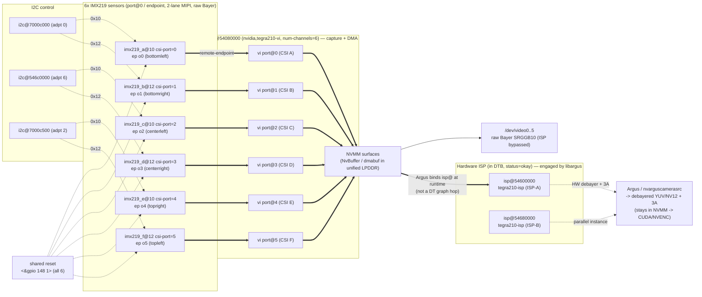
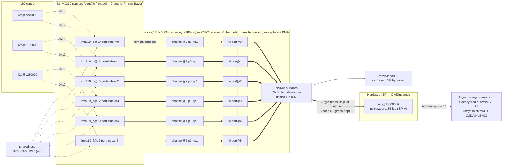

# Auvidea J106 — 6× CSI IMX219 cameras on Jetson TX2

This document captures the analysis of the existing **working TX1** setup and the
**plan + scaffold** to reproduce the same **6 CSI camera** support on **Jetson TX2**
on the Auvidea **J106 (+ M110)** carrier.

> TL;DR: On TX1 it works because Auvidea patched the kernel (IMX219 driver) and shipped a
> custom device tree wiring all 6 cameras across 3 i2c buses. On TX2 the **IMX219 driver
> already exists** in the L4T R32 kernel, so the bulk of the port is a **device‑tree job** —
> **plus one small driver patch** ([`patches/0001-imx219-share-reset-gpio-j106.patch`](patches/0001-imx219-share-reset-gpio-j106.patch))
> so the 6 sensors can share the J106's single hardware reset line (see §5, Stage 1). The board
> already runs **L4T R32.7.6** — we **stay on it** and build a single carrier DTB that fixes
> **cameras + USB** together (WiFi/Ethernet already work). **USB is already fixed & verified**
> (§7). The starting device tree is in
> [`tx2-j106-6csi/tegra186-camera-j106-imx219.dtsi`](tx2-j106-6csi/tegra186-camera-j106-imx219.dtsi).

> **New board / just flashed?** First complete NVIDIA's headless first-boot (oem-config) over
> the micro-USB serial — see
> [`headless-first-boot-setup.md`](headless-first-boot-setup.md). You need a login before any
> of the DTB work below.

---

## 1. Inventory of the supplied material

| Item | What it is |
|------|------------|
| `bsp_L4T_24_2_1_V2.2.tar.gz` + `*.patch` | **Working TX1** BSP. L4T **R24.2.1**, kernel **3.10.96**. |
| `Tegra210_Linux_R24.2.1_aarch64.tbz2` | NVIDIA L4T driver package for TX1 (base the TX1 BSP overlays). |
| `J90_v2.2_4.2.2.tar.bz2` | **TX2** BSP from Auvidea. L4T **R32.2.1 / JetPack 4.2.2**, kernel **4.9**. Boots J106 on TX2 but **does not** configure 6 CSI cameras. |
| `J106_technical_reference_1.0.pdf` | J106 carrier hardware. Documents the **i2c‑bus ↔ CSI** routing and the i2c **address shifter**. |
| `Firmware_installation_TX1_2.1.pdf` | TX1 flashing procedure (swap DTB + `flash.sh`). |

### How the TX1 BSP is structured (important)
- `J10x_J120.patch` / `J140.patch` are **trivial** — they only change the `FDT` line in
  `bootloader/.../extlinux.conf.emmc` to a custom DTB
  (`tegra210-jetson-auvidea-120-IMX219.dtb`).
- The real work lives in `bsp_L4T_24_2_1_V2.2.tar.gz → patch_sources.tar.gz`:
  - `0001-add-imx219-subdevice-driver.patch` — adds the IMX219 kernel driver (kernel 3.10).
  - `0002-add-imx219-dtb.patch` — adds `tegra210-imx219.dts` defining **all 6 cameras**.

---

## 2. The J106 6‑camera wiring (carrier hardware — identical for TX1 and TX2)

From the J106 technical reference and the TX1 DTS, the carrier routes the 6 CSI‑2
connectors to **3 i2c buses, 2 cameras per bus**. The carrier contains a unique
**i2c address shifter** (default shift = **2**), so the "south" camera on each bus
moves from `0x10` to `0x10 + 2 = 0x12`. This lets you use 6 identical sensors.

| Cam | J106 conn. | CSI port | serial iface | i2c addr | TX1 i2c bus | i2c "marked" |
|-----|-----------|----------|--------------|----------|-------------|--------------|
| A | CSI‑A | 0 | serial_a | 0x10 | `I2C0`  `i2c@7000c000` | 0‑N |
| B | CSI‑B | 1 | serial_b | 0x12 | `I2C0`  `i2c@7000c000` | 0‑S (shifted) |
| C | CSI‑C | 2 | serial_c | 0x10 | `I2C6`  `i2c@546c0000` | 6‑N |
| D | CSI‑D | 3 | serial_d | 0x12 | `I2C6`  `i2c@546c0000` | 6‑S (shifted) |
| E | CSI‑E | 4 | serial_e | 0x10 | `I2C2`  `i2c@7000c500` | 2‑N |
| F | CSI‑F | 5 | serial_f | 0x12 | `I2C2`  `i2c@7000c500` | 2‑S (shifted) |

Other carrier facts:
- All 6 connectors' **reset pin (pin 6) are tied together** and driven by **one GPIO**.
- `VI` uses `num-channels = <6>`, ports 0–5.
- Each link is **2‑lane** (`bus-width = 2`).
- The TC358743/B101 HDMI‑to‑CSI bridge is a separate device (0x0F) — out of scope here.

---

## 3. Why the TX1 device tree cannot be copied verbatim to TX2

| Aspect | TX1 (L4T R24, kernel 3.10) | TX2 (L4T R32.2.1, kernel 4.9) |
|--------|----------------------------|-------------------------------|
| IMX219 driver | **Added by Auvidea patch** | **Already present**: `drivers/media/i2c/imx219.c`, `imx219_mode_tbls.h`, compatible `nvidia,imx219` |
| Camera DT binding | `camera_common` (old) | **tegracam** framework (new) — different node/property layout |
| host1x video nodes | `vi { ... }` | `vi@15700000` + `nvcsi@150c0000` (channels w/ `port-index`) |
| i2c controllers | `7000cxxx` / `546c0000` | `316/318/c24…0000` (see table below) |
| Sensor clock | `cam_mclk1` | `extperiph1` (`TEGRA186_CLK_EXTPERIPH1`) |
| GPIO refs | raw `<&gpio 148 1>` | `<&tegra_main_gpio TEGRA_MAIN_GPIO(x,y) ...>` |
| Mode props | `pixel_t`, … | `mode_type`, `pixel_phase`, `csi_pixel_bit_depth`, fixed‑point gain/exp/fps |

### i2c bus translation (from `tegra186-soc-i2c.dtsi`)

| Role on J106 | TX1 node | **TX2 node (use this)** | Linux bus | Live status |
|--------------|----------|--------------------------|-----------|-------------|
| CSI‑A/B (GEN i2c) | `i2c@7000c000` | `gen2_i2c:` **`i2c@c240000`** | `i2c-1` | **CONFIRMED: 0x10 ACK (north)** |
| CSI‑C/D (CAM i2c) | `i2c@546c0000` | `cam_i2c:` **`i2c@3180000`** | `i2c-2` | **CONFIRMED: 0x10 + 0x12 ACK** |
| CSI‑E/F (GEN i2c) | `i2c@7000c500` | `gen8_i2c:` **`i2c@c250000`** | `i2c-7` | **CONFIRMED: 0x10 + 0x12 ACK** |

Available TX2 i2c controllers: `gen1_i2c@3160000`, `gen2_i2c@c240000`,
`cam_i2c@3180000`, `dp_aux_ch1_i2c@3190000`, `dp_aux_ch0_i2c@31b0000`,
`gen7_i2c@31c0000`, `gen8_i2c@c250000`, `gen9_i2c@31e0000`.

### IMX219 modes supported by the R32 driver
`3264x2464@21`, `3264x1848@28`, `1920x1080@30`, `1280x720@60`, `1280x720@120`
(native Bayer RGGB, 2 lanes).

---

## 3a. Camera pipeline architecture — TX1 vs TX2 (diagrams)

These two diagrams show all six IMX219 pipelines end‑to‑end on each platform,
including the hardware ISP. Cross‑checked against the real device trees:
`bsp_L4T_24_2_1_V2.2/.../tegra210-imx219.dts` (TX1) and the decompiled stock
c03 DTB (TX2).

### TX1 (L4T R24.2.1, tegra210) — VI‑only **2‑hop** graph, **2× ISP**



### TX2 (L4T R32.7.6, tegra186 / J106) — NVCSI+VI **3‑hop** graph, **1× ISP**



### TX1 ⟷ TX2 pipeline differences

| Aspect | TX1 (tegra210, K3.10) | TX2 (tegra186, K4.9 / J106) |
|--------|------------------------|------------------------------|
| Capture graph | **2‑hop**: `sensor → vi port@N` | **3‑hop**: `sensor → nvcsi channel@N → vi port@N` |
| CSI‑2 receiver in DT | folded into VI (no separate node) | explicit **`nvcsi@150c0000`** with one `channel@N` per stream |
| Port key on endpoint | `csi-port = N` | `port-index = N` |
| VI node | `vi@54080000` (`nvidia,tegra210-vi`) | `vi@15700000` (`nvidia,tegra186-vi`) |
| **Hardware ISP count** | **2** (`isp@54600000`, `isp@54680000`) | **1** (`isp@15600000`) |
| ISP compatible | `nvidia,tegra210-isp` | `nvidia,tegra186-isp` |
| I²C buses (A/B, C/D, E/F) | `7000c000`, `546c0000`, `7000c500` | `c240000`, `3180000`, `c250000` |
| Sensor clock | `cam_mclk1` | `extperiph1` (`TEGRA186_CLK_EXTPERIPH1`) |
| GPIO ref style | raw `<&gpio 148 1>` | `<&tegra_main_gpio TEGRA_MAIN_GPIO(R,5) ...>` |
| Camera DT framework | old `camera_common` | **tegracam** (`mode_type`/`pixel_phase`/fixed‑point gain) |

**Why NVCSI is broken out on TX2 (the extra hop):** on Tegra186 the CSI‑2
receiver is promoted to a first‑class, per‑channel device‑tree block so the SoC
can do **virtual‑channel (VC) demux**, **deserializer/aggregator** cameras
(GMSL/FPD‑Link: many cameras over one CSI port), flexible **N:M stream→VI
routing**, and per‑stream **test‑pattern/error** handling. For one‑camera‑per‑port
IMX219 (our J106), each `nvcsi channel@N` is just a straight `port@0 → port@1`
passthrough, so it behaves like TX1's 2‑hop — just two more nodes to set
`status="okay"`.

**Common to both:** unified LPDDR (UMA) — VI DMAs into **NVMM** buffers shared by
GPU/ISP/NVENC, so the raw V4L2 path (`/dev/videoN`) bypasses the ISP, while the
Argus path engages the HW ISP and can stay zero‑copy into CUDA/NVENC
(`NvBuffer` → EGLImage → CUDA). The 6 sensors share one reset line; the patched
`imx219` driver (§5, Stage 1 / patch `0001`) never asserts it low so the cameras are independent.

---

## 3b. LIVE hardware verification (2026‑06‑08, on the actual TX2)

Probed the running board (`nvidia-desktop`, `192.168.0.168`) directly:

- **L4T = R32.7.6** / kernel **4.9.337-tegra** (JetPack 4.6.x) — note this is NEWER than the
  J90 BSP's R32.2.1. The `tegracam` DT binding is identical across R32.x so the `.dtsi`
  is valid; build the DTB against the **R32.7.x** kernel sources to match the running kernel.
- Active DTB is the **stock devkit** (`model = quill`, `nvidia,p2597-0000+p3310-1000`) — no
  camera nodes yet, VI ports report `ep ... not enabled`, no `/dev/video*`.
- Live `i2cdetect -l` adapter numbering matches the table above exactly
  (`c240000`→i2c-1, `3180000`→i2c-2, `c250000`→i2c-7).
- **Reset GPIO CONFIRMED**: `TEGRA_MAIN_GPIO(R, 5)` = sysfs **gpio 461** (chip base 320 + 141).
  Exporting it, driving **0 then 1** (active‑low release), made the sensors appear. Pulse:
  ```bash
  G=461
  sudo sh -c "echo $G > /sys/class/gpio/export"
  sudo sh -c "echo out > /sys/class/gpio/gpio$G/direction"
  sudo sh -c "echo 0 > /sys/class/gpio/gpio$G/value"; sleep 0.3
  sudo sh -c "echo 1 > /sys/class/gpio/gpio$G/value"
  ```
  (This is the manual equivalent of the gpio‑hog in the dtsi; it does **not** survive reboot.)
- **Cameras detected after reset release** (initially 4 connected):
  ```
  i2c-2 (3180000):  0x10  0x12     <-- CSI-C/D pair
  i2c-7 (c250000):  0x10  0x12     <-- CSI-E/F pair
  i2c-0 (3160000):  (none)
  i2c-1 (c240000):  (none)         <-- CSI-A/B connectors still empty at this point
  ```

- ALL THREE camera buses now hardware-confirmed (5th camera added to A/B bus):
  ```
  i2c-1 (c240000):  0x10        <-- CSI-A/B pair (north only; +0x12 when 6th added)
  i2c-2 (3180000):  0x10  0x12  <-- CSI-C/D pair
  i2c-7 (c250000):  0x10  0x12  <-- CSI-E/F pair
  i2c-0 (3160000):  (none)      <-- not a camera bus
  ```
  => A/B=`c240000`, C/D=`3180000`, E/F=`c250000` all match the dtsi. The lone `0x0c`
  seen on i2c-1 is the carrier address-shifter companion, not a camera.

---

## 3c. M110 expansion board: Ethernet, USB, PCIe + L4T version decision (2026‑06‑08)

The TX2 is on a **J106 + M110** stack. Checked the M110 peripherals live and decided which
L4T to standardise on.

### Ethernet — WORKS (Tegra EQOS, not a PCIe NIC)

- The M110 RJ45 is wired to the Tegra **built-in EQOS MAC** (`2490000.ether_qos`, driver
  `eqos`, `phy-mode = rgmii`) through an on-carrier Broadcom PHY — it is **not** a USB or
  PCIe network card. So it needs **no Auvidea-specific networking patch** and is not tied to
  any particular L4T version.
- `eth0` links up and passes traffic. It currently negotiates only **10 Mbps**, but `ethtool`
  shows the **TX2 side advertises full 10/100/1000 with zero errors** — the link partner
  ("Link partner advertised link modes: 10baseT/Half/Full") is the bottleneck. Fix is on the
  host/cable side: use a known-good Cat5e/Cat6 cable and set the host NIC to **auto-negotiate**.
  Re-check with:
  ```bash
  sudo ethtool eth0 | grep -E "Speed|Link partner advertised link modes"
  ```

### USB — BROKEN by the stock devkit DTB (same root cause as the cameras)

A Logitech wireless dongle is plugged in but the mouse never moves. USB is **completely dead**:
`/sys/bus/usb/devices/` is empty, no input device appears, and the XUSB host controller never
registers. The persistent boot log shows exactly why:

```
pca953x 0-0074: failed reading register
pca953x: probe of 0-0074 failed with error -121     <-- devkit-only I2C GPIO expander, absent on J106/M110
pca953x: probe of 0-0077 failed with error -121
tegra-xusb-padctl 3520000.xusb_padctl: failed to setup XUSB ports: -517   <-- EPROBE_DEFER (forever)
tegra-usb-cd usb_cd: otg phy is not available yet
```

Root cause: the running **stock p2597 devkit DTB** drives USB **VBUS enable** through two I²C
GPIO expanders (`pca953x` @ `0x74`/`0x77`) that only exist on the NVIDIA devkit. On the
J106/M110 those chips are not present, so the expanders fail to probe (`-121` = no I²C ACK),
the XUSB pad controller can never obtain its VBUS GPIOs, and it defers probe permanently
(`-517`). With no host controller, the dongle is unpowered and never enumerates. (The
`ina3221` power-monitor probe failures at `0x42/0x43` are the same devkit-only story.)

`xhci@3530000` and `xusb_padctl@3520000` are both `status = okay` and `CONFIG_USB_XHCI_TEGRA=y`
is built in — the hardware/driver are fine; only the **board description** is wrong.

**Fix = the correct J106/M110 carrier DTB.** The carrier DTB must define USB VBUS via the
carrier's actual regulators/GPIOs instead of the devkit's `pca953x` expanders. This is exactly
what Auvidea's documented **USB vbus-supply patch** (USB 2.0 `vbus-*-supply` change) and the
separate **USB 3.0 patch** do. **Cameras and USB therefore get fixed together** when we flash
the proper carrier device tree — neither is a hardware fault.

### PCIe — slot present but empty

`lspci` returns nothing; no card is installed in the M110 PCIe slot. Nothing to configure.

### L4T version decision → **STAY on R32.7.6** (do not downgrade to R32.2.1)

The question was whether to downgrade to R32.2.1 (JetPack 4.2.2, matching the J90 BSP) to get
"full" J106 + M110 support. Decision: **keep R32.7.6**, because:

- M110 Ethernet is the **standard Tegra EQOS** path — fully supported on R32.7.6, not
  version-locked, and needs no Auvidea patch.
- The TX1-era Auvidea BSP patch set (`bsp_L4T_24_2_1_V2.2`) contains **only** camera (IMX219),
  CAN, and a build fix — **no PCIe or Ethernet patches** — confirming M110 networking does not
  depend on any special/older BSP.
- USB needs a small **device-tree** VBUS patch, which applies cleanly on R32.7.6; it is **not**
  a kernel/driver problem that an older release would solve.
- R32.7.6 ships an **equal-or-newer** kernel (4.9.337) with broader driver/security coverage.

So: build the carrier DTB (cameras + USB VBUS + verified EQOS PHY) against **R32.7.x** sources
and flash it — no OS downgrade required.

---

## 4. The two open values — RESOLVED from web research

Both previously-unknown values are now confirmed from working **J106 + TX2** reports and
from Auvidea's own firmware device tree. They are already applied in the dtsi.

### 4.1 Shared camera RESET GPIO  →  `TEGRA_MAIN_GPIO(R, 5)` (ACTIVE_LOW + gpio-hog)

All 6 connectors share one reset line. On TX2 it is **`TEGRA_MAIN_GPIO(R, 5)`**, released at
boot by a **gpio-hog (`output-high`)** on `gpio@2200000`, and referenced **ACTIVE_LOW** by each
sensor node:

```dts
/ {
        gpio@2200000 {
                camera-control-output-high {
                        gpio-hog;
                        output-high;
                        gpios = <TEGRA_MAIN_GPIO(R, 5) 0>;
                        label = "cam-rst";
                };
        };
};
```

Sources:
- NVIDIA forum *"Raspberry Pi camera and Jetson TX2"* (J106 + TX2, CSI‑E, marked **SOLVED**) —
  uses `CAM_RST_L = TEGRA_MAIN_GPIO(R, 5)` ACTIVE_LOW + the gpio-hog above.
- Auvidea J106/TX2 firmware workflow: the same physical pin is `sysfs gpio 461` on R28
  (`echo 461 > export; echo out > direction; echo 1 > value`).

### 4.2 CSI‑E/F i2c controller  →  `i2c@c250000` (gen8, `i2c-7`) — CONFIRMED

A working J106 + TX2 CSI‑E camera enumerates as **`imx219 7-0010`**, i.e. Linux bus **7**,
which is SoC controller **`i2c@c250000`** (`gen8_i2c`). The south camera sits at `0x12` on the
same bus. This replaces the earlier `i2c@c240000` guess for E/F.

### 4.3 The authoritative source for ALL six buses

Auvidea distributes the complete vendor device tree as **`tegra186-camera-imx219-rr.dtsi`**
(the `-rr` = RidgeRun), included from `tegra186-quill-p3310-1000-a00-00-base.dts`. Get it from
the **source/** directory inside Auvidea firmware **v1.5** (https://auvidea.com/firmware/,
match the JetPack 4.2.2 / L4T R32.2.1 release). That file is the definitive answer for the
A/B and C/D buses too. In Auvidea's rr.dtsi, CSI‑A/B sit on **`i2c@c240000`** (which is why the
table above uses it); the C/D bus here (`i2c@3180000`) is inferred as the remaining camera bus
and should be cross‑checked against that file or via `i2cdetect`.

### 4.4 Known hardware caveat (address shifter)

Multiple J106 + TX2 reports see the **north** cameras (`0x10` on A/C/E) reliably, but the
**south** cameras (`0x12` on B/D/F, produced by the carrier's address shifter) sometimes fail
to ACK — especially after a cold `shutdown` rather than `reboot`. If B/D/F don't appear:

```bash
i2cdetect -l                 # list adapters and their SoC addresses
for b in $(seq 0 8); do echo "== bus $b =="; i2cdetect -y -r $b; done
```

Properly toggling the shared reset (the gpio-hog above) and a full power cycle generally fixes
it; it is a documented carrier quirk, not a device-tree error.

---

## 5. Camera bring‑up: issues & fixes by pipeline stage (TX2 on J106 vs stock L4T R32.7.6)

Stock **L4T R32.7.6** (kernel `4.9.337‑tegra`) targets NVIDIA's **p2597 devkit**, not the Auvidea
J106/M110 carrier. Everything below is what the carrier needs **on top of stock**. All changes are in
two device‑tree files plus **one** driver patch — nothing else is rebuilt:

| Deliverable | What it changes |
|---|---|
| [`tx2-j106-6csi/tegra186-camera-j106-imx219.dtsi`](tx2-j106-6csi/tegra186-camera-j106-imx219.dtsi) | the 6 cameras: sensors, reset hog, MCLK pinmux, NVCSI/VI channels, sensor modes, `tegra-camera-platform` (Argus) |
| [`tx2-j106-6csi/override-usb.dtsi`](tx2-j106-6csi/override-usb.dtsi) | USB VBUS (host) + OTG device‑mode |
| [`patches/0001-imx219-share-reset-gpio-j106.patch`](patches/0001-imx219-share-reset-gpio-j106.patch) | imx219 driver: shared reset GPIO **and** 680 Mbps MIPI rate |

Capture path (3‑hop on tegra186):
`sensor (imx219 @0x10/0x12) → NVCSI@150c0000 channel@N → VI@15700000 port@N → /dev/videoN`, then
`ISP → libargus` for the processed path. The stages below follow that path from the sensor down.

### Stage 1 — Sensor I²C enumeration & shared reset

6 sensors on **3 i²c buses, 2 per bus** (`c240000`→i2c‑1 A/B, `3180000`→i2c‑2 C/D, `c250000`→i2c‑7 E/F);
the carrier address‑shifter (shift = 2) puts the "south" sensor of each pair at **0x12** instead of 0x10.

| # | Issue (vs stock) | Fix |
|---|---|---|
| 1.1 | Stock devkit DTB has **no J106 camera nodes**. | Add `imx219_<a..f>@10/12` under each `i2c@…` with the carrier reset/clocks/regulators (dtsi). |
| 1.2 | The R32 *tegracam* `imx219` driver makes `reset-gpios` **mandatory** and `gpio_request()`s it **exclusively** (one consumer/pin). The J106 ties **all 6** resets to **one** line → only the first sensor probes, the rest fail `‑EBUSY/‑16`; and any sensor open/close/crash resets all six. | **Driver patch `0001`:** treat `‑EBUSY` as success, never free the line, and **never drive it low** (release once, leave high — mirroring the working TX1 BSP). |
| 1.3 | The shared reset must be released once and held high. A gpio‑hog **named like the stock disabled `camera-control-output-high` hog silently merges and does nothing**. | Unique gpio‑hog `j106-camera-reset-release` on `TEGRA_MAIN_GPIO(R,5)` = gpio 461 (dtsi). |
| 1.4 | Stock DTB carries **PCA9546/PCA9548 i²c muxes** at `0x70`/`0x77` on the camera buses. The J106 address‑shifter responds to `0x70`; the mux driver claims it → the shifted **`0x12` south cameras never ACK** (even with the mux `disabled`). | `/delete-node/ tca9546@70; tca9548@77;` (i2c‑2) and `i2cmux@70;` (i2c‑1); also delete colliding devkit sensors (`ov23850_a@10`, `ov5693_c@36`, `ov23850_c@36`). |

> **Intermittent caveat (open):** even with 1.4, the south `0x12` cameras (B, D) are a **per‑boot
> lottery** — the bare‑J106 bus‑2 shifter sometimes fails to present `0x12` (`i2c read probe ‑121`).
> The M110 bus (E/F) has a robust translator (`0x43` + EEPROM `0x50`) and always works. Recovered by
> reboot / reset / power‑cycle; **not** a cable/reseat issue and **not** i²c speed (F runs `0x12` fine at
> 400 kHz). Camera **B has no physical sensor** on this rig regardless.

### Stage 2 — MCLK (24 MHz)

All 6 sensors share **one** 24 MHz MCLK from `extperiph1`.

| # | Issue | Fix |
|---|---|---|
| 2.1 | The MCLK pin can sit in **GPIO** mode (not SFIO) → no clock at the pin. | Pinmux `extperiph1_clk_po0` → function `extperiph1` placed under **`pinmux@2430000/common`** (a standalone group is ignored — nothing references it in `pinctrl-0`). |

> *Note:* §debug found MCLK was actually live regardless (the pinmux was a red herring for the streaming
> failure — that was Stage 3). The `common`‑group pinmux is kept as the correct, documented config.

### Stage 3 — MIPI CSI‑2 / NVCSI D‑PHY

This was the **real "no frames" blocker.** Symptom: `NVCSI INTR_STATUS 0x8 = PP_FSM_TIMEOUT` +
`tegra-vi4 … PXL_SOF syncpt timeout! err=‑11`, clock lane locks but zero pixel packets arrive.

| # | Issue | Fix |
|---|---|---|
| 3.1 | NVIDIA's RPi‑cam‑v2 reference (which we copied) sets **`discontinuous_clk = "yes"`**. The J106 IMX219 run a **continuous** MIPI clock, and the **tegra186 NVCSI polices the D‑PHY LP escape sequence** unless told to bypass — so it waits forever for an LP sequence the cameras never send. (TX1's older receiver never policed it → "just worked".) | **`discontinuous_clk = "no"`** — sets `T18X_BYPASS_LP_SEQ` (`csi4_fops.c:233`). **The key fix.** |
| 3.2 | Stock PLL = **912 Mbps/lane**, exactly matched to the pixel rate with **zero margin**. On the J106's longer CSI traces this causes intermittent CRC/short‑frame errors and a link that wedges. | **Driver patch `0001`:** lower PLL `0x0307 0x39→0x2B`, `0x030D 0x72→0x55` → **680 Mbps/lane** (−25%) for modes 0–4, **matching the Auvidea TX1 production BSP** exactly. Set DT `pix_clk_hz="136000000"` to match. |
| 3.3 | `cil_settletime` — investigated (manual `17` vs auto `22`). | Left at auto (`0`); a manual value did not survive a soak test. Not load‑bearing once 3.1/3.2 are in. |

### Stage 4 — VI capture & channel routing

| # | Issue | Fix |
|---|---|---|
| 4.1 | `embedded_metadata_height = "0"` → VI4 programs `ATOMP_EMB_SURFACE_OFFSET0 = 0x0` → **SMMU fault** `iova=0x0, fsr=0x402` on stream start. | **`embedded_metadata_height = "2"`** (NVIDIA t186 ref uses ≥1) so a real DMA buffer is allocated. |
| 4.2 | The vi/nvcsi channels inherit **`status="disabled"`** from the stock‑tree merge → no `/dev/video*`. | Set `status = "okay"` on every `nvcsi channel@N` and `vi port@N`. |
| 4.3 | Each sensor must route to its **own** NVCSI channel and VI port. | Distinct `port-index = 0..5`, `remote-endpoint` chains sensor→`csi_in`→`csi_out`→`vi_in`, 6 nvcsi channels (dtsi). Verified: connector CSI‑A..F = bricks 0..5 (J106 reference). |

### Stage 5 — ISP / Argus (`tegra-camera-platform`, userspace)

| # | Issue | Fix |
|---|---|---|
| 5.1 | **DT mode index ≠ driver register‑table index.** DT defined only 2 modes; the driver table has 5. Argus passes the DT mode index straight to the driver → wrong resolution programmed → `ChanselFault PIXEL_LONG_LINE` → ISP never outputs → `nvbuf_utils: dmabuf_fd ‑1`. | Define **all 5 modes in driver‑table order** (`mode0…mode4`). |
| 5.2 | DT framerates exceeded the lowered (680 Mbps) PLL → `frame_length` too short → `ChanselShortFrame / PIXEL_INCOMPLETE`. | **Derate framerates** to the 680 Mbps clock: 15 / 20 / 30 / 44 / 110 fps for modes 0–4. |
| 5.3 | Stock `tegra-camera-platform` modules are `status="disabled"`; the overlay merge inherits that → Argus "**No cameras available**". | `status="okay"` on every module + `drivernode0`; add `drivernode1` (`v4l2_lens`) → a lens node. |
| 5.4 | **Argus aliasing:** all 6 modules had `position = "rear"`. libargus keys each camera by `(GUID, position)`; 6× identical **EEPROM‑less** IMX219 all hash to `(GUID 0, position 0)` → every `sensor-id` resolves to the **last** module → *all show one camera*. | Give each module a **unique `position`** (`topleft/topright/centerleft/centerright/bottomleft/bottomright`) + matching badge. Proven in the PCL log: `Found GUID 0 match at index[0..5]` (before) → distinct GUID 0–5, 1:1 (after). NVIDIA docs require unique position for identical modules; stock TX1 `e3322` (same A815P2 IMX219) DTB does exactly this. |

### Stage 6 — `/dev/videoN` & capture usage (not bugs — gotchas)

- **V4L2 mode‑select quirk:** raw capture defaults to **mode0 full‑res 3264×2464@~15 fps** unless you set
  `v4l2-ctl --set-ctrl sensor_mode=N` (2 = 1080p, 3 = 720p…). Raw V4L2 scales to all cameras concurrently.
- **Argus caps gotcha:** pin a **valid** mode/rate or you get `not-negotiated (-4)`: `1280×720` has only
  44/60 fps modes (680‑rate: 44/110), `1920×1080` only 30 fps. There is no 720p@30.
- **Argus 5‑session start race (open):** launching 5 `nvarguscamerasrc` simultaneously, one source
  intermittently fails `Internal data stream error` / `not-negotiated`. 4 are reliable; 5 races. Workaround:
  restart `nvargus-daemon`, launch, and if no error in ~9 s record, else retry (a short loop lands it).

**Result:** all wired cameras stream raw V4L2 and through Argus; deliverable
[`captures/tx2_grid_5cam.mp4`](captures/tx2_grid_5cam.mp4) — 2×3 grid, 30 fps, ~38 s, 5 distinct cameras
(A, C, D, E, F; B has no sensor) — the TX2 equivalent of the TX1 grid.

### Stage 5b — ISP image quality (Argus): the missing IMX219 tuning, and the fix

Out of the box the Argus images are **hazy / washed‑out with a magenta cast**. Root cause (verified against
sources): the ISP colour tuning lives in a **`camera_overrides.isp`** file in `/var/nvidia/nvcam/settings/`
(loaded by libargus) — **not** in the imx219 driver (Auvidea's TX1 driver patch only adds sensor modes, no
colour). IMX219 is a *reference* sensor on **tegra210** (Nano/TX1 = the RPi Camera v2), so its tuning is
built into that camera stack; on **tegra186 (TX2)** IMX219 was never a reference camera, so there's **no
built‑in tuning** → generic defaults → the washed/magenta look. (My earlier note that "Auvidea is tuned" was
wrong: neither the TX1 R24 BSP nor Auvidea's patches ship an `.isp` — confirmed, both have 0.)

**The fix — a drop‑in ISP override (verified working on the TX2/tegra186):**
The community **Arducam `camera_overrides.isp`** loads on tegra186 and corrects both the colour matrix and the
black level. Before/after on the same camera, override the only variable:

- **Port F** (content scene): [`captures/isp_F_compare.jpg`](captures/isp_F_compare.jpg) — washed purple haze →
  natural (black connectors, warm desk, bright LEDs). R/G/B 97/**80**/89 → 64/**72**/57, contrast std 7.8 → **43** (≈5.5×).
- **Camera A** (plain wall): [`captures/isp_override_compare.jpg`](captures/isp_override_compare.jpg) — R/G/B
  101/**85**/95 (magenta) → 89/**89**/81 (neutral), contrast std 10.7 → **52.9** (≈5×).
- **Multi‑cam grid**, override active: [`captures/tx2_grid_override10.mp4`](captures/tx2_grid_override10.mp4)
  (natural colour) vs the default‑ISP grid [`captures/tx2_grid_10s.mp4`](captures/tx2_grid_10s.mp4) (purple haze).

The magenta cast disappears (green deficit gone, neutral whites) and the haze clears (real blacks).
Install (the file is in [`tools/nvcam-settings/camera_overrides.isp`](tools/nvcam-settings/); persists in the
rootfs across reboots):
```bash
sudo cp camera_overrides.isp /var/nvidia/nvcam/settings/camera_overrides.isp
sudo chmod 664 /var/nvidia/nvcam/settings/camera_overrides.isp
sudo chown root:root /var/nvidia/nvcam/settings/camera_overrides.isp
sudo rm -f /var/nvidia/nvcam/settings/nvcam_cache_*.bin    # force re-read
sudo systemctl restart nvargus-daemon
```
> ⚠️ The daemon logs two non‑fatal warnings (`Invalid isp config attribute: em.preset[*].wbgains=…`) — a few
> preset attributes from a different L4T version are ignored, but the core CCM/black‑level/tone tuning applies.
> Arducam notes the tuning isn't lens‑specific (NVIDIA hasn't opened CamTune), so it's a strong baseline, not a
> perfect calibration.

Further options (now optional, not required): `nvarguscamerasrc` runtime params (`saturation`, `tnr`, `ee`,
`exposurecompensation`) on top of the override for extra punch; or raw V4L2 + a custom **CUDA ISP**
(debayer → WB → CCM → gamma) for full control + lowest latency (the "simpler HW + lower latency" route).

---

## 6. Build, apply the patch & flash

Builds run on an **x86‑64 Linux host**; artifacts deploy to the TX2 **over SSH**. Deployment is **always
reversible** via `extlinux.conf` LABELs — the partition DTB (`mmcblk0p30`) is never touched. Build tree
lives in `j106build/` (git‑ignored, reproducible).

### 6.1 Prerequisites (one‑time)
- L4T **R32.7.6** `public_sources` (kernel + DT): `kernel_src.tbz2` → `j106build/r3276/ksrc/`.
- Cross toolchain (NVIDIA Bootlin GCC 9.3 **or** Linaro 7.3.1 — both yield `4.9.337-tegra`).
- The board's own kernel config: `scp nvidia@<board>:/proc/config.gz . && zcat config.gz > board-config`
  (keeps modules compatible).

### 6.2 Build the patched kernel `Image` (applies patch `0001`: shared reset + 680 Mbps)
```bash
cd j106build/r3276
patch -p1 -d ksrc < ../../patches/0001-imx219-share-reset-gpio-j106.patch   # idempotent; skip if applied
cp board-config kout/.config
export CROSS_COMPILE=$PWD/l4t-gcc/.../bin/aarch64-linux-gnu-          # or aarch64-buildroot-linux-gnu-
make -C ksrc/kernel/kernel-4.9 O=$PWD/kout ARCH=arm64 CROSS_COMPILE=$CROSS_COMPILE LOCALVERSION=-tegra olddefconfig
make -C ksrc/kernel/kernel-4.9 O=$PWD/kout ARCH=arm64 CROSS_COMPILE=$CROSS_COMPILE LOCALVERSION=-tegra -j$(nproc) Image
# Result: kout/arch/arm64/boot/Image   — verify: strings Image | grep 4.9.337-tegra
#         and the 680 rate compiled in: grep '0x0307, 0x2B' ksrc/kernel/nvidia/drivers/media/i2c/imx219_mode_tbls.h
```

### 6.3 Build the carrier DTB (cameras + USB), 680 timing + unique positions
Approach A — decompile the board's stock DTB and append the carrier overlays (keeps the real running tree):
```bash
cd j106build
dtc -I dtb -O dts stock-c03.dtb -o stock-c03.dts          # from board /boot, or BSP tegra186-quill-p3310-1000-c03-00-base.dtb
# add the two labels the camera dtsi needs (decompiled tree lacks them):
#   clock@5000000 -> tegra_car: clock@5000000   ;   gpio@2200000 -> tegra_main_gpio: gpio@2200000
SRC=../tx2-j106-6csi
cat stock-c03.dts "$SRC/tegra186-camera-j106-imx219.dtsi" "$SRC/override-usb.dtsi" > tegra186-j106.dts
dtc -I dts -O dtb -@ -o tegra186-j106.dtb tegra186-j106.dts 2> tegra186-j106.dtc.log
# decompile/recompile phandle + unit-address warnings are expected and harmless.
# verify positions merged: dtc -I dtb -O dts tegra186-j106.dtb | grep -A1 'module[0-5] {' | grep position
```

### 6.4 Deploy reversibly (over SSH) — all fixes in one shot

**One‑command deploy** ([`tools/deploy-j106.sh`](tools/)) — pushes and installs **all** carrier fixes
(patched Image, carrier DTB, extlinux entry, **`camera_overrides.isp`** ISP fix, and the recovery‑button
service) in one go, reversibly:
```bash
tools/deploy-j106.sh  j106build/r3276/kout/arch/arm64/boot/Image  j106build/tegra186-j106.dtb
# then reboot the board to apply. Env: TARGET=, SSHOPTS=-o ProxyJump=…, SUDOPW=, LABEL=
```
It runs [`tools/j106-install.sh`](tools/) on the board, which: installs the Image+DTB, adds an `extlinux`
`LABEL` (sets it `DEFAULT`, backs up the prior conf), drops `camera_overrides.isp` into
`/var/nvidia/nvcam/settings/` (+ clears `nvcam_cache_*.bin`), and enables `j106-recovery-key.service`.

**Manual equivalent** (if you prefer step‑by‑step):
```bash
sudo cp /tmp/Image            /boot/Image.j106-680
sudo cp /tmp/tegra186-j106.dtb /boot/tegra186-j106.dtb
sudo install -m664 -o root -g root tools/nvcam-settings/camera_overrides.isp /var/nvidia/nvcam/settings/
sudo rm -f /var/nvidia/nvcam/settings/nvcam_cache_*.bin           # ISP image-quality fix (§5b)
sudo cp /boot/extlinux/extlinux.conf /boot/extlinux/extlinux.conf.bak     # first time only
# append a new LABEL (keep the previous one as fallback) and set DEFAULT to it:
#   LABEL j106cam
#         LINUX /boot/Image.j106-680
#         INITRD /boot/initrd
#         FDT   /boot/tegra186-j106.dtb
#         APPEND ${cbootargs} quiet
sudo sed -i 's/^DEFAULT .*/DEFAULT j106cam/' /boot/extlinux/extlinux.conf
sudo reboot
```
(Board sudo password is `nvidia`: `echo nvidia | sudo -S <cmd>`.)

**Full reflash instead?** Bake the same fixes into the rootfs *before* `flash.sh`: copy the patched `Image`
+ DTB into `Linux_for_Tegra/kernel/`, and the ISP override into the rootfs at
`Linux_for_Tegra/rootfs/var/nvidia/nvcam/settings/camera_overrides.isp` (plus the recovery service files),
so they ship in the flashed image.

### 6.5 Verify on target
```bash
uname -r                                   # 4.9.337-tegra
ls /dev/video*                             # video0..N (one per probing camera)
dmesg | grep -E 'imx219 .*(bound|failed)'  # which of A/B/C/D/E/F enumerated
v4l2-ctl -d /dev/video0 --set-ctrl sensor_mode=2 --set-fmt-video=width=1920,height=1080,pixelformat=RG10 \
         --stream-mmap --stream-count=30 --stream-to=/dev/null
# Argus grid (restart daemon first; retry if a source races):
sudo systemctl restart nvargus-daemon
```

### 6.6 Rollback
Set `DEFAULT` back to a previous LABEL (e.g. `j106usb` or `primary`) and reboot. The partition DTB and
stock `Image` are never modified.

---

## 7. Status & open issues

**Deployed config — default boot `j106-680`** (reversible via `extlinux` LABELs; fallbacks kept):
`Image.j106-680` (4.9.337‑tegra, patch `0001` = shared reset + **680 Mbps**) + `tegra186-j106-modes-pos.dtb`
(6 cameras, **unique positions**, 680 timing/derated framerates, USB VBUS fix, `usb2-0` = `otg`). Board:
`ssh nvidia@10.42.0.157` (pw `nvidia`); board sudo `echo nvidia | sudo -S …`.

### ✅ Working
- **USB host ports** (M110) — VBUS fix in `override-usb.dtsi` (stock routes VBUS through devkit
  `pca953x` expanders absent on the carrier → `‑517` defer; fixed regulator forced always‑on).
- **Fan control** — fixed in `override-usb.dtsi`. Stock gates `vdd-fan` (`regulator@13`) through the
  *same* absent devkit I²C expander, so the regulator never registers → `FAN: couldn't get the regulator`
  → `pwm-fan` won't probe → no PWM control → fan stuck **always on at full**. Same fix (drop the expander
  gpio, force the regulator always‑on): `pwm-fan` now probes, registers as a cooling device under
  `thermal-fan-est`, and the kernel **ramps the fan with temperature** (verified OFF at ~33 °C, `target_pwm=0`)
  — as on TX1.
- **Ethernet** (M110, Tegra EQOS) and **WiFi** — stock, untouched.
- **Cameras** — all wired sensors stream raw V4L2 and through Argus; aliasing fixed (Stage 5.4);
  **5‑camera Argus grid** delivered ([`captures/tx2_grid_5cam.mp4`](captures/tx2_grid_5cam.mp4)).
- **ISP image quality** — fixed with the Arducam `camera_overrides.isp` (Stage 5b); installed in
  `/var/nvidia/nvcam/settings/`. Washed/magenta → natural colour + real contrast
  ([`captures/isp_F_compare.jpg`](captures/isp_F_compare.jpg)).
- **UART0 debug console** — works: `/dev/ttyUSB0` @ 115200 8N1 on the host (FTDI on the debug header).
- **Micro‑USB recovery / flashing (M110 J17)** — works. `sudo reboot forced-recovery` (or the M110 recovery
  button via `tools/j106-recovery-key`) puts the board into RCM and the host enumerates it as
  `0955:7c18 NVIDIA Corp. T186 [TX2 Tegra Parker] recovery mode` (verified). The M110 PDF calls J17 the
  *"USB 2.0 port for firmware upgrades"* — flashing is its actual purpose.
- **Carrier buttons** — all functional; verified map below. The M110 "Recovery" button now triggers software
  recovery via [`tools/j106-recovery-key`](tools/).

### ◑ Intermittent (hardware/Argus quirks, not config bugs)
- **South cameras B/D (`0x12`) per‑boot enumeration lottery** — Stage 1 caveat. D comes up some boots,
  not others; recovered by reboot. B has no physical sensor.
- **Argus 5‑session start race** — Stage 6; use the restart‑daemon + retry workaround.

### ❌ Open / hardware‑limited
- **Micro‑USB Linux device‑mode gadget (`/dev/ttyACM0` / `192.168.55.1`) — will NOT work on M110 J17.** This is
  USB0/OTG (J106 → M110 **J17**), *separate* from UART0 (and *separate* from recovery, which **does** work —
  see Working). Per the M110 PDF, J17 is a **host‑leaning port**: `USB0_ID` floats → host, and `USB0_VBUS` is
  tied to the M110's own 5 V output. Forcing `usb2-0 mode="device"` binds the L4T gadget
  (`acm.GS0`+`rndis/ncm`+`mass_storage` on UDC `3550000.xudc`, `/dev/ttyGS0` present) but it **never goes
  online**: dmesg `tegra-xudc 3550000.xudc: vbus state: 0` + `extcon@1: USB_HOST=1` (host VBUS not sensed) →
  xudc stays in ELPG, host sees nothing. Confirmed at register level — **hardware wiring, not a software bug**
  (forcing pure‑device by stripping xudc's `extcon`/`otg-controller` breaks the padctl with `-517`). So we **leave `usb2-0` as stock `mode="otg"`** (forcing device gave no
  benefit and would block J17 from acting as a USB host). It would
  enumerate on a devkit‑wired micro‑USB (e.g. **XCB‑Lite**). *Recovery/flashing over the same J17 works fine
  (Working) — that is what the port is for.*

### Carrier buttons — verified map (live per‑button test, 2026‑06‑14)
| Button | Wiring (measured) | Behaviour |
|---|---|---|
| **J106 power** | Tegra `gpio-312` → `KEY_POWER` (+ module `POWER_BTN`) | ✅ powers the board on; shuts down a running board (`logind HandlePowerKey=poweroff`) |
| **M110 power** | PMIC `POWER_BTN` (B50) — **not on any GPIO**; all‑GPIO scan saw nothing on press, and it never powers on | ❌ electrically dead on this stack — **hardware** (not remappable). Use the J106 power button. |
| **M110 recovery** | Tegra `gpio-313` → `KEY_VOLUMEUP` (a plain GPIO — **not** the bootrom `FORCE_RECOVERY` strap) | by itself a no‑op; with [`tools/j106-recovery-key`](tools/) a **≥1.5 s hold** runs `reboot forced-recovery` → **RCM** (verified) |
| **Reset** (J106 / M110) | `SYS_RESET_N` | ✅ hardware reset (LED blinks) |

`reboot forced-recovery` is supported by the t18x kernel (`reboot-t18x.c`). Because the M110 "Recovery" button
is wired to a GPIO (not `FORCE_RECOVERY`), it cannot enter recovery on its own — the `tools/j106-recovery-key`
systemd service bridges it (hold ≥1.5 s → software RCM). Tap **Reset** (no hold) to leave recovery.

### Notes
- Detailed chronological bring‑up investigation (every dead‑end, symptom, and the reasoning that led to
  each fix above) is preserved in the git history of this file.
- **Cross‑checked against the working TX1 reference** (2026‑06‑14): the camera driver patch `0001` mirrors
  Auvidea's TX1 R24.2.1 imx219 patch exactly (comment out `gpio_set_value(reset,0)`; release the shared
  reset high once) and the 680 Mbps PLL matches Auvidea's TX1 values; the micro‑USB fix mirrors TX1's
  carrier‑independent OTG approach; buttons confirmed devkit‑wired via the XCB‑Lite reference.
