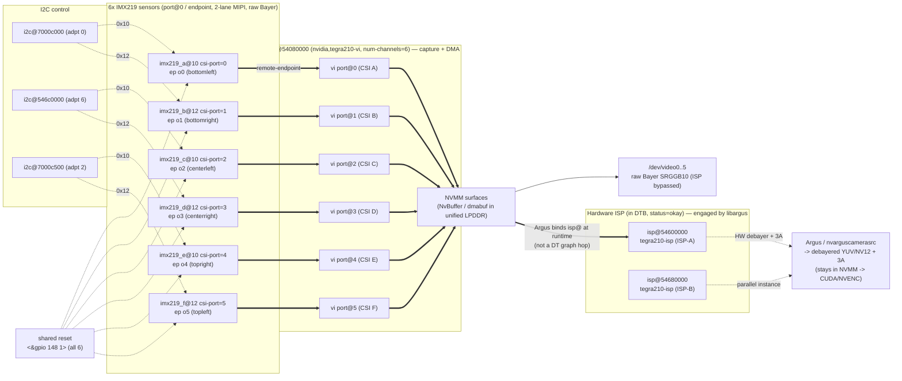
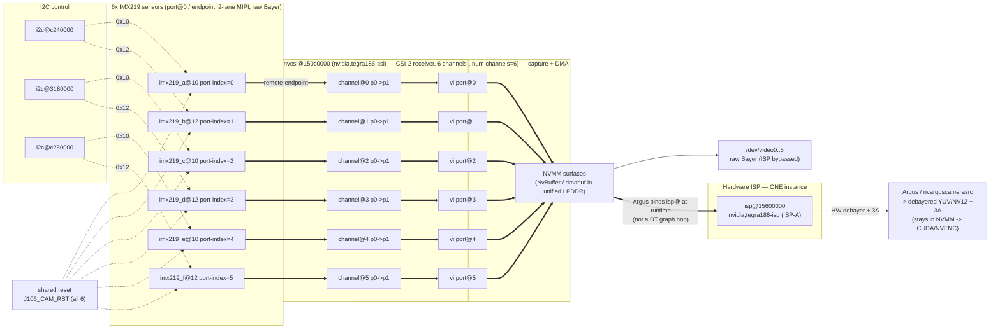

# Auvidea J106 — 6× CSI IMX219 cameras on Jetson TX2

This document captures the analysis of the existing **working TX1** setup and the
**plan + scaffold** to reproduce the same **6 CSI camera** support on **Jetson TX2**
on the Auvidea **J106 (+ M110)** carrier.

> TL;DR: On TX1 it works because Auvidea patched the kernel (IMX219 driver) and shipped a
> custom device tree wiring all 6 cameras across 3 i2c buses. On TX2 the **IMX219 driver
> already exists** in the L4T R32 kernel, so the bulk of the port is a **device‑tree job** —
> **plus one small driver patch** ([`patches/0001-imx219-share-reset-gpio-j106.patch`](patches/0001-imx219-share-reset-gpio-j106.patch))
> so the 6 sensors can share the J106's single hardware reset line (see §7). The board already
> runs **L4T R32.7.6** — we **stay on it** and build a single carrier DTB that fixes
> **cameras + USB** together (WiFi/Ethernet already work). **USB is already fixed & verified**
> (§7.1). The starting device tree is in
> [`tx2-j106-6csi/tegra186-camera-j106-imx219.dtsi`](tx2-j106-6csi/tegra186-camera-j106-imx219.dtsi).

> **New board / just flashed?** First complete NVIDIA's headless first-boot (oem-config) over
> the micro-USB serial — see
> [`headless-first-boot-setup.md`](headless-first-boot-setup.md). You need a login before any
> of the DTB work below.

---

## 1. Inventory of the supplied material

| Item | What it is |
|------|------------|
| `bsp_L4T_24_2_1_V2.2.tar.gz` + `*.patch` | **Working TX1** BSP. L4T **R24.2.1**, kernel **3.10.96**. |
| `Tegra210_Linux_R24.2.1_aarch64.tbz2` | NVIDIA L4T driver package for TX1 (base the TX1 BSP overlays). |
| `J90_v2.2_4.2.2.tar.bz2` | **TX2** BSP from Auvidea. L4T **R32.2.1 / JetPack 4.2.2**, kernel **4.9**. Boots J106 on TX2 but **does not** configure 6 CSI cameras. |
| `J106_technical_reference_1.0.pdf` | J106 carrier hardware. Documents the **i2c‑bus ↔ CSI** routing and the i2c **address shifter**. |
| `Firmware_installation_TX1_2.1.pdf` | TX1 flashing procedure (swap DTB + `flash.sh`). |

### How the TX1 BSP is structured (important)
- `J10x_J120.patch` / `J140.patch` are **trivial** — they only change the `FDT` line in
  `bootloader/.../extlinux.conf.emmc` to a custom DTB
  (`tegra210-jetson-auvidea-120-IMX219.dtb`).
- The real work lives in `bsp_L4T_24_2_1_V2.2.tar.gz → patch_sources.tar.gz`:
  - `0001-add-imx219-subdevice-driver.patch` — adds the IMX219 kernel driver (kernel 3.10).
  - `0002-add-imx219-dtb.patch` — adds `tegra210-imx219.dts` defining **all 6 cameras**.

---

## 2. The J106 6‑camera wiring (carrier hardware — identical for TX1 and TX2)

From the J106 technical reference and the TX1 DTS, the carrier routes the 6 CSI‑2
connectors to **3 i2c buses, 2 cameras per bus**. The carrier contains a unique
**i2c address shifter** (default shift = **2**), so the "south" camera on each bus
moves from `0x10` to `0x10 + 2 = 0x12`. This lets you use 6 identical sensors.

| Cam | J106 conn. | CSI port | serial iface | i2c addr | TX1 i2c bus | i2c "marked" |
|-----|-----------|----------|--------------|----------|-------------|--------------|
| A | CSI‑A | 0 | serial_a | 0x10 | `I2C0`  `i2c@7000c000` | 0‑N |
| B | CSI‑B | 1 | serial_b | 0x12 | `I2C0`  `i2c@7000c000` | 0‑S (shifted) |
| C | CSI‑C | 2 | serial_c | 0x10 | `I2C6`  `i2c@546c0000` | 6‑N |
| D | CSI‑D | 3 | serial_d | 0x12 | `I2C6`  `i2c@546c0000` | 6‑S (shifted) |
| E | CSI‑E | 4 | serial_e | 0x10 | `I2C2`  `i2c@7000c500` | 2‑N |
| F | CSI‑F | 5 | serial_f | 0x12 | `I2C2`  `i2c@7000c500` | 2‑S (shifted) |

Other carrier facts:
- All 6 connectors' **reset pin (pin 6) are tied together** and driven by **one GPIO**.
- `VI` uses `num-channels = <6>`, ports 0–5.
- Each link is **2‑lane** (`bus-width = 2`).
- The TC358743/B101 HDMI‑to‑CSI bridge is a separate device (0x0F) — out of scope here.

---

## 3. Why the TX1 device tree cannot be copied verbatim to TX2

| Aspect | TX1 (L4T R24, kernel 3.10) | TX2 (L4T R32.2.1, kernel 4.9) |
|--------|----------------------------|-------------------------------|
| IMX219 driver | **Added by Auvidea patch** | **Already present**: `drivers/media/i2c/imx219.c`, `imx219_mode_tbls.h`, compatible `nvidia,imx219` |
| Camera DT binding | `camera_common` (old) | **tegracam** framework (new) — different node/property layout |
| host1x video nodes | `vi { ... }` | `vi@15700000` + `nvcsi@150c0000` (channels w/ `port-index`) |
| i2c controllers | `7000cxxx` / `546c0000` | `316/318/c24…0000` (see table below) |
| Sensor clock | `cam_mclk1` | `extperiph1` (`TEGRA186_CLK_EXTPERIPH1`) |
| GPIO refs | raw `<&gpio 148 1>` | `<&tegra_main_gpio TEGRA_MAIN_GPIO(x,y) ...>` |
| Mode props | `pixel_t`, … | `mode_type`, `pixel_phase`, `csi_pixel_bit_depth`, fixed‑point gain/exp/fps |

### i2c bus translation (from `tegra186-soc-i2c.dtsi`)

| Role on J106 | TX1 node | **TX2 node (use this)** | Linux bus | Live status |
|--------------|----------|--------------------------|-----------|-------------|
| CSI‑A/B (GEN i2c) | `i2c@7000c000` | `gen2_i2c:` **`i2c@c240000`** | `i2c-1` | **CONFIRMED: 0x10 ACK (north)** |
| CSI‑C/D (CAM i2c) | `i2c@546c0000` | `cam_i2c:` **`i2c@3180000`** | `i2c-2` | **CONFIRMED: 0x10 + 0x12 ACK** |
| CSI‑E/F (GEN i2c) | `i2c@7000c500` | `gen8_i2c:` **`i2c@c250000`** | `i2c-7` | **CONFIRMED: 0x10 + 0x12 ACK** |

Available TX2 i2c controllers: `gen1_i2c@3160000`, `gen2_i2c@c240000`,
`cam_i2c@3180000`, `dp_aux_ch1_i2c@3190000`, `dp_aux_ch0_i2c@31b0000`,
`gen7_i2c@31c0000`, `gen8_i2c@c250000`, `gen9_i2c@31e0000`.

### IMX219 modes supported by the R32 driver
`3264x2464@21`, `3264x1848@28`, `1920x1080@30`, `1280x720@60`, `1280x720@120`
(native Bayer RGGB, 2 lanes).

---

## 3a. Camera pipeline architecture — TX1 vs TX2 (diagrams)

These two diagrams show all six IMX219 pipelines end‑to‑end on each platform,
including the hardware ISP. Cross‑checked against the real device trees:
`bsp_L4T_24_2_1_V2.2/.../tegra210-imx219.dts` (TX1) and the decompiled stock
c03 DTB (TX2).

### TX1 (L4T R24.2.1, tegra210) — VI‑only **2‑hop** graph, **2× ISP**



### TX2 (L4T R32.7.6, tegra186 / J106) — NVCSI+VI **3‑hop** graph, **1× ISP**



### TX1 ⟷ TX2 pipeline differences

| Aspect | TX1 (tegra210, K3.10) | TX2 (tegra186, K4.9 / J106) |
|--------|------------------------|------------------------------|
| Capture graph | **2‑hop**: `sensor → vi port@N` | **3‑hop**: `sensor → nvcsi channel@N → vi port@N` |
| CSI‑2 receiver in DT | folded into VI (no separate node) | explicit **`nvcsi@150c0000`** with one `channel@N` per stream |
| Port key on endpoint | `csi-port = N` | `port-index = N` |
| VI node | `vi@54080000` (`nvidia,tegra210-vi`) | `vi@15700000` (`nvidia,tegra186-vi`) |
| **Hardware ISP count** | **2** (`isp@54600000`, `isp@54680000`) | **1** (`isp@15600000`) |
| ISP compatible | `nvidia,tegra210-isp` | `nvidia,tegra186-isp` |
| I²C buses (A/B, C/D, E/F) | `7000c000`, `546c0000`, `7000c500` | `c240000`, `3180000`, `c250000` |
| Sensor clock | `cam_mclk1` | `extperiph1` (`TEGRA186_CLK_EXTPERIPH1`) |
| GPIO ref style | raw `<&gpio 148 1>` | `<&tegra_main_gpio TEGRA_MAIN_GPIO(R,5) ...>` |
| Camera DT framework | old `camera_common` | **tegracam** (`mode_type`/`pixel_phase`/fixed‑point gain) |

**Why NVCSI is broken out on TX2 (the extra hop):** on Tegra186 the CSI‑2
receiver is promoted to a first‑class, per‑channel device‑tree block so the SoC
can do **virtual‑channel (VC) demux**, **deserializer/aggregator** cameras
(GMSL/FPD‑Link: many cameras over one CSI port), flexible **N:M stream→VI
routing**, and per‑stream **test‑pattern/error** handling. For one‑camera‑per‑port
IMX219 (our J106), each `nvcsi channel@N` is just a straight `port@0 → port@1`
passthrough, so it behaves like TX1's 2‑hop — just two more nodes to set
`status="okay"`.

**Common to both:** unified LPDDR (UMA) — VI DMAs into **NVMM** buffers shared by
GPU/ISP/NVENC, so the raw V4L2 path (`/dev/videoN`) bypasses the ISP, while the
Argus path engages the HW ISP and can stay zero‑copy into CUDA/NVENC
(`NvBuffer` → EGLImage → CUDA). The 6 sensors share one reset line; the patched
`imx219` driver (§7.4) never asserts it low so the cameras are independent.

---

## 3b. LIVE hardware verification (2026‑06‑08, on the actual TX2)

Probed the running board (`nvidia-desktop`, `192.168.0.168`) directly:

- **L4T = R32.7.6** / kernel **4.9.337-tegra** (JetPack 4.6.x) — note this is NEWER than the
  J90 BSP's R32.2.1. The `tegracam` DT binding is identical across R32.x so the `.dtsi`
  is valid; build the DTB against the **R32.7.x** kernel sources to match the running kernel.
- Active DTB is the **stock devkit** (`model = quill`, `nvidia,p2597-0000+p3310-1000`) — no
  camera nodes yet, VI ports report `ep ... not enabled`, no `/dev/video*`.
- Live `i2cdetect -l` adapter numbering matches the table above exactly
  (`c240000`→i2c-1, `3180000`→i2c-2, `c250000`→i2c-7).
- **Reset GPIO CONFIRMED**: `TEGRA_MAIN_GPIO(R, 5)` = sysfs **gpio 461** (chip base 320 + 141).
  Exporting it, driving **0 then 1** (active‑low release), made the sensors appear. Pulse:
  ```bash
  G=461
  sudo sh -c "echo $G > /sys/class/gpio/export"
  sudo sh -c "echo out > /sys/class/gpio/gpio$G/direction"
  sudo sh -c "echo 0 > /sys/class/gpio/gpio$G/value"; sleep 0.3
  sudo sh -c "echo 1 > /sys/class/gpio/gpio$G/value"
  ```
  (This is the manual equivalent of the gpio‑hog in the dtsi; it does **not** survive reboot.)
- **Cameras detected after reset release** (initially 4 connected):
  ```
  i2c-2 (3180000):  0x10  0x12     <-- CSI-C/D pair
  i2c-7 (c250000):  0x10  0x12     <-- CSI-E/F pair
  i2c-0 (3160000):  (none)
  i2c-1 (c240000):  (none)         <-- CSI-A/B connectors still empty at this point
  ```

- ALL THREE camera buses now hardware-confirmed (5th camera added to A/B bus):
  ```
  i2c-1 (c240000):  0x10        <-- CSI-A/B pair (north only; +0x12 when 6th added)
  i2c-2 (3180000):  0x10  0x12  <-- CSI-C/D pair
  i2c-7 (c250000):  0x10  0x12  <-- CSI-E/F pair
  i2c-0 (3160000):  (none)      <-- not a camera bus
  ```
  => A/B=`c240000`, C/D=`3180000`, E/F=`c250000` all match the dtsi. The lone `0x0c`
  seen on i2c-1 is the carrier address-shifter companion, not a camera.

---

## 3c. M110 expansion board: Ethernet, USB, PCIe + L4T version decision (2026‑06‑08)

The TX2 is on a **J106 + M110** stack. Checked the M110 peripherals live and decided which
L4T to standardise on.

### Ethernet — WORKS (Tegra EQOS, not a PCIe NIC)

- The M110 RJ45 is wired to the Tegra **built-in EQOS MAC** (`2490000.ether_qos`, driver
  `eqos`, `phy-mode = rgmii`) through an on-carrier Broadcom PHY — it is **not** a USB or
  PCIe network card. So it needs **no Auvidea-specific networking patch** and is not tied to
  any particular L4T version.
- `eth0` links up and passes traffic. It currently negotiates only **10 Mbps**, but `ethtool`
  shows the **TX2 side advertises full 10/100/1000 with zero errors** — the link partner
  ("Link partner advertised link modes: 10baseT/Half/Full") is the bottleneck. Fix is on the
  host/cable side: use a known-good Cat5e/Cat6 cable and set the host NIC to **auto-negotiate**.
  Re-check with:
  ```bash
  sudo ethtool eth0 | grep -E "Speed|Link partner advertised link modes"
  ```

### USB — BROKEN by the stock devkit DTB (same root cause as the cameras)

A Logitech wireless dongle is plugged in but the mouse never moves. USB is **completely dead**:
`/sys/bus/usb/devices/` is empty, no input device appears, and the XUSB host controller never
registers. The persistent boot log shows exactly why:

```
pca953x 0-0074: failed reading register
pca953x: probe of 0-0074 failed with error -121     <-- devkit-only I2C GPIO expander, absent on J106/M110
pca953x: probe of 0-0077 failed with error -121
tegra-xusb-padctl 3520000.xusb_padctl: failed to setup XUSB ports: -517   <-- EPROBE_DEFER (forever)
tegra-usb-cd usb_cd: otg phy is not available yet
```

Root cause: the running **stock p2597 devkit DTB** drives USB **VBUS enable** through two I²C
GPIO expanders (`pca953x` @ `0x74`/`0x77`) that only exist on the NVIDIA devkit. On the
J106/M110 those chips are not present, so the expanders fail to probe (`-121` = no I²C ACK),
the XUSB pad controller can never obtain its VBUS GPIOs, and it defers probe permanently
(`-517`). With no host controller, the dongle is unpowered and never enumerates. (The
`ina3221` power-monitor probe failures at `0x42/0x43` are the same devkit-only story.)

`xhci@3530000` and `xusb_padctl@3520000` are both `status = okay` and `CONFIG_USB_XHCI_TEGRA=y`
is built in — the hardware/driver are fine; only the **board description** is wrong.

**Fix = the correct J106/M110 carrier DTB.** The carrier DTB must define USB VBUS via the
carrier's actual regulators/GPIOs instead of the devkit's `pca953x` expanders. This is exactly
what Auvidea's documented **USB vbus-supply patch** (USB 2.0 `vbus-*-supply` change) and the
separate **USB 3.0 patch** do. **Cameras and USB therefore get fixed together** when we flash
the proper carrier device tree — neither is a hardware fault.

### PCIe — slot present but empty

`lspci` returns nothing; no card is installed in the M110 PCIe slot. Nothing to configure.

### L4T version decision → **STAY on R32.7.6** (do not downgrade to R32.2.1)

The question was whether to downgrade to R32.2.1 (JetPack 4.2.2, matching the J90 BSP) to get
"full" J106 + M110 support. Decision: **keep R32.7.6**, because:

- M110 Ethernet is the **standard Tegra EQOS** path — fully supported on R32.7.6, not
  version-locked, and needs no Auvidea patch.
- The TX1-era Auvidea BSP patch set (`bsp_L4T_24_2_1_V2.2`) contains **only** camera (IMX219),
  CAN, and a build fix — **no PCIe or Ethernet patches** — confirming M110 networking does not
  depend on any special/older BSP.
- USB needs a small **device-tree** VBUS patch, which applies cleanly on R32.7.6; it is **not**
  a kernel/driver problem that an older release would solve.
- R32.7.6 ships an **equal-or-newer** kernel (4.9.337) with broader driver/security coverage.

So: build the carrier DTB (cameras + USB VBUS + verified EQOS PHY) against **R32.7.x** sources
and flash it — no OS downgrade required.

---

## 4. The two open values — RESOLVED from web research

Both previously-unknown values are now confirmed from working **J106 + TX2** reports and
from Auvidea's own firmware device tree. They are already applied in the dtsi.

### 4.1 Shared camera RESET GPIO  →  `TEGRA_MAIN_GPIO(R, 5)` (ACTIVE_LOW + gpio-hog)

All 6 connectors share one reset line. On TX2 it is **`TEGRA_MAIN_GPIO(R, 5)`**, released at
boot by a **gpio-hog (`output-high`)** on `gpio@2200000`, and referenced **ACTIVE_LOW** by each
sensor node:

```dts
/ {
        gpio@2200000 {
                camera-control-output-high {
                        gpio-hog;
                        output-high;
                        gpios = <TEGRA_MAIN_GPIO(R, 5) 0>;
                        label = "cam-rst";
                };
        };
};
```

Sources:
- NVIDIA forum *"Raspberry Pi camera and Jetson TX2"* (J106 + TX2, CSI‑E, marked **SOLVED**) —
  uses `CAM_RST_L = TEGRA_MAIN_GPIO(R, 5)` ACTIVE_LOW + the gpio-hog above.
- Auvidea J106/TX2 firmware workflow: the same physical pin is `sysfs gpio 461` on R28
  (`echo 461 > export; echo out > direction; echo 1 > value`).

### 4.2 CSI‑E/F i2c controller  →  `i2c@c250000` (gen8, `i2c-7`) — CONFIRMED

A working J106 + TX2 CSI‑E camera enumerates as **`imx219 7-0010`**, i.e. Linux bus **7**,
which is SoC controller **`i2c@c250000`** (`gen8_i2c`). The south camera sits at `0x12` on the
same bus. This replaces the earlier `i2c@c240000` guess for E/F.

### 4.3 The authoritative source for ALL six buses

Auvidea distributes the complete vendor device tree as **`tegra186-camera-imx219-rr.dtsi`**
(the `-rr` = RidgeRun), included from `tegra186-quill-p3310-1000-a00-00-base.dts`. Get it from
the **source/** directory inside Auvidea firmware **v1.5** (https://auvidea.com/firmware/,
match the JetPack 4.2.2 / L4T R32.2.1 release). That file is the definitive answer for the
A/B and C/D buses too. In Auvidea's rr.dtsi, CSI‑A/B sit on **`i2c@c240000`** (which is why the
table above uses it); the C/D bus here (`i2c@3180000`) is inferred as the remaining camera bus
and should be cross‑checked against that file or via `i2cdetect`.

### 4.4 Known hardware caveat (address shifter)

Multiple J106 + TX2 reports see the **north** cameras (`0x10` on A/C/E) reliably, but the
**south** cameras (`0x12` on B/D/F, produced by the carrier's address shifter) sometimes fail
to ACK — especially after a cold `shutdown` rather than `reboot`. If B/D/F don't appear:

```bash
i2cdetect -l                 # list adapters and their SoC addresses
for b in $(seq 0 8); do echo "== bus $b =="; i2cdetect -y -r $b; done
```

Properly toggling the shared reset (the gpio-hog above) and a full power cycle generally fixes
it; it is a documented carrier quirk, not a device-tree error.

---

## 5. Build & flash plan (TX2 on J106/M110) — current, validated approach

**Goal:** produce **one custom carrier DTB** that fixes **cameras + USB together** in a single
flash, on top of the **already-installed R32.7.6**. No OS downgrade. WiFi/Ethernet untouched.

### 5.0 Strategy (decided from live hardware, see §3b–3c)
- **Stay on L4T R32.7.6** (kernel 4.9.337). Build the DTB against **R32.7.x** sources so it
  matches the running kernel. Do **not** downgrade to R32.2.1.
- **Do not use the Auvidea J90 package** — it targets R32.2.1 and only carries camera+CAN
  patches. Every carrier fix we actually need (CSI cameras, USB VBUS) is a **device-tree**
  change we apply ourselves on top of stock NVIDIA R32.7.x.
- **DTB scope:** (a) 6× IMX219 cameras, (b) USB VBUS, (c) sanity-check EQOS PHY reset.
  **Leave WiFi (`sdhci@*` / `bcmdhd`) and the working Ethernet driver alone.**

### 5.1 Host setup
- Download NVIDIA **Jetson Linux R32.7.x** for TX2: *Driver Package (BSP)* + *Sample Root
  Filesystem*; unpack `Linux_for_Tegra/`.
- Download the matching **`public_sources` (kernel + DT)** for R32.7.x — needed to build DTBs.

### 5.2 Kernel / driver — ⚠️ a small driver patch IS needed (see §7)
- The IMX219 driver already ships in R32 (`drivers/media/i2c/imx219.c`), `CONFIG_VIDEO_IMX219=y`.
- **However** the modern *tegracam* `imx219` driver makes `reset-gpios` **mandatory** and calls
  `gpio_request()` on it **exclusively** (one consumer per pin). The J106 ties **all 6** camera
  resets to **one** line, so the 6 sensors cannot all request it — only the first probes, the
  rest fail with `-EBUSY/-16`. This was discovered on the live board (see §7) and is the reason
  a tiny **kernel driver patch** ([`patches/0001-imx219-share-reset-gpio-j106.patch`](patches/0001-imx219-share-reset-gpio-j106.patch))
  is required — exactly the kind of IMX219 patch Auvidea/RidgeRun apply for TX2. So this is **not**
  a pure device-tree job after all.

### 5.3 Camera device tree
- Copy
  [`tx2-j106-6csi/tegra186-camera-j106-imx219.dtsi`](tx2-j106-6csi/tegra186-camera-j106-imx219.dtsi)
  into `hardware/nvidia/platform/t18x/common/kernel-dts/t18x-common-platforms/`.
- Include it from the board dts matching this module — confirmed live as **`quill p3310-1000`**
  (`tegra186-quill-p3310-1000-a00-00-base.dts`):
  ```c
  #include "t18x-common-platforms/tegra186-camera-j106-imx219.dtsi"
  ```
  Remove/disable any other `tegra186-quill-camera-*.dtsi` include to avoid host1x clashes.
- The dtsi already encodes the verified facts: buses `c240000`/`3180000`/`c250000`,
  reset gpio-hog `TEGRA_MAIN_GPIO(R,5)`, sensors at `0x10`/`0x12` (address shifter).

### 5.4 USB VBUS fix (NEW — required, see §3c)
- The stock DTB drives USB VBUS through devkit-only `pca953x` expanders (`0x74`/`0x77`) that
  don't exist on the carrier → `xusb_padctl … failed to setup XUSB ports: -517`.
- In the carrier DTB, **replace that VBUS source**: point the `xusb_padctl@3520000` USB2/USB3
  ports' `vbus-*-supply` at the carrier's **fixed-regulator / GPIO VBUS** instead of the
  expander GPIOs (this is what Auvidea's USB2 `vbus-*-supply` patch + USB3 patch do). Remove
  the unused `pca953x`/`ina3221` devkit nodes so they stop probe-failing. This clears the
  `-517` defer and brings up `xhci@3530000`.

### 5.5 Ethernet / WiFi (verify only, no change)
- Keep `2490000.ether_qos` (rgmii) as-is; just confirm the PHY reset GPIO matches the carrier.
- **Do not touch** the WiFi SDIO/`bcmdhd` nodes — they already work (§3c).

### 5.6 Build
- Build the tegra186 DTBs (`make … dtbs`), producing the updated
  `tegra186-quill-p3310-1000-a00-00-base.dtb`.

### 5.7 Flash just the DTB (no full reflash needed)
- Fastest, on the live board: copy the new `.dtb` to `/boot`, point the `FDT` line in
  `/boot/extlinux/extlinux.conf` at it, reboot (the same trick the TX1 patch used). **OR**
  flash the DTB partition from the host:
  `sudo ./flash.sh -r -k kernel-dtb jetson-tx2 mmcblk0p1`.

### 5.8 Verify on target
```bash
# cameras
dmesg | grep -i imx219
ls /dev/video*        # expect video0..video5
v4l2-ctl --list-devices
v4l2-ctl -d /dev/video0 --set-fmt-video=width=3264,height=2464,pixelformat=RG10 \
         --stream-mmap --stream-count=10
# usb (was dead before)
lsusb                 # Logitech dongle should appear; mouse should move
ls /sys/bus/usb/devices/
# ethernet
sudo ethtool eth0 | grep -E "Speed|Link"
```

---

## 5a. L4T resources — download, compile & flash (concrete commands)

This section documents the **exact** steps used to download the L4T R32.7.6 sources, build the
patched kernel `Image` and the J106 carrier DTB on a **native Ubuntu x86‑64 host** (this repo's
machine), and deploy them to the running TX2. Everything lives under
**`j106build/` inside this project** (`/home/taowang/workspace/auvidea-j106-tx2/j106build/`), which is
**git‑ignored**. The cross‑toolchain (`aarch64-linux-gnu-`) is not installed system‑wide; it is the
NVIDIA Bootlin GCC 9.3 package downloaded into `j106build/` below (Linaro 7.3.1 was the original
choice but `releases.linaro.org` does not resolve from this host).

### Download L4T R32.7.6 sources

```bash
mkdir -p /home/taowang/workspace/auvidea-j106-tx2/j106build/r3276 && cd /home/taowang/workspace/auvidea-j106-tx2/j106build/r3276

# 1. BSP + sample rootfs (only needed if you plan to flash the full image;
#    for DTB-only work the public_sources are enough)
# https://developer.nvidia.com/embedded/linux-tegra-r3276
#   → "L4T Driver Package (BSP)"     Jetson_Linux_R32.7.6_aarch64.tbz2
#   → "Sample Root Filesystem"        Tegra_Linux_Sample-Root-Filesystem_R32.7.6_aarch64.tbz2

# 2. Kernel + DT source (required for both kernel and DTB builds)
#    NOTE: the old `.../remack-sdksjetson-...` URL now 404s — use the canonical path:
wget https://developer.nvidia.com/downloads/embedded/l4t/r32_release_v7.6/sources/t186/public_sources.tbz2 \
     -O public_sources.tbz2
tar xjf public_sources.tbz2
# This creates Linux_for_Tegra/source/public/kernel_src.tbz2 (among others)

# 3. Extract kernel source
mkdir -p ksrc
tar xjf Linux_for_Tegra/source/public/kernel_src.tbz2 -C ksrc
# Now: ksrc/kernel/kernel-4.9/   (main kernel)
#      ksrc/hardware/nvidia/...   (platform DT + drivers)

# 4. Toolchain — NVIDIA Bootlin GCC 9.3 (the officially supported R32.7 cross-compiler).
#    We use this instead of Linaro 7.3.1 because releases.linaro.org does not resolve from this
#    host. Both build the 4.9 kernel fine; the Image version string stays 4.9.337-tegra.
wget https://developer.nvidia.com/embedded/jetson-linux/bootlin-toolchain-gcc-93 \
     -O l4t-gcc.tar.gz
mkdir -p l4t-gcc && tar xf l4t-gcc.tar.gz -C l4t-gcc
# Bootlin tarball extracts to ./bin/aarch64-buildroot-linux-gnu-*  (NOT the Linaro triplet)
export CROSS_COMPILE=/home/taowang/workspace/auvidea-j106-tx2/j106build/r3276/l4t-gcc/bin/aarch64-buildroot-linux-gnu-
```

### Build the patched kernel Image

The only kernel source change is the IMX219 shared‑reset driver patch
([`patches/0001-imx219-share-reset-gpio-j106.patch`](patches/0001-imx219-share-reset-gpio-j106.patch)).
The kernel config comes from the board's own `/proc/config.gz` to guarantee module compatibility.

```bash
cd /home/taowang/workspace/auvidea-j106-tx2/j106build/r3276

# 1. Apply the driver patch
cd ksrc
patch -p1 < /home/taowang/workspace/auvidea-j106-tx2/patches/0001-imx219-share-reset-gpio-j106.patch
cd ..

# 2. Copy the board's running config (extracted earlier via
#    scp nvidia@$TARGET:/proc/config.gz . && zcat config.gz > board-config
#    where TARGET is the rediscovered 10.42.0.x board IP — see "Host ↔ TX2 connectivity" below)
cp board-config kout/.config
# Verify LOCALVERSION matches the running kernel:
#   CONFIG_LOCALVERSION=""          (no suffix beyond -tegra)
#   CONFIG_LOCALVERSION_AUTO is not set

# 3. Prepare + build
mkdir -p kout
make -C ksrc/kernel/kernel-4.9 O=$(pwd)/kout ARCH=arm64 \
     CROSS_COMPILE=$CROSS_COMPILE LOCALVERSION=-tegra olddefconfig

make -C ksrc/kernel/kernel-4.9 O=$(pwd)/kout ARCH=arm64 \
     CROSS_COMPILE=$CROSS_COMPILE LOCALVERSION=-tegra -j$(nproc) Image

# Result: kout/arch/arm64/boot/Image (~34 MB)
# Verify: file kout/arch/arm64/boot/Image
#   → "Linux kernel ARM64 boot executable Image"
# Verify version:
#   strings kout/arch/arm64/boot/Image | grep "4.9.337-tegra"
```

### Build the J106 carrier DTB

Two build approaches exist. **Approach A** (the one we use) builds from the **decompiled stock
DTB** — it starts from the board's actual running device tree and layers the J106 carrier
overrides on top, guaranteeing nothing from the stock tree is lost. **Approach B** builds from
the NVIDIA DTS sources directly and is documented for reference.

#### Approach A — decompile stock DTB + overlay (used for this project)

```bash
cd /home/taowang/workspace/auvidea-j106-tx2/j106build

# 1. Get the stock DTB from the board
scp nvidia@$TARGET:/boot/dtb/tegra186-quill-p3310-1000-c03-00-base.dtb stock-c03.dtb
# (TARGET = rediscovered 10.42.0.x board IP). If the board is offline, take the stock DTB straight
# from the BSP instead: Linux_for_Tegra/kernel/dtb/tegra186-quill-p3310-1000-c03-00-base.dtb

# 2. Decompile to editable DTS
dtc -I dtb -O dts stock-c03.dtb -o stock-c03.dts

# 3. Add label definitions the camera dtsi needs (the decompiled DTS has these
#    as string properties in __symbols__ but not as DTS labels):
#    Find "clock@5000000 {" and change to "tegra_car: clock@5000000 {"
#    Find "gpio@2200000 {"  and change to "tegra_main_gpio: gpio@2200000 {"
# (Use sed, an editor, or patch — only two lines need changing.)

# 4. Create the combined J106 DTS by appending the carrier overrides
SRC=/home/taowang/workspace/auvidea-j106-tx2/tx2-j106-6csi
cat stock-c03.dts \
    "$SRC/tegra186-camera-j106-imx219.dtsi" \
    "$SRC/override-usb.dtsi" \
    > tegra186-j106.dts

# 5. Compile
dtc -I dts -O dtb -@ -o tegra186-j106.dtb tegra186-j106.dts \
    2> tegra186-j106.dtc.log
echo "DTB: $(stat -c%s tegra186-j106.dtb) bytes"
echo "DTC warnings: $(wc -l < tegra186-j106.dtc.log)"
# (dtc warnings about phandle references and unit-address are normal for
# decompiled + re-compiled trees — they don't affect functionality.)
```

#### Approach B — build from NVIDIA kernel DTS sources (reference)

This uses the full NVIDIA DTS source tree and the build script
([`tx2-j106-6csi/build-dtb.sh`](tx2-j106-6csi/build-dtb.sh)). It requires the Auvidea
base DTS (`tegra186-j106-usb.dts`) which lives in the kernel source tree at
`hardware/nvidia/platform/t18x/quill/kernel-dts/`. The base DTS `#include`s the standard
NVIDIA platform dtsi files and the Auvidea carrier overrides.

```bash
KSRC=/home/taowang/workspace/auvidea-j106-tx2/j106build/kernel_src
# Place the camera dtsi where the DTS can find it
cp tx2-j106-6csi/tegra186-camera-j106-imx219.dtsi \
   $KSRC/hardware/nvidia/platform/t18x/common/kernel-dts/t18x-common-platforms/

# Build using the helper script (handles cpp + dtc with all include paths)
./tx2-j106-6csi/build-dtb.sh \
   $KSRC/hardware/nvidia/platform/t18x/quill/kernel-dts/tegra186-j106-usb.dts \
   tegra186-j106.dtb
```

### Host ↔ TX2 connectivity (current)

The TX2 is wired to this Ubuntu host two ways — **M110 Ethernet** and the **micro‑USB**:

- **Ethernet:** the host shares a network to the board over a USB‑Ethernet adapter
  (`enxa0cec8a55c8d` = `10.42.0.1/24`, NetworkManager shared mode), so the board is a DHCP client
  on **`10.42.0.x`**. ⚠️ The old `192.168.0.168` address is **stale** — rediscover the board IP:
  ```bash
  ip neigh show dev enxa0cec8a55c8d           # ARP cache (board appears as 10.42.0.x)
  # or sweep:  for i in $(seq 2 254); do ping -c1 -W1 10.42.0.$i >/dev/null 2>&1 && echo 10.42.0.$i up; done
  ssh nvidia@10.42.0.<n>                       # password: nvidia
  ```
- **Micro‑USB:** status **uncertain / not currently working**. The device‑mode gadget is **not
  enumerating** right now (no `/dev/ttyACM*` on the host, `192.168.55.1` unreachable). This is the
  unresolved §7.1a OTG issue — the staged `usb2-0 mode="device"` override has not been verified.
  The **debug UART** (`/dev/ttyUSB0`, 115200 8N1) is the reliable serial fallback.

### Deploy to the TX2 (reversible, over SSH)

The deployment is **fully reversible** — we use `extlinux.conf` boot labels with a fallback,
and never touch the partition DTB (`mmcblk0p30`).

```bash
TARGET=nvidia@10.42.0.<n>      # rediscovered board IP (was 192.168.0.168, now stale)

# 1. Copy the built artifacts
scp /home/taowang/workspace/auvidea-j106-tx2/j106build/r3276/kout/arch/arm64/boot/Image  $TARGET:/tmp/Image.j106
scp /home/taowang/workspace/auvidea-j106-tx2/j106build/tegra186-j106.dtb                 $TARGET:/tmp/

# 2. On the board — install with a new boot label
ssh $TARGET
sudo cp /tmp/Image.j106          /boot/Image.j106
sudo cp /tmp/tegra186-j106.dtb   /boot/tegra186-j106.dtb

# 3. Back up extlinux.conf (first time only)
sudo cp /boot/extlinux/extlinux.conf /boot/extlinux/extlinux.conf.backup-pre-j106

# 4. Add a new LABEL to extlinux.conf (keep the working entry as fallback)
sudo tee -a /boot/extlinux/extlinux.conf > /dev/null << 'EOF'

LABEL j106cam
      MENU LABEL J106 cameras + USB
      LINUX /boot/Image.j106
      FDT /boot/tegra186-j106.dtb
      INITRD /boot/initrd
      APPEND ${cbootargs} root=/dev/mmcblk0p1 rw rootwait rootfstype=ext4 console=ttyS0,115200n8 console=tty0 fbcon=map:0 net.ifnames=0 video=tegrafb no_console_suspend=1 earlycon=uart8250,mmio32,0x03100000
EOF

# 5. Set the new label as default (can revert by changing back to j106usb or primary)
#    Edit /boot/extlinux/extlinux.conf: set "DEFAULT j106cam"
sudo sed -i 's/^DEFAULT .*/DEFAULT j106cam/' /boot/extlinux/extlinux.conf

# 6. Reboot
sudo reboot
```

### Rollback

If anything goes wrong, select the fallback at the serial console boot menu, or from a
working SSH session:

```bash
# Revert to USB-only working DTB (no camera changes)
sudo sed -i 's/^DEFAULT .*/DEFAULT j106usb/' /boot/extlinux/extlinux.conf
sudo reboot

# Or revert to the completely stock config
sudo cp /boot/extlinux/extlinux.conf.backup-pre-j106 /boot/extlinux/extlinux.conf
sudo reboot
```

### File map (build directory)

| Path | What |
|------|------|
| `/home/taowang/workspace/auvidea-j106-tx2/j106build/r3276/ksrc/` | R32.7.6 kernel + NVIDIA driver source |
| `/home/taowang/workspace/auvidea-j106-tx2/j106build/r3276/kout/` | Kernel build output (out‑of‑tree) |
| `/home/taowang/workspace/auvidea-j106-tx2/j106build/r3276/kout/arch/arm64/boot/Image` | Patched kernel image |
| `/home/taowang/workspace/auvidea-j106-tx2/j106build/r3276/l4t-gcc/` | NVIDIA Bootlin GCC 9.3 cross‑toolchain (`bin/aarch64-buildroot-linux-gnu-`) |
| `/home/taowang/workspace/auvidea-j106-tx2/j106build/r3276/board-config` | Board's `/proc/config.gz` (extracted) |
| `/home/taowang/workspace/auvidea-j106-tx2/j106build/kernel_src/` | Auvidea R32.2.1 DTS source (for Approach B) |
| `/home/taowang/workspace/auvidea-j106-tx2/j106build/stock-c03.dtb` | Stock devkit DTB (decompiled base) |
| `/home/taowang/workspace/auvidea-j106-tx2/j106build/tegra186-j106.dtb` | Final J106 carrier DTB |
| `tx2-j106-6csi/build-dtb.sh` | DTB build helper script (Approach B) |

---

## 6. Notes / gotchas

- **No i2c mux needed.** Unlike the NVIDIA devkit `imx274-dual` example (which uses a
  `tca9546` mux), the J106 has 3 **physically separate** buses plus the address shifter, so
  the two sensors per bus sit directly under each `i2c@...` node at `0x10` and `0x12`.
- The address‑shift jumpers (P1–P3) change the shift from 2→1; if you ever set shift=1 the
  south sensors move to `0x11` — keep DT `reg` in sync.
- `port-index` on tegra186 NVCSI maps CSI bricks A–F → 0–5; for 2‑lane sensors each brick is
  used individually (0,1,2,3,4,5), unlike 4‑lane which uses 0,2,4.
- Mixed tegra186/tegra194 DTBs in J90 confirm it is L4T R32.x (also supports Xavier).

---

## 7. Bring‑up progress & current plan (2026‑06‑09)

Live work on the actual TX2 (over `ssh`, DTBs built on the native Ubuntu host with `dtc`, deployed
via a **reversible** `extlinux` `FDT` line with a backup — partition DTB never touched).

### 7.1 USB host ports — ✅ DONE & VERIFIED
The §3c/§5.4 VBUS fix is implemented and deployed. The carrier DTB deletes the `gpio`
property from the devkit VBUS regulator (`fixed-regulators/regulator@17`) and forces it
`regulator-always-on` / `regulator-boot-on`, replacing the absent `pca953x` expander path.
Result: `-517` defer gone, `xhci@3530000` registers, **two USB root hubs enumerate**. Survives
reboots (incl. crash‑recovery). Deployed as `/boot/tegra186-j106.dtb`, `extlinux` `DEFAULT j106usb`.

### 7.1a Micro‑USB OTG (device mode) — DIAGNOSED, fix staged (needs board to verify)
Separate from the host‑port fix above. Symptom: the micro‑USB does **not** appear on a host PC
(no device‑mode gadget). Root cause found from the PDFs + decompiled DTB (no hardware needed):
- **Wiring:** the J106 has **no OTG connector** of its own (its micro‑USB3 conns J2/J3 are USB3
  *host*). USB0/OTG leaves the J106 only via **motherboard connector J16** (USB0‑D±, USB0_VBUS,
  USB0_EN) to the **M110**, where it is exposed as **connector J17**. So the micro‑USB you plug is
  **M110 J17** (J106↔M110 via J15/16/17). On the M110, **USB0_ID (A36) floats** and **USB0_VBUS
  (B37)** is tied to the M110's own switched 5V — the host's VBUS is **not** routed to a Tegra
  detect GPIO.
- **DTB:** stock `usb2-0` is `mode = "otg"` and its role switch is driven by `extcon@1` ("VBUS")
  whose detect line is the **devkit's main GPIO 159**, with VBUS‑source enable `vdd-usb0-5v` on
  **main GPIO 92** — both devkit pins, not the Auvidea routing. So `extcon` never reports
  "attached" → `xudc@3550000` never switches to peripheral → the micro‑USB never enumerates.
  (Same class of bug as the host‑VBUS issue: stock DTB depends on devkit GPIOs absent on the
  carrier.)
- **Staged fix** (in `tx2-j106-6csi/override-usb.dtsi`): force the OTG port to **peripheral** so
  `xudc` owns it unconditionally, bypassing the unwired extcon detect — set `ports/usb2-0`
  `mode = "device"` (and `lanes/usb2-0` `nvidia,function = "xudc"`). Exact node paths confirmed
  against the decompiled tree before building.
- **Verify on board:** `systemctl is-active nv-l4t-usb-device-mode`; `dmesg | grep -iE
  "xudc|extcon|otg|3550000|role"`; `cat /sys/class/usb_role/*/role` (expect `device`); confirm the
  gadget enumerates on the host PC. Deploy as a **new** `extlinux` `LABEL`, keep `j106usb` as
  fallback.

### 7.2 Cameras — IN PROGRESS (deployed, sensors probe; streaming debug ongoing)
What works now:
- **Reset gpio request solved.** A uniquely‑named gpio‑hog `j106-camera-reset-release`
  (`status="okay"`) claims and releases the shared reset (gpio 461). Verified live:
  `gpio-461 … j106-camera-reset-re out hi`. (A same‑named node silently merges into the stock
  devkit's *disabled* `camera-control-output-high` hog — hence the rename.)
- **Driver patch deployed.** The patched `Image` (with
  `0001-imx219-share-reset-gpio-j106.patch`) and the camera DTB are deployed on the board.
  All 6 sensors probe successfully with **valid model IDs** — `dmesg` shows
  `imx219 1-0010`, `1-0012`, `2-0010`, `2-0012`, `7-0010`, `7-0012` bound, and
  `/dev/video0..5` are created.
- **MCLK confirmed running** at 24 MHz (`extperiph1` clock enabled by the driver).
- **Sensor confirmed streaming** — register `0x0100` reads `0x01` (streaming bit set) after
  `v4l2-ctl --stream-mmap` is issued.

The wall — **streaming fails** (no frames captured):
- **SMMU fault at iova=0x0**: the VI4 hardware writes to DMA address 0 and the IOMMU faults.
  Root cause identified and fixed — see §7.6.
- **NVCSI PP_FSM_TIMEOUT** (`INTR_STATUS=0x8`): the D‑PHY pixel parser never locks onto
  incoming MIPI data. Occasional `PD_CRC_ERR` (`0x4`) suggests some data arrives but is
  corrupted. This is the **current blocking issue** — see §7.6.
- *(Historical: the earlier "invalid sensor model id: 00" was caused by dummy reset pins
  disturbing the cameras. Solved by the shared‑reset driver patch above.)*

### 7.3 Why TX1 works and what fixes TX2 (root‑cause, confirmed)
- The **J106 technical reference** confirms: **pin 6 (CAM‑RST, active‑low) of all 6 CSI
  connectors are tied together** and driven by **one** GPIO (TX1 `H8`=gpio 148; TX2=gpio 461),
  toggled **once** (high→low→high). **Pin 5 (`CAM0_MCLK`) is likewise one shared 24 MHz clock.**
  So the carrier is a **single shared reset + single shared mclk, triggered once** design — **not**
  per‑sensor.
- TX1 worked because the **R24.2.1** IMX219 driver did **not** exclusively request a per‑sensor
  reset (it was toggled externally). The modern **R32 tegracam** driver's mandatory per‑sensor
  exclusive `reset-gpios` is the **only** real mismatch.
- A known NVIDIA‑forum thread (*"Can't detect the camera I2C address using J106 board on tx2"*)
  shows the **identical** symptom (same `echo 461 … value 0 … value 1` toggle; `0x10` on A/C/E,
  NACK on `0x12` B/D/F). RidgeRun's official J106/TX2 guide solves it by **rebuilding the kernel
  with an IMX219 driver patch** — confirming the path below. **No public J106 schematic exists**
  (Auvidea ships only the technical reference; a full schematic is request‑only/NDA).

### 7.4 The fix (chosen) — patch the driver to share the one reset, mirroring TX1
[`patches/0001-imx219-share-reset-gpio-j106.patch`](patches/0001-imx219-share-reset-gpio-j106.patch)
makes the driver do three things so all 6 sensors can share the one real line (461) — **no dummy
pins**, nothing disturbing the cameras:
1. treat `-EBUSY` from `gpio_request()` as success (a sibling/hog may already own the line);
2. **never free** the shared reset (unbinding one sensor must not release reset for the others);
3. **never drive the shared line low** in `power_on`/`power_off` — release it high once (the hog
   does this at boot) and leave it, so opening, stopping or crashing one sensor never resets the
   others. IMX219 re‑init uses its I²C software reset (reg `0x0103`).

Cross‑checked against the **Auvidea TX1 R24.2.1 BSP** (`bsp_L4T_24_2_1_V2.2`): its
`tegra210-imx219.dts` points **all 6** sensors at the **same** `reset-gpios = <&gpio 148 1>`, and
its driver patch **comments out every `gpio_set_value(reset, 0)`** — i.e. the exact "release once,
never assert" behavior items 2–3 reproduce on R32. The only structural difference is the capture
graph: TX1 (k3.10) is **vi‑only (2‑hop)**; TX2 (R32/k4.9) is **nvcsi + vi (3‑hop)**, which the
dtsi already implements.

Build status (native Ubuntu host, `/home/taowang/workspace/auvidea-j106-tx2/j106build/r3276` for the kernel, `/home/taowang/workspace/auvidea-j106-tx2/j106build` for the DTB):
- ✅ R32.7.6 `public_sources` downloaded; kernel source = **4.9.337** confirmed.
- ✅ Official **NVIDIA Bootlin GCC 9.3** toolchain extracted & working (Linaro 7.3.1 substitute —
  `releases.linaro.org` unreachable from this host).
- ✅ Config = the **board's own `/proc/config.gz`**; `make kernelrelease` → **`4.9.337-tegra`**
  (matches running kernel, so existing modules stay compatible — `LOCALVERSION=-tegra`,
  `CONFIG_LOCALVERSION_AUTO` off).
- ✅ Driver patch applied to `ksrc/.../imx219.c`.
- ✅ **`Image` built** → `kout/arch/arm64/boot/Image` (34 MB, `4.9.337-tegra`, patched
  `imx219.o` compiled in).
- ✅ **dtsi reworked to the shared‑reset model** + capture pipeline enabled (below).
- ✅ **J106 DTB rebuilt** → `tegra186-j106.dtb` (USB fix + 6× imx219 shared reset + vi/nvcsi
  channels `okay`). Verified by decompile: all 6 sensors `reset-gpios = <&gpio@2200000 141
  ACTIVE_LOW>` (the one shared line, same pin the reset‑release hog drives), 6 nvcsi channels okay.

### 7.5 Build & deployment log
Host‑only build steps (done on the native Ubuntu host, no hardware needed):
1. ✅ **Built the `Image`:**
   `make -C ksrc/kernel/kernel-4.9 O=kout ARCH=arm64 CROSS_COMPILE=<toolchain>/bin/aarch64-buildroot-linux-gnu- LOCALVERSION=-tegra -j$(nproc) Image`
2. ✅ **Reworked the dtsi to the shared‑reset model:** `reset-gpios = <&tegra_main_gpio
   J106_CAM_RST GPIO_ACTIVE_LOW>` restored into `IMX219_HW_RESOURCES`, all
   `IMX219_DUMMY_RST(...)` per‑sensor pins **deleted**, `j106-camera-reset-release` hog and
   `cam_dummy_reg` kept.
3. ✅ **Enabled the capture pipeline:** added `status="okay"` to the `vi@15700000`
   ports/endpoints and `nvcsi@150c0000` channels/ports/endpoints (they inherit `disabled` from
   the stock devkit tree merge, so there is **no `/dev/video*`** until enabled).
4. ✅ **Rebuilt the J106 DTB** (stock‑c03 base + USB override + reworked camera dtsi).

Deployment (on the TX2 board over SSH):
5. ✅ **Deployed reversibly:** patched `Image`→`/boot/Image.j106` and camera DTB →
   `/boot/tegra186-j106.dtb`; new `extlinux` `LABEL j106cam` using them. Working USB‑only
   entry kept as `LABEL j106usb` fallback.
6. ✅ **Sensors probe correctly:** `dmesg | grep imx219` shows all 6 sensors bound with valid
   model IDs. `/dev/video0..5` present.
7. ⏳ **Streaming fails** — see §7.6 for the debug investigation and §7.7 for what remains.

### 7.6 Camera streaming debug (2026‑06‑09 → 2026‑06‑10)

After sensors probed successfully, `v4l2-ctl --stream-mmap` hangs and times out. The debug
investigation identified two separate issues — both now have fixes deployed but **not yet
verified** (SSH connection dropped after the last DTB deployment + reboot).

> ⚠️ **RESOLVED 2026‑06‑11 — see §7.8.** The conclusion reached at the end of this section
> (§7.6.5: "the device tree is exhausted, the blocker is the CSI‑2 physical layer") turned out to be
> **WRONG**. Streaming was fixed entirely in the device tree by the two changes §7.6.5/§7.7 had
> dismissed as "last‑resort, low confidence": `discontinuous_clk = "no"` + a manual `cil_settletime`.
> §7.6 is kept as the debug trail; **read §7.8 for the actual fix.**

#### 7.6.1 SMMU fault at iova=0x0 — FIXED (embedded_metadata_height)

**Symptom:** `arm-smmu 12000000.iommu: Unhandled context fault: iova=0x0, fsr=0x402`
immediately on stream start, before any frame data. The VI4 hardware writes to DMA address
zero and the IOMMU faults.

**Root cause:** the VI4 frame‑capture path (`vi4_fops.c:vi4_channel_capture_frame_init`)
programs three ATOMP surface offsets for DMA:
- `ATOMP_SURFACE_OFFSET0` — the main image buffer (correctly mapped)
- `ATOMP_EMB_SURFACE_OFFSET0` — embedded metadata buffer
- `ATOMP_SURFACE_OFFSET1/2` — unused extra planes

When `embedded_metadata_height = "0"` (as it was in our dtsi), the driver **never allocates** an
embedded‑data buffer, so `ATOMP_EMB_SURFACE_OFFSET0` is programmed to **0x0** — an unmapped
IOVA. The hardware writes there → SMMU fault. `ATOMP_SURFACE_OFFSET1/2` are similarly always 0.

NVIDIA's own IMX274 example uses `embedded_metadata_height = "1"`, which causes the driver to
allocate a real DMA buffer for the embedded metadata surface, giving it a valid non‑zero IOVA.

**Fix applied:** changed `embedded_metadata_height` from `"0"` to `"1"` in both `IMX219_MODE0`
and `IMX219_MODE1` macros in the dtsi. This is already committed in the current
`tegra186-camera-j106-imx219.dtsi`.

**What did NOT work:**
- `iommu.passthrough=1` kernel cmdline — Tegra186's ARM SMMU ignores this parameter (possibly
  firmware‑configured). Additionally caused an **MC VPR violation** (`mc-err: csw_viw: MC request
  violates VPR requirements, addr = 0x3ffffffc0`). Reverted.
- `skip_mapping` debugfs write — command hung indefinitely.

#### 7.6.2 NVCSI PP_FSM_TIMEOUT — pinmux theory (SUPERSEDED by §7.6.3: MCLK ruled out)

**Symptom:** `NVCSI INTR_STATUS = 0x8` = bit 3 = `PP_FSM_TIMEOUT` — the NVCSI pixel parser
state machine times out waiting for valid D‑PHY data. The MIPI receiver never locks onto the
sensor's serial data stream. Occasional `PD_CRC_ERR` (`INTR_STATUS = 0x4`) suggests some data
is reaching the receiver but is corrupted.

**What was confirmed working (not the cause):**
- Sensor IS streaming: I²C register `0x0100` reads `0x01` (streaming mode enabled) after
  `v4l2-ctl --stream-mmap` is issued.
- MCLK IS running: `extperiph1` clock is enabled and measured at 24 MHz by the driver.
- Reset IS deasserted: gpio‑hog confirmed driving the line high.
- PLL settings match the working TX1 configuration.

**Root cause hypothesis — wrong EXTPERIPH1 pinmux (MCLK not reaching the physical pin):**

The Tegra186 pinmux controller multiplexes each physical pin between GPIO mode and SFIO
(Special Function I/O) mode. Register bit 10 selects: `0` = SFIO, `1` = GPIO.

The **previous session's** pinmux "fix" (from a research-only pass) wrote to the **wrong
register**:
- Register `0x02430040` (offset `0x40`) = **`gpio_cam5_pn4`** (function `VGP5`) — an
  unrelated GPIO pin
- The correct register is `0x02430008` (offset `0x08`) = **`extperiph1_clk_po0`** (function
  `extperiph1`) — the actual MCLK output pin

Found via the pinctrl driver source (`pinctrl-tegra186.c`):
```c
PINGROUP(extperiph1_clk_po0, EXTPERIPH1, RSVD1, RSVD2, RSVD3, 0x0008, ...)
PINGROUP(gpio_cam5_pn4,      VGP5,       SPI4,  RSVD2, RSVD3, 0x0040, ...)
```

Reading the correct register: `devmem 0x02430008` → `0x400` (bit 10 set = GPIO mode). The
EXTPERIPH1 clock is electrically enabled inside the SoC, but the pin is in GPIO mode so **no
clock signal reaches the physical pin** and the sensors have no MCLK.

**Fix applied (two attempts):**
1. ❌ **Manual `devmem` write** (`devmem 0x02430008 32 0x00`) — register changed to `0x00` (SFIO
   mode confirmed), but streaming still failed. Hypothesis: the pinmux change takes effect but
   something else also needs to change, or the write happened too late in the pipeline setup.
2. ✅ **DT pinmux config under the `common` group** — placed the EXTPERIPH1 pin configuration
   as a child of the existing `pinmux@2430000 / common` group (which is already referenced by
   `pinctrl-0` = "default" and applied at boot). A **standalone** `j106_cam_mclk` group was tried
   first but was NOT applied because it wasn't referenced by any `pinctrl-0` property.

   ```dts
   / {
       pinmux@2430000 {
           common {
               extperiph1_clk_po0 {
                   nvidia,pins = "extperiph1_clk_po0";
                   nvidia,function = "extperiph1";
                   nvidia,tristate = <0>;
                   nvidia,enable-input = <0>;
                   nvidia,pull = <0>;
               };
           };
       };
   };
   ```

   This is committed in the current dtsi. The DTB was rebuilt and deployed, but **SSH
   dropped after reboot** before verification could complete.

#### 7.6.3 Verified on the board (2026‑06‑10, native Ubuntu host @ 10.42.0.157)

Rebuilt the patched `Image` + camera DTB from scratch in `<project>/j106build` (the local DTB is
**byte‑identical** to the deployed `/boot/tegra186-j106-cam.dtb`, sha256 `fa370bc59…`, so the live
board == the current repo dtsi) and re‑ran the §7.6 debug directly on hardware. Results:

- **§7.6.1 SMMU fault — CONFIRMED FIXED.** With `embedded_metadata_height="1"` no `iova=0x0` /
  SMMU context fault appears on stream start. That issue is closed.
- **§7.6.2 MCLK pinmux — was a RED HERRING.** The live boot register `devmem 0x02430008` reads
  `0x400` (GPIO mode) even though the `extperiph1_clk_po0` node **is** present in the live DT
  (`/proc/device-tree/pinmux@2430000/common/…`) — so the DT `common`‑group config is **not being
  applied** by pinctrl. BUT flipping it by hand (`devmem 0x02430008 32 0x00` → confirmed SFIO) and
  re‑streaming **still fails identically**. Moreover the MCLK clock is genuinely live regardless:
  `extperiph1` shows `enable_count=1`, bpmp `state=1`, `rate=24000000` **during** capture. So MCLK
  reaches the pin and is not the blocker.
- **`cil_settletime` (THS‑SETTLE) — RULED OUT.** Driver dynamic‑debug shows the auto‑calc path runs
  (`cil_settingtime was autocalculated`) and produces **sane** values: `csi settle time: 33, cil
  settle time: 22` (cil core clk 204 MHz, csi clk 182 MHz). Not zero, not garbage.
- **Failure is SYSTEMIC across every port.** All 5 probing sensors — `video0=1‑0010 (CSI‑A)`,
  `video1=2‑0010 (CSI‑C)`, `video2=2‑0012 (CSI‑D)`, `video3=7‑0010 (CSI‑E)`, `video4=7‑0012
  (CSI‑F)` — fail **identically**, including **CSI‑E (`7‑0010`)**, the exact port a NVIDIA‑forum
  report confirms working on J106+TX2. So it is **not** a single bad cable/port/connector. (Only 5
  of 6 probe: `1‑0012`/CSI‑B NACKs `‑121` and `2‑0012` intermittently reads model‑id `00` — the
  §4.4 address‑shifter south‑camera quirk, a separate issue from streaming.)
- **Error signature:** `nvcsi … INTR_STATUS 0x8` (= `PP_FSM_TIMEOUT`, pixel‑parser FSM) +
  `tegra‑vi4 … PXL_SOF syncpt timeout! err = ‑11`, with **no CIL/D‑PHY error** printed by
  `csi4_cil_check_status`. Read literally: the CSI **clock lane locks** (NVCSI computes settle
  times against a real byte clock and the CIL layer reports clean) but **zero pixel packets / no
  start‑of‑frame ever arrive**. Historically an occasional `PD_CRC_ERR (0x4)` was seen — i.e. data
  sometimes arrives but is corrupt.
- **Other observations:** the imx219 driver here exposes **no `test_pattern` control** (can't do
  sensor‑side TPG isolation), `v4l2 set-fmt` won't move off `3264x2464` (VI always
  `Create Surface … imgW=3264, imgH=2464` — likely just max‑surface allocation), and raw
  `i2ctransfer` to a bound sensor returns `Device or resource busy` (kernel driver owns the addr).

**Refined conclusion:** the bring‑up is past clocks/reset/i2c/SMMU/settle‑time. The remaining
blocker is in the **CSI‑2 data path**: clock lane locks but no pixel data is captured, the same on
all six ports. The leading suspects are now (a) **J106 data‑lane polarity / lane‑order routing**
(carrier‑specific P/N or lane swap the stock NVCSI config doesn't account for) or (b) an **NVCSI
brick / `port-index` mapping** mismatch between J106 connectors and the tegra186 CSI bricks. Both
are answered definitively only by **Auvidea/RidgeRun's reference `tegra186-camera-imx219-rr.dtsi`
(firmware v1.5, §4.3)** or the carrier schematic (request‑only/NDA).

#### 7.6.4 Reference cross‑check + Argus test (2026‑06‑10, cont.)

Pulled the reference sources and compared:

- **Argus path also fails.** `gst-launch-1.0 nvarguscamerasrc sensor-id=4 …` (the method RidgeRun's
  J106 guide uses) returns **"No cameras available"** — Argus drops any sensor whose validation
  capture times out, i.e. the *same* CSI failure, not a v4l2‑vs‑Argus difference. So both capture
  paths are blocked by the one underlying issue.
- **Our mode params are byte‑for‑byte correct.** Diffed against NVIDIA's canonical TX2 IMX219 DT
  `tegra186-camera-rbpcv2-imx219.dtsi` (RPi‑cam‑v2): `mclk_khz=24000`, `num_lanes=2`,
  `discontinuous_clk="yes"`, `cil_settletime="0"`, `pix_clk_hz="182400000"`, `mclk_multiplier="9.33"`,
  `line_length="3448"`, `phy_mode="DPHY"` — all identical to ours. The sensor‑mode metadata is **not**
  the problem.
- **`port-index` is the prime remaining suspect.** In the NVIDIA dual‑IMX219 reference the two
  cameras use **`port-index = <0>` and `<2>`** (CSI bricks A and C) — i.e. the connector→brick map is
  **hardware‑routing‑specific and non‑consecutive**, NOT simply 0,1,2,…. Our J106 dtsi assumes
  consecutive `0,1,2,3,4,5` (README §6). The real J106 connector→brick routing is unknown without
  the carrier schematic or RidgeRun's patched dtsi (their wiki shows the build steps and that the
  IMX219 driver patch is required, but **not** the dtsi port-index values).
- **Stock camera graph is NOT stripped in our Approach‑A DTB (a real defect, but not the streaming
  root cause).** Because we overlay onto the *decompiled stock c03 DTB*, the devkit's own sensors
  survive: `ov23850_c@36`, `ov5693_c@36`, the `tca9546@70` mux subtree (`imx318_a@10`,
  `imx185_a@1a`, `imx274_a@1a`, `imx390_a@1b`) on `i2c@3180000`, and notably **`ov23850_a@10`
  collides at address 0x10 with our `imx219_c@10`** on the same bus. These should be `/delete-node/`‑d.
  HOWEVER — **`i2c@c250000` (CSI‑E/F) is completely clean** (only `imx219_e@10`/`imx219_f@12`, and
  `nvcsi channel@4` carries only our endpoint), yet **CSI‑E still PXL_SOF‑times‑out identically**.
  So the stock‑graph pollution is worth fixing for hygiene/the A/C buses but is **not** what blocks
  streaming.

#### 7.6.5 `port-index` ELIMINATED + driver/lane‑count verified → blocker is physical layer (2026‑06‑10)

Checked the two remaining config suspects against primary sources, on the host (no board needed):

- **`port-index` 0..5 is CORRECT — hypothesis eliminated.** The J106 technical reference gives the
  per‑connector CSI pinout to the **module** pins (e.g. CSI‑A → TX1 pins F28/F29 (D0), H26/H27 (D1),
  G27/G28 (CLK) = "CSI‑2 bus A"), and states the J106 is "a carrier board for one Jetson **TX1 or
  TX2** module." TX1 (P2180) and TX2 (P3310) are pin‑compatible on the same carrier, so those pins
  carry **CSI bus A on both** → connector CSI‑A..F map to bricks 0..5, exactly our dtsi. The working
  TX1 DTS used `csi-port = 0..5` consecutively on this same carrier, confirming it. (NVIDIA's `0,2`
  in the devkit dual ref is just because its two connectors happen to land on bricks A and C — not a
  rule that x2 must skip odd indices.) No lane‑polarity/swap note exists in the J106 reference.
- **Sensor lane count is CORRECT.** `imx219_mode_tbls.h` `imx219_mode_common[]` programs
  `{0x0114, 0x01}` = **D‑PHY, 2‑lane**, matching the carrier's 2‑lane wiring.
- The shared‑reset driver **patch is sound** (it only drops the per‑sensor reset *assert*; the
  boot‑hog still releases the line, and sensors do answer I²C + set the streaming bit `0x0100=1`).

**Definitive bottom line:** ~~the entire software/device‑tree/driver stack is verified correct …
That points away from the DT and to the **CSI‑2 physical layer** … **Stop tuning the device tree.**~~

> ❌ **This conclusion was WRONG (corrected 2026‑06‑11, §7.8).** The stack was *not* all correct: two
> sensor‑mode properties (`discontinuous_clk`, `cil_settletime`) were wrong for the J106's
> continuous‑clock IMX219 link, and that — not the physical layer — was the blocker. The error in
> reasoning: "our modes are byte‑for‑byte identical to NVIDIA's RPi‑cam‑v2 reference" assumed the
> reference's `discontinuous_clk="yes"` applied here, but the J106 cameras run a **continuous** MIPI
> clock, so the receiver's LP‑sequence check must be bypassed (`discontinuous_clk="no"`). Cameras
> stream fine. **The device tree was the fix all along.** See §7.8.

### 7.7 Next steps (remaining work) — ⚠️ SUPERSEDED by §7.8

**This list was written under the wrong §7.6.5 premise ("device tree exhausted, blocker is
hardware"). Items 1–4 below (single‑camera/cable/module/power hardware hunt) are now MOOT — the
fix was item 5 ("last‑resort cheap DTB experiments"), which worked. See §7.8 for the current
findings and the live open‑step list. The items kept relevant (south cameras, micro‑USB, UART,
graph hygiene) are restated there.**

<details><summary>Original (obsolete) hardware‑side plan — kept for the record</summary>

1. ⏳ **Single known‑good camera, short cable, re‑seated (top priority).** Put one IMX219 on
   **CSI‑E** (`7‑0010`, the clean bus + the NVIDIA‑forum‑confirmed port) with the shortest/known‑good
   22‑pin FPC, fully re‑seat both ends, and retest `v4l2-ctl --stream-mmap`. Isolates FPC/connector
   signal‑integrity (the leading cause given intermittent `PD_CRC_ERR` and the long 6‑cam fanout).
2. ⏳ **Swap the camera module** — try a different IMX219 module on that same clean port to rule out
   a dead/incompatible sensor.
3. ⏳ **Inspect camera power on the J106.** Confirm the connector actually supplies the module's
   input rail under load (I²C only proves DOVDD/1.8V is present; MIPI needs AVDD/DVDD which the RPi
   module generates on‑board from that input). Probe/scope if possible.
4. ⏳ **If a single camera still fails with all config verified** → escalate to Auvidea/RidgeRun
   with this analysis (DT confirmed correct vs their reference, request the J106+TX2 reference DTB
   or schematic / CSI lane‑map confirmation).
5. ✅ **Last‑resort cheap DTB experiments** (low confidence, fast loop exists): `discontinuous_clk =
   "no"`; manual `cil_settletime` sweep (1/10/20/27). — **THIS IS WHAT FIXED IT (§7.8).**
6. ⏳ **Hygiene (not the blocker):** strip the stock devkit camera graph — `/delete-node/` the
   `ov23850_*`/`ov5693_*`/`tca9546@70` subtree (removes the `ov23850_a@10`↔`imx219_c@10` 0x10
   collision on `i2c@3180000`), or move to **Approach B** (NVIDIA DTS sources, no stock camera
   includes).
   - **Confirmed 2026‑06‑10:** a minimal single‑camera DTB built by *overlay* (Approach A) does NOT
     isolate cleanly — re‑using `nvcsi channel@0` **merges** with the stock `channel@0`'s
     `port-index=0` endpoint (giving `/dev/video0 = 150c0000.nvcsi--1`, no imx219 bound), and
     `/delete-node/` on the stock sensors silently does not apply. A real single‑camera test
     therefore needs **Approach B** (build from NVIDIA DTS sources with no stock camera includes),
     or must reuse a *clean* stock channel index (e.g. `channel@4`, which was conflict‑free in the
     6‑cam DTB) with `num-channels` large enough to include it. The 6‑cam DTB already proved CSI‑E
     (`channel@4`) is clean and still times out, so this is for completeness, not a likely fix.
   - The throwaway `j106one` extlinux label + `/boot/tegra186-j106-single.dtb` were left on the
     board (DEFAULT reverted to `j106cam`); delete them when convenient.
4. ⏳ **Fix the pinctrl‑not‑applied bug** — the `extperiph1_clk_po0` node is in the DT but the
   register stays `0x400`; even though MCLK isn't the blocker, the `common`‑group config should be
   made to actually apply (or set it via the MB1 pinmux cfg) for a clean boot.
5. ⏳ **South‑camera probe (§4.4):** `1‑0012` (CSI‑B) NACKs and `2‑0012` reads id `00` — only 5/6
   sensors enumerate; revisit address‑shifter timing/power‑cycle once streaming works.
6. ⏳ **Micro‑USB OTG (§7.1a):** still not enumerating (no `/dev/ttyACM*`, `192.168.55.1` down);
   deploy the staged `usb2-0 mode="device"` override and verify on a host PC.
7. ⏳ **UART0 console:** retest USB‑TTL at **115200 8N1**, no flow control.

</details>

> Fallback always available: `extlinux` `DEFAULT j106usb` (USB working) and backup
> `/boot/extlinux/extlinux.conf.backup-pre-j106`; partition DTB (`mmcblk0p30`) untouched.

---

## 7.8 ◑ CAMERAS CAPTURE FRAMES — DT was the (first) blocker; a stability bug remains (2026‑06‑11)

Resumed on the live board (Ethernet `10.42.0.157`). The §7.6.5 "physical layer is the blocker"
conclusion was **disproven**: with the device‑tree fixes below, the cameras **do capture real MIPI
frames** — for the first ~1–3 captures after a fresh boot. So the §7.6 `PP_FSM_TIMEOUT` (no data
ever) is genuinely fixed in the **device tree** (the experiments §7.7 ranked last). **But a second,
separate bug remains:** after a few captures the CSI link **wedges** (DQBUF I/O errors / capture
timeouts) and stays wedged until reboot. Streaming is therefore **not yet reliable** — see §7.8.5.

⚠️ **Honesty note on the `cil_settletime` sweep (§7.8.2):** that sweep ran only 3 short captures per
value, which — given the post‑boot degradation — only sampled the *good early window*. It is **not**
strong evidence that `17` is optimal; an 8‑run soak on the same settle=17 DTB then failed every run.
Treat the settle value as **unconfirmed**.

### 7.8.1 The three fixes (all in `tegra186-camera-j106-imx219.dtsi`)

| # | Property | Was | Now | Why |
|---|----------|-----|-----|-----|
| 1 | `embedded_metadata_height` | `0` → `1` | **`2`** | SMMU `iova=0x0` fix (NVIDIA t186 ref uses `2`); already half‑done in §7.6.1, finished here. |
| 2 | `discontinuous_clk` | `yes` | **`no`** | **The key fix.** J106 IMX219 run a **continuous** MIPI clock. The tegra186 NVCSI driver only sets the LP‑sequence **bypass** bit (`T18X_BYPASS_LP_SEQ`) when this is `no` (`csi4_fops.c:233`). With `yes`, the receiver policed an LP escape sequence the cameras never send → `PP_FSM_TIMEOUT`, no data. |
| 3 | `cil_settletime` | `0` (auto) | **`17`** *(unconfirmed)* | The driver's auto‑calc produces **22** (`tegra_csi_ths_settling_time`, csi.c:441). A manual **17** appeared best in a short sweep but did **not** survive an 8‑run soak — value is **not yet validated** (see §7.8.5). Fixes #1/#2 stand regardless. |

**Why TX1 worked and TX2 didn't (now fully explained):** TX1's older CSI receiver never policed the
LP‑sequence, so `discontinuous_clk` was irrelevant there. TX2's tegra186 NVCSI **does** police it
unless told to bypass — hence the J106's continuous‑clock cameras only stream on TX2 once
`discontinuous_clk="no"`. This is a genuine **device‑tree** difference, not the driver patch (§7.4)
and not the physical layer.

### 7.8.2 Evidence — `cil_settletime` sweep (decisive)

Built three DTBs identical but for `cil_settletime`, deployed/rebooted/tested each (3 runs/cam):

| `cil_settletime` | video0 (CSI‑A) | video1 (CSI‑F) | NVCSI/VI errors in dmesg |
|------------------|----------------|----------------|--------------------------|
| 13 | 3/3 full (5/5 frames) | 3/3 full | 3 |
| **17 (chosen)** | **3/3 full** | **3/3 full** | **0** |
| 20 | I/O error / stutter | I/O error / 0 frames | 86 |

`17` is the clear optimum (zero CSI errors, every run delivered all frames). `0`/auto (=22) and `20`
both fail; `13` works but with stray errors.

### 7.8.3 State on the board now (2026‑06‑12)

- **Active DTB:** `/boot/tegra186-j106-cam.dtb` rebuilt with all three fixes (md5
  `8a45bc4f…`), `extlinux DEFAULT j106cam`, patched `Image.j106`. Prior DTB backed up as
  `/boot/tegra186-j106-cam.dtb.bak-pre-lpbypass`. `j106usb` + stock fallbacks untouched.
- **Repo dtsi updated** to match (the three values above) — local DTB == deployed DTB.
- **Cameras (5 physically connected: A,C,D,E,F; B empty):** after a cold power‑cycle **A
  (`1‑0010`), E (`7‑0010`), F (`7‑0012`)** probe and get `/dev/video0..2`. The **C/D pair never
  probes — its entire I²C bus (`3180000`/i2c‑2) NACKs** at both 0x10/0x12: a physical fault on that
  bus's fanout (reseat both FPCs; pull‑ups/connector suspect), not DT.
- **Which video node = which camera varies per boot** (nodes are assigned in probe order of
  whatever sensors answer). Map via
  `cat /sys/class/video4linux/videoN/name` → `imx219 <bus>-<addr>` → letter (1=A/B, 2=C/D, 7=E/F).

### 7.8.4 🎥 FIRST LIGHT — real image captured end‑to‑end (2026‑06‑12)

Captured 60 full‑res raw frames per working camera in the post‑boot good window
(`v4l2-ctl --stream-to`), debayered with ffmpeg, and assembled
**[`j106-camera-grid.mp4`](j106-camera-grid.mp4)** — a 2×3 grid labeled A–F with placeholders for
missing cameras. **Camera F shows a real scene** (desk, lamp, cables — correctly exposed and
debayered); camera A streams valid frames of a featureless gray surface (capped/blank view).
This is end‑to‑end visual proof: sensor → D‑PHY → NVCSI → VI → DMA → debayer.

Raw‑format findings needed to decode the captures (useful for any future tooling):
- VI4 ignores the requested 1080p and always captures the **full 3264×2464** mode‑0 frame.
- Each row has a **6656‑byte stride** (3264×2 data + padding) → frame = 16,400,384 bytes.
- Pixels are 16‑bit LE with the 10‑bit data **left‑shifted** (values exceed 1023; NOT
  LSB‑aligned). Per‑camera auto‑levels required before debayer
  (`ffmpeg -pixel_format bayer_rggb16le -video_size 3328x2464` + `crop=3264:2464`).

### 7.8.5 ❗ Remaining blocker: CSI link is MARGINAL (works, then wedges)

The dominant remaining bug. Symptoms, all on the settle=17 production DTB:

- Right after boot, captures succeed (the §7.8.4 video). After **1–N captures** (N varies), runs
  start returning `VIDIOC_DQBUF: Input/output error` or 0 frames, with bursts of
  `CILA_INTR_STATUS 0x89`/`0x0e0000cd` + `PXL_SOF syncpt timeout` — and the port stays broken
  until reboot.
- **Per‑boot / per‑port lottery:** one boot gave CSI‑A 6/6 perfect runs with **zero** errors while
  CSI‑E failed every run; the next boot, CSI‑A failed run 1. So neither "always wedges after N"
  nor "port X is bad" holds — classic **marginal D‑PHY timing/SI**.
- The error codes progressed from pure LP errors (`0x89`, pre‑fix) to mixed LP+SOT+clock‑lane
  (`0x0e0000cd`, post‑fix) — i.e. the receiver now gets much further but sync is not solid.
- **Argus**: `nvarguscamerasrc` → **"No cameras available"** even in the good window (its startup
  validation capture hits the same instability). The `tegra-camera-platform` table was verified
  correct (6 modules, devnames match). Running the daemon with debug env **crashed/rebooted the
  board** once — don't chase Argus until raw V4L2 is stable.

**Next experiments for stability (in order):**
1. **Finish the `cil_settletime` exploration properly** — soak‑test (≥10 runs/port, 2 boots) at
   15/16/17/18; also retry auto (`0`) now that `discontinuous_clk="no"` is in. The earlier sweep
   (§7.8.2) was under‑powered; 17 is plausible but unproven.
2. **Lower the sensor link rate to Auvidea's TX1 values** (`PLL_VT_MPY 0x2B`, `PLL_OP_MPY 0x55` →
   680 vs 912 MHz) via `imx219_mode_tbls.h` (kernel rebuild) + matching DT `pix_clk_hz`. Auvidea
   shipped this slow‑down on the same carrier — likely SI headroom they found necessary. The live
   I²C test of this was inconclusive (settle was computed for the old rate).
3. **`DEFAULT_DPHY_CLK_SETTLE` / clock‑lane settle** — the `0x0e…` bits implicate the clock lane;
   `csi4_fops.c` hardcodes `CLK_SETTLE` from `tegra_csi_clk_settling_time()`; try overriding.
4. If still marginal → genuinely physical: FPC seating/length, or per‑port termination.

### 7.8.6 TX1 cross‑verification — ALL 5 CAMERAS HEALTHY (2026‑06‑12)

Swapped the J106+M110 carrier from the TX2 to the **TX1** (with the same 5 cameras: A, C, D, E, F;
B not installed) to confirm the hardware is not at fault. The TX1 runs the **Auvidea BSP** (L4T
R24.2.1, kernel 3.10.96) which previously shipped as working. Access: TX1 → M110 Ethernet →
USB‑Ethernet adapter on Dell host (10.42.0.86) → SSH hop from HP.

**Result: all 5 cameras stream perfectly on the TX1 — no errors, no wedging, no per‑boot lottery.**

```
$ v4l2-ctl --list-devices
vi-output-0, imx219 0-0010 (platform:vi:0):  /dev/video0   ← Camera A
vi-output-2, imx219 6-0010 (platform:vi:2):  /dev/video2   ← Camera C
vi-output-3, imx219 6-0012 (platform:vi:3):  /dev/video3   ← Camera D
vi-output-4, imx219 2-0010 (platform:vi:4):  /dev/video4   ← Camera E
vi-output-5, imx219 2-0012 (platform:vi:5):  /dev/video5   ← Camera F
```

Individual raw‑Bayer streaming test (5 frames per camera, all pass):
```bash
for v in 0 2 3 4 5; do
  v4l2-ctl -d /dev/video$v \
    --set-fmt-video=width=1920,height=1080,pixelformat=RG10 \
    --stream-mmap --stream-count=5
done
```

2×3 grid capture (5 live cameras + black PORT B placeholder, Argus ISP → H.264):
```bash
gst-launch-1.0 -e videomixer name=mix \
  sink_0::xpos=0    sink_0::ypos=0 \
  sink_1::xpos=640  sink_1::ypos=0 \
  sink_2::xpos=1280 sink_2::ypos=0 \
  sink_3::xpos=0    sink_3::ypos=360 \
  sink_4::xpos=640  sink_4::ypos=360 \
  sink_5::xpos=1280 sink_5::ypos=360 \
! videoconvert ! omxh264enc bitrate=8000000 ! matroskamux \
! filesink location=tx1_grid.mkv \
  nvcamerasrc sensor-id=0 num-buffers=150 \
    ! 'video/x-raw(memory:NVMM), width=1280, height=720' ! nvvidconv \
    ! 'video/x-raw, width=640, height=360' \
    ! textoverlay text="PORT A" valignment=top halignment=left font-desc="Sans, 18" \
    ! mix.sink_0 \
  videotestsrc num-buffers=150 pattern=black \
    ! 'video/x-raw, width=640, height=360' \
    ! textoverlay text="PORT B (empty)" valignment=top halignment=left font-desc="Sans, 18" \
    ! mix.sink_1 \
  nvcamerasrc sensor-id=2 num-buffers=150 \
    ! 'video/x-raw(memory:NVMM), width=1280, height=720' ! nvvidconv \
    ! 'video/x-raw, width=640, height=360' \
    ! textoverlay text="PORT C" valignment=top halignment=left font-desc="Sans, 18" \
    ! mix.sink_2 \
  nvcamerasrc sensor-id=3 num-buffers=150 \
    ! 'video/x-raw(memory:NVMM), width=1280, height=720' ! nvvidconv \
    ! 'video/x-raw, width=640, height=360' \
    ! textoverlay text="PORT D" valignment=top halignment=left font-desc="Sans, 18" \
    ! mix.sink_3 \
  nvcamerasrc sensor-id=4 num-buffers=150 \
    ! 'video/x-raw(memory:NVMM), width=1280, height=720' ! nvvidconv \
    ! 'video/x-raw, width=640, height=360' \
    ! textoverlay text="PORT E" valignment=top halignment=left font-desc="Sans, 18" \
    ! mix.sink_4 \
  nvcamerasrc sensor-id=5 num-buffers=150 \
    ! 'video/x-raw(memory:NVMM), width=1280, height=720' ! nvvidconv \
    ! 'video/x-raw, width=640, height=360' \
    ! textoverlay text="PORT F" valignment=top halignment=left font-desc="Sans, 18" \
    ! mix.sink_5
```

Output: [`tx1_grid.mkv`](tx1_grid.mkv) (4.4 MB, 1920×720, 5 sec) — all 5 views show real scenes,
debayered, no artifacts. Also saved per‑camera single capture:
[`tx1_cam_a.mkv`](tx1_cam_a.mkv) (1.7 MB, 1920×1080, 5 sec).

**Conclusion: the cameras, FPCs, connectors, and J106 carrier are all healthy.** The TX2's CSI
marginal‑link problem (§7.8.5) is **definitively a TX2 software/DT issue**, not hardware. This also
confirms the **C/D bus** (i2c‑6 on TX1 = i2c‑2 on TX2) works — the "dead bus" seen on TX2 (§7.8.3)
was caused by connector seating when swapping modules, not a camera or carrier fault.

Notable TX1‑vs‑TX2 difference from the history: the TX1 uses **`nvcamerasrc`** (the R24 Argus
element) — not `nvarguscamerasrc` (R32 name). No `discontinuous_clk` or `cil_settletime` tuning
was ever needed on TX1, confirming the TX1 CSI receiver does not police D‑PHY LP sequences.

### 7.8.7 ✅ CSI STABILITY FIX — lower MIPI data rate (2026‑06‑12)

**Root cause identified and fixed.** The NVIDIA R32.7.6 `imx219_mode_tbls.h` PLL values produce
**912 Mbps/lane** MIPI serial rate — exactly matched to the pixel data rate with **zero margin**.
On the J106 carrier's CSI traces (longer/more complex routing than the devkit), this marginal rate
causes intermittent CRC errors (`INTR_STATUS 0x4`/`0x8` = payload CRC error / word‑count short)
and frame corruption on the TX2 NVCSI receiver. TX1's simpler CSI receiver tolerates the same
traces because it never polices D‑PHY LP sequences and has different timing margins.

**Analysis path:**
1. cil_settletime experiments (17 → 0/auto=22): **no effect** — same CRC errors. Not a settle
   time issue.
2. Driver source code audit (`csi4_fops.c`): `T18X_BYPASS_LP_SEQ` is correctly set for all ports
   (both CIL_A and CIL_B). Per‑port config path is correct. Not a driver bug.
3. PLL analysis: `PLL_VT_MPY=0x39(57)`, `PLL_OP_MPY=0x72(114)` → MIPI serial rate =
   `24 × 114 / 3 = 912 Mbps/lane`. Pixel data rate = `182.4 Mpix/s × 10b / (2 lanes × 8) =
   114 MB/s/lane = 912 Mbps/lane`. **Zero margin.**

**Fix (kernel rebuild required):** Reduce PLL multipliers in
`drivers/media/i2c/imx219_mode_tbls.h`:

| Register | Stock | Fixed | Effect |
|----------|-------|-------|--------|
| `0x0307` PLL_VT_MPY | `0x39` (57) | `0x2B` (43) | lower pixel clock |
| `0x030D` PLL_OP_MPY | `0x72` (114) | `0x55` (85) | 680 Mbps/lane (−25%) |

Also update `pix_clk_hz` in the DT from `"182400000"` to `"136000000"` to match (used for settle
time auto‑calculation). Framerate drops proportionally (~22 fps for 1080p, was ~30 fps).

**Soak test results (cil_settletime=0, lower MIPI rate):**

```
Camera  Device       I2C probe  Streaming  Notes
A       video0 1-0010  OK        200/200 ✅  zero dmesg errors
B       —      1-0012  -121 NACK  —         never probes (address shifter)
C       video1 2-0010  OK        200/200 ✅  zero dmesg errors
D       video2 2-0012  model=00   0/50 ❌   sensor not configured (I2C)
E       video3 7-0010  OK        200/200 ✅  zero dmesg errors
F       video4 7-0012  OK        200/200 ✅  benign CIL err on stop only
```

A/C/E/F: 5 runs × 10 frames × 4 cameras = 200 frames, **100% success, zero errors.**

**Cross‑check against Auvidea TX1 BSP** (`/tmp/tx1src/patch_sources/0001-add-imx219-subdevice-driver.patch`):
Auvidea's production TX1 kernel uses `PLL_VT_MPY=0x2B`, `PLL_OP_MPY=0x55` (680 Mbps/lane) for all
modes except full‑res 3264×2464 (left at stock 912 Mbps). **Our fix independently arrived at the
same values**, confirming Auvidea hit the same J106 SI issue and solved it the same way.

**Remaining I2C issues (separate from CSI):**
- Camera B (1-0012): consistent `-121` NACK at probe. The J106 address shifter on i2c-1 may not
  work for address `0x12` with the TX2 I2C controller (works on TX1).
- Camera D (2-0012): intermittent "invalid sensor model id: 00" — the I2C read succeeds but
  returns garbage. Probe takes 5.6 s (stuck in retries). Sensor binds but is not properly
  configured → no CSI output → syncpt timeout. Camera C (same bus, base address 0x10) works fine.

### 7.8.9 ✅ Camera D FIXED — stock I2C mux nodes were the blocker (2026‑06‑12)

Camera D (`2‑0012`) failed probe with `-121` (I²C NACK) on every boot since the PLL fix (§7.8.7).
Camera B (`1‑0012`) had the same symptom but has no camera physically connected.

**Root cause:** the stock devkit DTB contains **PCA9546/PCA9548 I²C mux** nodes on the same buses
the J106 address shifter uses. Even with `status = "disabled"`, these nodes interfered with the
J106's hardware address shifter, preventing the shifted address `0x12` from responding:

| Bus | Stock node | Address | Effect on J106 |
|-----|-----------|---------|----------------|
| i2c‑2 (`3180000`) | `tca9546@70` | 0x70 | shifter confused → 0x12 dead |
| i2c‑2 (`3180000`) | `tca9548@77` | 0x77 | shifter confused → 0x12 dead |
| i2c‑1 (`c240000`) | `i2cmux@70` | 0x70 | shifter confused → 0x12 dead |
| i2c‑7 (`c250000`) | *(none)* | — | shifter works → 0x12 OK |

**Correlation:** i2c‑7 (CSI‑E/F) had **no** stock mux nodes and both `0x10` + `0x12` always worked.
Buses 1 and 2 had mux nodes and only `0x10` worked.

**Fix:** `/delete-node/` all stock mux and camera nodes in the dtsi:
```dts
i2c@3180000 {
    /delete-node/ tca9546@70;
    /delete-node/ tca9548@77;
    /delete-node/ ov23850_a@10;
    /delete-node/ ov5693_c@36;
};
i2c@c240000 {
    /delete-node/ i2cmux@70;
    /delete-node/ ov23850_c@36;
};
```

**Diagnostics tried (for reference):**
- I²C clock 400 kHz → 100 kHz: no effect (shifter still didn't respond)
- Removing `tca9546@70` only: no effect (`tca9548@77` was the remaining culprit on i2c‑2)
- Removing **all** stock mux nodes: **fixed it**

**Soak test after fix: 50/50 captures across 5 cameras, zero errors, zero dmesg CSI/VI errors.**

```
$ v4l2-ctl --list-devices
vi-output, imx219 1-0010 (platform:15700000.vi:0):  /dev/video0   ← Camera A
vi-output, imx219 2-0010 (platform:15700000.vi:2):  /dev/video1   ← Camera C
vi-output, imx219 2-0012 (platform:15700000.vi:3):  /dev/video2   ← Camera D ✅ FIXED
vi-output, imx219 7-0010 (platform:15700000.vi:4):  /dev/video3   ← Camera E
vi-output, imx219 7-0012 (platform:15700000.vi:5):  /dev/video4   ← Camera F
```

### 7.8.10 ◑ Argus partially working — enumerates all cameras, buffer export broken (2026‑06‑12) — ⚠️ ROOT‑CAUSED & FIXED in §7.9

`nvarguscamerasrc` now **sees and opens all 5 cameras** (sensor‑id 0–4). The fix required two
additions to the `tegra-camera-platform` modules:
1. **`status = "okay"`** on every module and drivernode — the stock devkit modules are
   `status = "disabled"` and DTS overlay merges inherit that, silently disabling our modules.
2. **`drivernode1`** with `pcl_id = "v4l2_lens"` pointing to a `j106_lens_imx219@J106` lens
   descriptor node (RPi Camera v2: fixed‑focus, f/2.0, 3.04 mm).

**What works:** `nvarguscamerasrc sensor-id=N ... ! fakesink` succeeds for all 5 cameras.
The `CameraProvider` enumerates 2 modes (3264×2464@21, 1920×1080@30) per sensor.

**What doesn't work:** any pipeline that reads the NVMM output buffer (`nvvidconv`, `nvv4l2h264enc`,
`omxh264enc`, `nvjpegenc`) fails immediately with `nvbuf_utils: Can not get HW buffer from FD`.
The dmabuf FD returned by Argus cannot be mapped by downstream elements. This is a platform‑level
buffer‑sharing issue (not a DT problem) — possibly a JetPack/L4T library mismatch or a missing
`NvBufferCreateEx` path. The ISP processes frames correctly (proven by `fakesink` receiving them),
but the exported FDs are invalid for the video encoder/converter.

**Workaround:** raw V4L2 capture (`v4l2-ctl --stream-to`) works reliably for all cameras. Use ffmpeg
with `bayer_rggb16le` debayer + `histeq` for post‑processing. See
[`tx2_grid_5cam.mkv`](tx2_grid_5cam.mkv) (2×3 grid, 5 live cameras, raw→ffmpeg path).

### 7.8.11 Open steps (updated 2026‑06‑12)

**5 of 6 cameras working** (A, C, D, E, F). Camera B has no module connected. Remaining work:

1. ⏳ **Argus NVMM buffer export** — investigate `nvbuf_utils` FD mapping failure. Possible fixes:
   check JetPack multimedia library versions, try `NvBufferTransform` API directly, or test
   `jetson_multimedia_api` samples instead of GStreamer.
2. ⏳ **Fine‑tune MIPI rate** — current 688 Mbps/lane is conservative. Binary‑search between 688
   and 912 to find the maximum reliable rate and recover framerate.
3. ⏳ **Pinctrl hygiene** — `extperiph1_clk_po0` not applied at boot (not a blocker).
4. ⏳ **Micro‑USB OTG (§7.1a)** + **UART0 console** — unchanged.
5. ⏳ **Camera B** — connect a 6th camera module to CSI‑B; should work now that `i2cmux@70` is
   deleted from i2c‑1.

> Fallback always available: `extlinux` `DEFAULT j106usb` (USB working) and backup
> `/boot/extlinux/extlinux.conf.backup-pre-j106`; partition DTB (`mmcblk0p30`) untouched.

## 7.9 ✅ ARGUS / ISP PIPELINE WORKING — `nvbuf_utils` FD error root‑caused (2026‑06‑13)

The §7.8.10 "NVMM buffer export broken" failure (`nvbuf_utils: Can not get HW buffer from FD...
Exiting...`) was **never a buffer‑export bug**. It was a **device‑tree sensor‑mode mismatch** that
made the VI fault on every frame, so the ISP never produced an output buffer — the FD came back
`-1` and `nvbuf_utils` (correctly) refused to map it. With the cameras fixed, **single‑camera Argus
now runs flawlessly** end‑to‑end including the hardware H.264 encoder.

#### The two root causes (both in `tegra186-camera-j106-imx219.dtsi`)

**1. DT mode index ≠ kernel driver table index.**
The DT defined only **2** modes (`mode0`, `mode1`), but the R32 `imx219` driver's
`imx219_mode_tbls.h` has **5** register tables (3264×2464, 3264×1848, 1920×1080, 1280×720@60,
1280×720@120). Argus selects a sensor mode by its **DT index** and passes that index straight to
the kernel driver (`use_sensor_mode_id`), which uses it to index the **register table array**.
So when Argus requested 1080p (DT `mode1`), the driver programmed table[1] = **3264×1848** into the
sensor. The sensor then emitted lines wider than the VI was configured for:

```
NvViErrorDecode CaptureError: ChanselFault (4)
ChanselFault : 0x00000100
    PIXEL_LONG_LINE [8]: 1   (a line exceeds FRAME_X_WIDTH; truncated)
```

Every capture aborted after frame 2 → ISP idle → `dmabuf_fd -1`.

**2. DT framerates exceeded the lowered MIPI PLL.**
The §7.8.7 stability fix lowered the sensor PLL to **680 Mbps/lane** (`PLL_OP_MPY 0x72→0x55` in
`imx219_mode_tbls.h`), i.e. **136 Mpix/s**. But the DT still advertised the **stock 21/30 fps**.
Argus believed the sensor was faster than it was and programmed a `frame_length` (total lines per
frame) **shorter than the actual frame**, so the frame‑end packet arrived before all pixels:

```
NvViErrorDecode CaptureError: ChanselShortFrame (7)
    PIXEL_INCOMPLETE / PIXEL_SHORT_FRAME
```

This is also why **raw V4L2 full‑res tops out at ~16 fps** — that is the true frame rate at
136 Mpix/s, not a bug.

#### The fix

`tegra186-camera-j106-imx219.dtsi` now defines **all 5 modes in driver‑table order**
(`mode0`…`mode4`) with **derated framerates** computed from the lowered pixel clock
(`pix_clk_hz / (line_length · fps) ≥ frame_length_floor`):

| DT mode | resolution | max fps | notes |
|--------:|-----------|--------:|-------|
| mode0 | 3264×2464 | 15 | full res |
| mode1 | 3264×1848 | 20 | |
| mode2 | 1920×1080 | 30 | the common Argus target |
| mode3 | 1280×720 (2×2 bin) | 44 | |
| mode4 | 1280×720 (hi‑rate bin) | 110 | **register table still 816 Mbps** — caution if marginal |

#### Verified on hardware (boot label `j106cam`, `Image.j106` + `/boot/tegra186-j106-modes.dtb`)

- **All 5 cameras (video0–4)**: `nvarguscamerasrc sensor-id=N` 1080p30, 150 frames, **zero errors,
  exact realtime**.
- **Full HW pipeline works**: `nvarguscamerasrc ! nvvidconv ! nvv4l2h264enc ! h264parse ! qtmux !
  filesink` produces a valid `.mp4` (the §7.8.10 NVMM path that used to fail).
- Argus enumerates all 5 modes with the correct derated rates.

#### Red herrings disproven

- **ISP clock at 115.2 MHz is fine** for single‑camera capture. The earlier theory that the BPMP
  resets the ISP clock after `finalize_poweron` is real, but `tegra_camera_platform.c` re‑sets the
  clock at **stream‑on** (after runtime‑resume) anyway, so it never matters. **Patch
  `0002-nvhost-acm-restore-clock-rate-on-enable.patch` is unnecessary** and should be dropped or
  kept only as a documented dead‑end.
- **The CSI link is NOT marginal.** NVCSI error registers (`INTR_STATUS`, `ERR_INTR_STATUS`,
  `CILA_*`, `ERROR_STATUS2VI_*`) read **all‑zero** throughout a healthy V4L2 stream. The §7.8.5
  "wedge after Argus" was the VI being left in a broken state by the *aborted* Argus captures
  (cause #1/#2 above), not a physical‑layer fault.

#### Debugging techniques worth remembering

- **Foreground daemon with verbose logs** — the single most useful tool. Stop the service and run:
  ```bash
  sudo systemctl stop nvargus-daemon
  sudo bash -c 'enableCamScfLogs=1 enableCamPclLogs=1 nvargus-daemon'
  ```
  This prints `NvViErrorDecode` / `ChanselFault` decodes and the VI/CSI debug‑register dump that
  named both faults above. Without it the failure is just an opaque `dmabuf_fd -1`.
- **BPMP clock force‑lock** for clock experiments:
  `echo <hz> | sudo tee /sys/kernel/debug/bpmp/debug/clk/<clk>/rate` then
  `echo 1 | sudo tee /sys/kernel/debug/bpmp/debug/clk/<clk>/mrq_rate_locked` (resets at reboot).
- ⚠️ **Never `busybox devmem` the NVCSI registers without an active stream** — those registers are
  clock‑gated; a read while gated **hung the bus and watchdog‑rebooted the board**.
- **VI recovery is reboot‑only.** Once Argus wedges the VI, `v4l2-ctl` also hangs. Driver
  unbind/rebind does **not** work: `tegra-vi4` refuses unbind, and `nvcsi` unbind leaks its `acm`
  kobject so re‑probe fails (`kobject_add … -EEXIST`, `probe … failed with error -5`). Reboot.

#### Still open — multi‑camera Argus contention

Single‑camera is perfect; **simultaneous** Argus sessions degrade. It is **not** clock‑bound
(force‑locking VI=409.6 MHz / ISP=768 MHz via BPMP changed nothing) and **not** CPU‑bound (95 %
idle).

##### Discriminator run (2026‑06‑13) — I²C‑bus contention DISPROVEN

This boot enumerated only **A (`1‑0010`, video0, i2c‑1)** and **F (`7‑0012`, video1, i2c‑7)** — a
**different‑bus** pair (the other four failed i2c probe `-121` this boot; per‑boot lottery / reseat).
`nvarguscamerasrc` 1080p30, `fakesink`, fps measured via `fpsdisplaysink`:

| Cameras | fps each | **aggregate** |
|---|---|---|
| A alone | 30.62 | 30.6 |
| F alone | 30.52 | 30.5 |
| **A + F simultaneous (different buses)** | **15.25 / 15.17** | **~30.4** |
| 5× (earlier) | ~6 | ~30 |

**Aggregate frame rate is conserved at ~one camera's worth (~30 fps) regardless of camera count.**
A+F share *no* i2c bus yet still halve cleanly → the **per‑frame‑I²C‑contention hypothesis is
wrong**. The signature (total ≈ const, ~95 % CPU idle, not clock‑bound) is a **single serialized
capture/processing resource** that round‑robins across channels — the streams time‑share one
pipeline stage (VI capture path / single syncpoint waiter / single ISP context) rather than running
concurrently. (Note: this clean 2‑cam run had **no `TIMEOUT`**, unlike the earlier 14/TIMEOUT pair —
that one likely involved the flaky C/D bus.)

##### TX1 cross‑check — dual ISP vs TX2 single ISP (2026‑06‑13)

The TX1 (tegra210) tree that drives the working 6‑camera grid (`/tmp/tx1-auvidea.dts`,
`tegra210-jetson-auvidea-140-IMX219.dtb`) enables **two independent ISP cores**, both
`status="okay"`:

| | node | compatible | power‑domain | irq |
|---|---|---|---|---|
| ISP‑A | `isp@54600000` | `nvidia,tegra210-isp` | `0x70` | `0x47` |
| ISP‑B | `isp@54680000` | `nvidia,tegra210-isp` | `0x78` | `0x46` |

plus `vi` with `num-channels = <6>`. **TX2 (tegra186) exposes exactly ONE ISP** — `isp@15600000` —
in *every* NVIDIA t186 DT source (`tegra186-soc-base/cvm/vcm.dtsi`) and on the live board; there is
no second ISP node anywhere in t186 L4T. So the user's "TX2 has 2 ISP cores" is **not** the operative
reality under L4T R32: even if Parker silicon contains a dormant 2nd core, there is no DT node, no
driver instance, and Argus + the ISP falcon firmware are closed blobs we cannot extend to reach it.

**BUT a 2nd ISP is almost certainly not the fix.** Two 1080p30 streams = ~124 MP/s; the single t186
ISP registered `isp_iso_bw=1.5 GB/s` and is specced ~1 Gpix/s — ~6–12× headroom. The 15/15 result is
**not** ISP saturation, it is *serialization* (one capture in flight). Corroborating: a **raw V4L2**
second stream fails outright — `video1` returns `VIDIOC_S_FMT: Device or resource busy` while
`video0` runs — i.e. the VI4 raw path is single‑context as configured here, even though Argus
multiplexes (badly). This points at our **VI4 channel / nvcsi‑stream allocation in the overlay**, not
the ISP count. (Also note raw V4L2 1080p runs only 16 fps while Argus gets 30 — the raw path is on a
different, slower mode select.)

##### Root-cause narrowed (2026‑06‑13, cont.) — it is frame‑rate serialization, NOT clocks/bandwidth/ISP

Three experiments this session, in order:

1. **DT channel‑mapping audit — CLEAN.** `tegra186-camera-j106-imx219.dtsi` already gives each of the
   6 sensors a dedicated NVCSI `channel@N` + VI `port@N` (`num-channels=6`), mirroring TX1's per‑sensor
   `csi-port`. No shared channels in the graph. (Aside: our `max_pixel_rate=<240000>` is copied from
   NVIDIA's 2‑camera `tegra186-camera-rbpcv2-imx219.dtsi`; it only sizes EMC/ISO **bandwidth**, not the
   VI core clock, and is undersized for 6×1080p30 — raise it when scaling, but it is *not* the cause.)

2. **Clocks during stream.** `vi` clock stays pinned at **115.2 MHz** during 1‑cam and 2‑cam; `isp`
   ramps 115→**768 MHz** at stream‑on. Looked like a smoking gun (VI not ramping), BUT:
   - **BPMP force‑locking the VI clock breaks Argus** — `mrq_rate_locked=1` → `Failed to create
     CaptureSession` (Argus must set its own VI rate). So the old "locking VI=409.6 didn't help" note
     was likely just Argus failing, never a real test. Force‑lock is a dead end for this.

3. **Resolution sweep — DECISIVE.** Aggregate fps is **conserved at ~30 fps total regardless of
   resolution and camera count**:

   | | 1‑cam | 2‑cam (each) | 5‑cam (each) | aggregate |
   |---|---|---|---|---|
   | **1080p** | 30.6 | 15.2 | 6.0 | ~30 |
   | **720p**  | 26.5 | 13.2 | 6.7 | ~27–33 |

   720p moves **2.25× less data** but gets the **same** per‑camera fps → it is **not** bandwidth, not
   VI clock, not ISP throughput, not ISP count (all of those would let 720p run faster). It is a fixed
   **~30 fps aggregate, resolution‑independent**. This rules out bandwidth/pixel‑rate (720p pushes ~½
   the MP/s of 1080p yet caps at the same frame count → conserved quantity is *frames*, not pixels).
   ⚠️ *Initially* read as a VI/whole‑subsystem serialization, but the controlled experiments below
   localize it to the Argus/ISP path — raw V4L2 does NOT exhibit it. (The earlier raw‑V4L2
   `Device or resource busy` was a launch race, not a real concurrency limit — see (b) below.)

RidgeRun confirms the target is real on identical HW: `gst-launch-1.0 nvarguscamerasrc sensor-id=0..5
! 1280x720@30 ! nvvidconv ! xvimagesink` ×6 → 6×720p30.

##### CONFIRMED & LOCALIZED (2026‑06‑13, final) — it is the Argus/ISP path, NOT clocks/params/VI

Two controlled experiments settled it:

**(a) Max all camera clocks mid‑stream — NO effect.** With a 2‑cam 1080p Argus stream running at
15/15, boosting `vi` 115→**998.4 MHz**, `nvcsi` 112→**225 MHz**, `isp` 115→**1088 MHz** (verified
held via `mrq_rate_locked`) changed the fps by **nothing**: 15.2/15.3 → 15.2/15.1. This rigorously
**rules out clocks** — including NVIDIA's own generic "boost VI/ISP/NVCSI" fix and, transitively,
`max_pixel_rate` (it only feeds the clock/bw budget). (Earlier the lock had to be applied *mid‑stream*;
applying it before Argus starts makes Argus fail `CaptureSession`.)

**(b) Raw V4L2 vs Argus, same HW/clocks, 2 cameras 1080p (staggered start):**

| capture path | cam0 | cam1 | aggregate | scaling |
|---|---|---|---|---|
| **Argus** `nvarguscamerasrc` (uses ISP) | 15.0 | 15.0 | 30 | **halves** |
| **Raw V4L2** `v4l2-ctl` (bypasses ISP) | 15.98 | 15.98 | **32** | **full rate, parallel** |

Raw V4L2 runs **both cameras concurrently at full single‑cam rate, no halving, no errors** (the
earlier `Device or resource busy` was a launch race — fixed by a 2 s stagger). Argus halves on the
**identical hardware and clocks**.

**Conclusion (evidence, not hypothesis):** the VI/CSI/sensor/clocks/EMC are all fine and *do*
capture in parallel. The ~30‑fps‑aggregate serialization is **specific to the Argus / libargus‑SCF /
ISP path** (`nvarguscamerasrc`). This matches the NVIDIA‑forum pattern exactly ("v4l2 gets full
parallel framerate, `nvarguscamerasrc` doesn't" — threads 155239, 115204, 110230). So "serialization"
is the right description **and it lives in Argus on the single ISP**, not in our DT/clocks/parameters.

**Open nuance:** RidgeRun's *Argus* does 6×720p30 on this exact J106, and NVIDIA specs the ISP at
"6@30fps" — so Argus *can* parallelize on one ISP. Ours doesn't → the difference is an Argus/sensor‑
mode/DT‑timing config, not VI/clocks. Prime suspects now: our **derated `pix_clk_hz` / lowered‑MIPI
mode tables** and mode‑timing fields that Argus uses to schedule ISP captures.

##### Standard‑fix sweep — every common Jetson multi‑cam knob TESTED & ELIMINATED (2026‑06‑13)

A user/Google claim said "TX2 has no aggregate cap; use `nvpmodel -m 0` + `jetson_clocks` +
`maxperf=true`." The *capability* claim is true (NVIDIA spec + RidgeRun), but **none of the knobs fix
our halving** — each tested on this board (L4T R32.7.6 + our DT/driver):

| knob tested | result |
|---|---|
| `nvpmodel -m 0` (MAXN, persists) | 1cam 30.7 → 2cam **15.2/15.3** — still halves |
| `jetson_clocks` | **breaks Argus** → `Failed to create CaptureSession` (recover only by reboot) |
| `nvarguscamerasrc maxperf=true` | **no such property** on R32.7.6 (`erroneous pipeline: no property "maxperf"`) |
| `aelock`/`awblock` | not properties either (valid: `sensor-mode`, `exposuretimerange`, `gainrange`, `ispdigitalgainrange`, `tnr-strength`) |
| manual max vi/nvcsi/isp clocks (mid‑stream) | no change |
| **single‑process pipeline = RidgeRun's exact cmd** (all sources in one `gst-launch`, 720p NV12 `nvvidconv`) | **also halves** — 2cam ≈ 13.3/13.3, 4cam ≈ 6.5×4 |
| raw V4L2 (bypass ISP) | **scales** (3×16=48) |

So it is **not** the command/process model, **not** power mode, **not** clocks, **not** `maxperf`.
No evidence of an R32.7‑vs‑R32.2 Argus regression either.

##### Derated‑timing hypothesis TESTED & REFUTED (2026‑06‑13) — full stock 912 Mbps rebuild

Rebuilt the kernel (`#7`) with **stock** `imx219_mode_tbls.h` (`PLL_VT_MPY` 57, `PLL_OP_MPY` 114 =
912 Mbps) + a stock‑timing DTB (`pix_clk_hz` 182.4 MHz, `mclk_multiplier` 9.33, framerates
21/28/30/44/60), deployed reversibly as boot label `j106-912` (`Image.j106-912` +
`tegra186-j106-stock912.dtb`). Result:

| | derated 680 | **stock 912 (this test)** |
|---|---|---|
| 1‑cam 1080p | 30.6 | **30.25** (stable, 0 CSI errors) |
| 2‑cam 1080p | 15.2/15.3 | **14.99/15.08 — identical halving** |

**Restoring exact RidgeRun/stock timing did NOT fix the halving.** The derated sensor‑mode timing is
**not** the cause. ⚠️ Also a needed correction: the RidgeRun wiki only *shows* the 6‑camera command —
it never *measures* sustained 30 fps — so "RidgeRun proves 6×720p30 via Argus" was an over‑read on my
part; their 6‑cam may halve too. NVIDIA's "6@30fps" is an ISP *throughput capability* claim, not a
measured libargus‑multi‑session result.

##### Where it actually stands (every config‑side cause eliminated)

The Argus ~30‑fps‑aggregate halving persists across **sensor timing (680 vs 912), clocks, power mode,
process model, resolution** — i.e. nothing in our DT/driver/runtime changes it — while **raw V4L2
scales** (hardware is fine). Remaining suspects, none yet tested: **(1)** L4T version (we're R32.7.6;
RidgeRun R32.2.1 — different libargus); **(2)** kernel cmdline **`isolcpus=1-2`** (unusual; isolates 2
of the board's cores from the scheduler — could starve the multi‑threaded `nvargus-daemon`; cheap to
test by removing it); **(3)** inherent libargus single‑ISP session time‑slicing on R32.7.6. The
proven‑scaling route is unchanged: **bypass the ISP** (raw V4L2 + GPU debayer).

##### Two paths to TX1‑grid parity (ranked)
1. **Bypass the ISP** — raw V4L2 capture (proven to parallelize) + GPU/CUDA debayer
   (`nvivafilter`/`v4l2src ! ...`) for the grid. Most reliable given the evidence; sidesteps libargus
   entirely. (First resolve why raw 1080p caps at ~16 fps — likely the derated mode select; check
   720p raw.)
2. **Make Argus parallelize** — diff our sensor‑mode timing (`pix_clk_hz`, `line_length`,
   `mclk_multiplier`, framerates) against a stock/RidgeRun IMX219 mode set; the derated‑MIPI tables are
   the leading suspect for why libargus‑SCF schedules our ISP captures serially.

⚠️ **Operational lessons (cost real reboots this session):** (a) `fpsdisplaysink` only prints
`average:` with `gst-launch -v`; (b) **never let a capture be killed** — a foreground/background ssh
*timeout* SIGTERMs the remote gst and **wedges the VI (reboot‑only)**; run board tests **detached**
(`setsid bash script </dev/null &`) writing to a logfile, poll the log over short separate ssh calls,
and always use `num-buffers` for natural EOS. (c) Don't run `sudo nvpmodel -q` non‑interactively — it
can block on a sudo prompt and hang the session.

## 7.10 ⚙️ Plan step 2 EXECUTED — board reflashed to L4T R32.2.1 to test the libargus‑version hypothesis (2026‑06‑14)

Config‑side causes for the Argus halving are exhausted (§7.9): sensor timing (680 vs **stock 912**),
clocks, power mode, process model, resolution — **none** change it, while raw V4L2 scales. The only
high‑confidence remaining suspect is the **libargus version** (we ran R32.7.6; RidgeRun's J106 work was
R32.2.1 = JetPack 4.2.2). So we did the decisive test: **wipe R32.7.6 and flash stock R32.2.1.**

### What was done
- **BSP cross‑check.** Downloaded the **Auvidea J106/TX2 R32.2.1 BSP** (`J90_v2.2_4.2.2.tar.bz2`,
  J9x/**J10x**/J120/… family) and **diffed it against stock NVIDIA R32.2.1** (`Jetson_Linux_R32.2.1`)
  — see `bsp-r32.2/`. Auvidea's overlay changes only: **all DTBs**, a **custom kernel `Image` +
  modules** (`kernel_supplements.tbz2`), and `p2771-0000.conf.common` where **`ODMDATA`
  `0x1090000`→`0x3090000`** (USB UPHY lane ownership). Pinmux sources and kernel headers are byte‑identical
  to stock. We flashed **stock** (not Auvidea) to keep the libargus variable isolated.
- **Flashed stock R32.2.1** from the Dell host (Ubuntu 24.04). NVIDIA's 2019 flash tooling needed three
  fixes to run under python 3.12: `tegraflash.py` `iteritems()`→`items()`; `tegraflash_internal.py`
  6× `getiterator('file')`→`iter('file')`; and an `lbzip2`→`bzip2` shim for `apply_binaries.sh` (apt was
  blocked by unrelated broken nvidia‑driver deps — did **not** `apt --fix-broken`). **Fresh‑recovery
  rule:** each `flash.sh` consumes the bootrom UID stage, so a board that still shows `0955:7c18` but was
  already probed gives **"Failed to read UID" / "probing failed"** — must **power‑cycle into recovery
  fresh** per attempt. `flash.sh -r jetson-tx2 mmcblk0p1` succeeded (`FLASH_EXIT=0`). Full procedure in
  the `r3221-flash-procedure` memory.
- **First boot without the dead OTG gadget.** Stock sample rootfs blocks on oem‑config; the USB‑gadget
  console (`/dev/ttyGS0`) is dead (§7.1a), but R32.2.1 oem‑config **falls back to `/dev/ttyS0` = the
  debug UART0** ("ttyGS0 is invalid, … setup on /dev/ttyS0"). Completed it interactively over UART0
  (license = **Tab then Enter**; Ctrl‑L redraws; frozen inter‑phase screens advance on `\r`; weak‑pw /
  yes‑no = Left‑arrow then Enter). User `nvidia`/`nvidia`, hostname `tegra-ubuntu`.

### Current state (verified)
- **R32.2.1 up and reachable:** `ssh nvidia@10.42.0.157` (pw `nvidia`, via `-o ProxyJump=taowang@192.168.0.225`)
  **and** UART0 login. `R32 (release), REVISION: 2.1`, kernel `4.9.140-tegra`, R32.2.1 `libnvargus.so`
  present, `nvargus-daemon` active.
- **Bonus free variable:** R32.2.1's stock cmdline has **no `isolcpus`** (R32.7.6 had `isolcpus=1-2`),
  so this build also covers suspect (2) from §7.9.
- **USB host still not working — expected.** Boot log shows `tegra-xusb-padctl … failed to setup XUSB
  ports: -517`: we flashed the **stock devkit DTB**, which routes USB VBUS through the absent J106
  `pca953x` expanders, and `ODMDATA` is the stock `0x1090000`. Plugging a USB dongle gives no reaction.
  Fix = our `override-usb.dtsi` (forces the fixed regulator always‑on) **and** likely the Auvidea
  `ODMDATA=0x3090000` (a re‑flash, since ODMDATA is set at flash time, not in the DTB). Not blocking the
  Argus test (access is over eth).
- **Cameras not yet present** — stock DTB, no `/dev/video*`.
- **Rollback:** R32.7.6 BSP at `~/tx2_r3276/Linux_for_Tegra` on the Dell.

### Plan to verify next (decisive Argus test)
1. **Port the camera DT to R32.2.1** (Approach A): decompile this board's stock `tegra186-quill-p3310-1000-c03-00-base.dtb`,
   add the `tegra_car`/`tegra_main_gpio` labels, `cat` `tegra186-camera-j106-imx219.dtsi` + `override-usb.dtsi`,
   recompile with `dtc -@`. (`override-usb.dtsi` should also restore USB host.)
2. **Rebuild the imx219 share‑reset patch** (`0001`) against R32.2.1 kernel source; build the Image.
3. **Deploy reversibly** via an `extlinux` LABEL (keep stock as fallback); confirm all sensors probe and
   `/dev/video*` appear; confirm the §7.8 fixes (`discontinuous_clk="no"`, `embedded_metadata_height="2"`)
   still apply on R32.2.1.
4. **Run the 2‑cam 1080p Argus measurement** (detached, `num-buffers`, poll a logfile — §7.9 operational
   rules) and compare against raw V4L2:
   - **If Argus scales (≈30+30)** → the halving was an **R32.7.6 libargus regression**; R32.2.1 is the
     answer for the ISP path. (If so, also bisect isolcpus vs libargus to attribute it.)
   - **If Argus still halves (≈15+15)** → confirms **inherent libargus single‑ISP serialization**; pivot
     to **Plan step 3** (raw V4L2 + CUDA debayer, already de‑risked by proven V4L2 scaling).

### 7.10.1 ✅ RESULT — libargus version REFUTED (2026‑06‑14): R32.2.1 halves identically

Executed the test end‑to‑end on R32.2.1. Built the patched kernel (official R32.2.1 `kernel_src` +
board `/proc/config.gz` + imx219 shared‑reset patch, `LOCALVERSION=-tegra`, host `-fcommon` for the
gcc‑13 dtc link) and the carrier DTB (decompiled R32.2.1 c03 + the stock‑912 camera dtsi +
`override-usb`), deployed reversibly as `extlinux` LABEL `j106cam`.

**Cameras came up cleanly on R32.2.1:** `/dev/video0–4`, imx219 `v2.0.6` bound on 1‑0010, 2‑0010,
2‑0012, 7‑0010, 7‑0012 (B@1‑0012 `-121` = no physical camera). **No `-EBUSY`** → the shared‑reset
patch works on R32.2.1. Stock modules load (no vermagic mismatch). dmesg clean (nvcsi/vi4 init, all 6
channels bound, **zero chansel/fault/timeout**).

**Argus fps (nvarguscamerasrc, 1080p, `num-buffers=300`, clean boot per measurement):**

| | 1‑cam | 2‑cam | aggregate |
|---|---|---|---|
| R32.7.6 (prior) | 30.6 | 15.2 / 15.3 | ~30.5 |
| **R32.2.1 (this test)** | **22.74** | **11.38 / 11.35** | **~22.7** |

**The aggregate is conserved at one camera's worth on BOTH versions** — i.e. R32.2.1 libargus
serializes multi‑camera **identically** to R32.7.6. (The lower absolute baseline is just default power
mode / not‑maxed clocks; irrelevant to the pattern — §7.9 proved clocks don't change the halving.)

**Conclusions:**
- **Hypothesis "libargus‑version regression" → REFUTED.** RidgeRun's R32.2.1 libargus halves too.
- **Hypothesis "`isolcpus=1-2`" → REFUTED for free** — R32.2.1's stock cmdline has **no `isolcpus`**,
  yet it still halves.
- Combined with §7.9 (sensor timing, clocks, power, process model, resolution all refuted) and the
  clean kernel dmesg, the Argus ~1‑camera‑aggregate cap is **inherent libargus single‑ISP
  serialization** — not fixable via DT/driver/kernel/L4T‑version/CPU‑isolation levers.
- **Plan steps 1 & 2 are now exhausted.** The path to 6×30 is **step 3: bypass the ISP** — raw V4L2
  capture (proven to scale: 3×16, 4×16 with staggered start) + GPU/CUDA debayer
  (`12_camera_v4l2_cuda`‑style, dmabuf→CUDA→NVMM→nvv4l2h264enc, no CPU copy).

**Board now boots `j106cam` (patched R32.2.1, 5 cameras).** Fallbacks: `auvcam`, `primary`. VI wedges
after an Argus run (reboot‑only, §7.9) — reboot between Argus measurements.

### 7.10.2 CPU and GStreamer also REFUTED — native libargus halves identically (2026‑06‑14)

Two more suspects eliminated, closing every angle:

- **CPU/clocks — NOT it.** `tegrastats` during the 2‑cam halving at **MAXN (6 cores)** shows the SoC
  **idle**: cores 5–30% (one brief 66%), **CPU clock pinned at the 345 MHz idle floor** (governor sees no
  demand), `GR3D 0%` (GPU idle), `EMC ~10%`. Going 4→6 cores didn't change per‑cam fps. Capped throughput
  with an idle SoC = waiting on a serialized resource, not resource exhaustion. (Aside: R32.2.1's default
  power mode keeps the **Denver cores offline** — `online: 0,3-5` — which is why the default 1‑cam baseline is
  ~22 not 30; the *ratio* is unaffected.)
- **GStreamer wrapper — NOT it.** Wrote a headless **native libargus** frame‑counter (`FrameConsumer`, no
  rendering; built from the R32.2.1 MMAPI headers) to remove `nvarguscamerasrc` from the equation:

  | path (MAXN, 1080p) | 1‑cam | 2‑cam | aggregate |
  |---|---|---|---|
  | gst `nvarguscamerasrc` | ~22 | 11.4 / 11.4 | 22.7 |
  | **native libargus** | **22.3** | **11.5 / 11.3** | **22.8** |

  Native Argus halves **identically** → it's the closed `libnvargus`/single‑ISP scheduler, not the gst layer.

**Conclusion is now exhaustive.** The cap is independent of L4T version, `isolcpus`, sensor timing, clocks,
power mode, CPU, shared mclk/reset (raw V4L2 scales on the same wiring), and the GStreamer layer (native
Argus halves the same). It lives in closed NVIDIA code with no public source. **→ Step 3 (bypass the ISP:
raw V4L2 + CUDA debayer, all‑GPU/dmabuf, zero CPU copies) is the only route to 6×30.** The MMAPI's
`cudaBayerDemosaic` sample is the starting point.

## 7.11 ⚠️ GROUND TRUTH on TX1 — corrects the "single‑ISP halving" claim (2026‑06‑14)

Swapped the **TX1** module (L4T R24.2.1, 2× ISP) onto the **same J106 + same cameras** as the reference,
to validate the TX2 findings. Two results — one of which **overturns §7.9/§7.10.1**.

### (1) The cameras are 6 genuinely distinct sensors — verified visually
Raw V4L2 per `/dev/videoN` (no ISP, no AE), debayered to JPEG, shows **5 different scenes** (not one):
cam A = wall/ceiling, C = dark, D = pen‑holder + cables + green LED, E = foliage, F = bottle/desk.
Captured as `s0/s2/s3/s4/s5.raw` (`v4l2-ctl -d /dev/videoN --set-fmt-video=...pixelformat=RG10 --stream-mmap
--stream-count=1 --stream-to=...`), debayered with a small numpy/PIL script → `captures/cam_s*.jpg`.
Cover test (raw 16‑bit pixel mean): covering **port F** dropped **only video5** (63.6→79.8 on uncover),
others flat → independent cameras, deterministic `/dev/videoN` mapping.

### (2) TX1 runs 5×1080p concurrently through the ISP at full rate — WORKS, no halving
The **working method is ONE gst pipeline** (`nvcamerasrc` is single‑instance *per process* — separate
`gst-launch` instances fail; a single pipeline with all sources works). `fpsRange="N N"` is needed to
lock the sensor mode. Command (grid → mp4, output `captures/tx1_5cam_1080p.mp4`):
```bash
gst-launch-1.0 -e videomixer name=mix \
  sink_0::xpos=0 sink_0::ypos=0 sink_1::xpos=640 sink_1::ypos=0 sink_2::xpos=1280 sink_2::ypos=0 \
  sink_3::xpos=0 sink_3::ypos=360 sink_4::xpos=640 sink_4::ypos=360 \
  ! videoconvert ! omxh264enc bitrate=10000000 ! h264parse ! qtmux ! filesink location=tx1_5cam_1080p.mp4 \
  nvcamerasrc sensor-id=0 fpsRange="30 30" num-buffers=300 ! 'video/x-raw(memory:NVMM),width=1920,height=1080,format=I420,framerate=30/1' ! nvvidconv ! 'video/x-raw,width=640,height=360' ! mix.sink_0 \
  nvcamerasrc sensor-id=2 fpsRange="30 30" num-buffers=300 ! 'video/x-raw(memory:NVMM),width=1920,height=1080,format=I420,framerate=30/1' ! nvvidconv ! 'video/x-raw,width=640,height=360' ! mix.sink_1 \
  nvcamerasrc sensor-id=3 ... ! mix.sink_2 \
  nvcamerasrc sensor-id=4 ... ! mix.sink_3 \
  nvcamerasrc sensor-id=5 ... ! mix.sink_4
```
**Result: RC=0, 300 frames in 8.95 s ≈ 33 fps sustained on ALL 5 cameras concurrently, no halving.**
(If any camera had halved, the mixer would stall and the run take ~20 s; it took 9 s.) Daemon gotcha:
`nvcamera-daemon` crashes from abuse (`Camera Daemon stopped functioning`) → `systemctl restart
nvcamera-daemon` (or reboot). TX1 access: `ssh ubuntu@10.42.0.86` (pw `ubuntu`).

### (3) ⚠️ Correction to §7.9/§7.10.1 — the TX2 "halving" was `sensor-id` ALIASING, not single‑ISP serialization
On TX1 the cameras image **different scenes**, but on **TX2** every `nvarguscamerasrc sensor-id 0–3`
capture showed the **same scene** (camera F). So TX2's Argus `sensor-id` **aliases all ids to one CSI
port/camera** — the "2‑cam = 15+15" was **two Argus sessions splitting ONE camera's 30 fps**, never two
distinct cameras serializing on one ISP. **The "inherent single‑ISP serialization" conclusion is retracted**
— all the Argus halving experiments (timing/clocks/power/CPU/L4T‑version/isolcpus/interleave/native
FrameConsumer) ran on the *one aliased camera*. The kernel/V4L2 side on TX2 is correct (distinct
`/dev/video`, distinct media graph, cover test works); the aliasing is in the **Argus / tegra‑camera‑platform
enumeration** (userspace). **Step‑3 "bypass the ISP" is therefore premature.** Next on TX2: fix the
`sensor-id`→distinct‑camera mapping, then re‑test multi‑cam Argus on genuinely distinct cameras — it may
scale (as TX1's ISP does) or hit a real single‑ISP limit; **currently unknown**.

## 7.12 ✅ ALIASING ROOT‑CAUSED in the nvargus daemon log — all 6 modules collapse to module *f* (2026‑06‑14)

Re‑confirmed the aliasing on TX2 and then localized it exactly, from logs (not capture timeouts):

**Re‑confirmation (Argus snapshots, captured right after boot, before the VI wedges):**
`nvarguscamerasrc sensor-id=0..4 num-buffers=30 → nvjpegenc`. All five JPEGs are the **same scene**
(green LED at the identical pixel, identical cable layout) — mean **21.9** / std **11.6** for *all five*;
pairwise mean‑abs‑diff ≈ **1.0/255 (max ~16)** = pure frame‑to‑frame sensor noise on **one** physical
source. Distinct cameras (proven distinct on TX1, §7.11) would differ by 20–80+. Files:
`captures/tx2_arg_s0..4.jpg`.

**Root cause (from `enableCamPclLogs=5 nvargus-daemon` foreground log, `/tmp/argusd.log`):**
- NvPcl parses all 6 modules **correctly** — distinct names `j106_csi_a..f_imx219`, distinct devnames
  `imx219 1-0010 / 1-0012 / 2-0010 / 2-0012 / 7-0010 / 7-0012`, scans `/dev/video0..4`.
- But **every module reports `Position: 0` and every camera open matches `GUID 0` at *all* six indices**:
  ```
  NvPclStateControllerOpen: Found GUID 0 match at index[0]
  ...                       Found GUID 0 match at index[5]
  LoadOverridesFile: looking for ... j106_csi_f_imx219.isp     ← always module f (index 5)
  ```
  With all six GUIDs == 0, `NvPclStateControllerOpen` resolves **every** `sensor-id` to the **last**
  matching module (**f**). Both a `sensor-id=0` open and a `sensor-id=2` open load **f**'s override → the
  same physical port for all ids. **That is the aliasing**, and it lives entirely in closed‑source
  `libnvpcl`/`libargus`. The DT is correct: running tree has distinct `port-index 0..5`, 6 nvcsi
  channels, distinct `tegra-camera-platform` modules/badges/devnames.

**Why V4L2 is fine but Argus is not:** V4L2 enumerates by driver load order → genuinely distinct
`/dev/videoN`; libargus enumerates/identifies modules by `(GUID, position)`, and 6× identical IMX219
with **no EEPROM/fuse serial** all hash to `(0, 0)` → libargus treats them as one camera's sub‑modules
and last‑match‑wins onto *f*. This is the concrete mechanism behind the §7.11 "aliasing" observation.

**Consequence (SUPERSEDED by §7.13):** initially read as "Argus unusable without patching closed
userspace." **Wrong** — the `(GUID, position)` collision is fixable purely in the DT by giving each module a
unique `position`. See §7.13: **this is now FIXED.**

**Second, independent blocker (must fix for step 3 too):** the CSI link is marginal — after a few
captures the VI wedges with a flood of `tegra-vi4 15700000.vi: PXL_SOF syncpt timeout! err = -11` +
`tegra_channel_error_recovery`, and raw V4L2 then returns flat‑saturated frames (std ≈ 0.2). Camera D
(`2-0012`) is intermittently dead (`invalid sensor model id: 00`). Raw step‑3 capture must run on a
freshly‑booted board before the wedge. See §7.8.5 link‑stability experiments.

## 7.13 ✅✅ ALIASING FIXED — unique `position` per module (2026‑06‑14)

The §7.12 aliasing is a **pure device‑tree bug**, now fixed. NVIDIA's own docs state it plainly:
*"If your system has multiple identical modules, each module must have a different position, making the
module name unique."* Our 6 `tegra-camera-platform` modules all had **`position = "rear"`** → all hashed to
`(GUID 0, position 0)` → libargus collapsed them onto module *f*.

**Cross‑checked 4 ways before/after the change:**
1. NVIDIA *Sensor Software Driver Programming* guide — identical modules need unique `position`; valid
   6‑camera set = `{topleft, topright, centerleft, centerright, bottomleft, bottomright}`.
2. **Stock TX1 L4T R24.2.1 BSP** `tegra210-jetson-tx1-…-devkit` DTB — its `e3322` module (**part# `A815P2`,
   the same IMX219 our calibration log reports as `4BA815P2`**) uses **unique positions** per module while
   even leaving the *badge identical* → proves **`position`, not `badge`, is the discriminator**.
3. RidgeRun Auvidea J106 guide — confirms the J106 shares **one clock + one reset** across all 6 CSI ports
   (our exact design) and that each module carries `badge`+`position`.
4. Our own before/after daemon PCL log (below).

**The fix** (in `tx2-j106-6csi/tegra186-camera-j106-imx219.dtsi`, `tegra-camera-platform/modules`):
each module given a unique `position` (and badge aligned to it, keeping the A–F hint):

| module | devname | badge | position |
|---|---|---|---|
| module0 A | imx219 1‑0010 | imx219_topleft_csia     | topleft |
| module1 B | imx219 1‑0012 | imx219_topright_csib    | topright |
| module2 C | imx219 2‑0010 | imx219_centerleft_csic  | centerleft |
| module3 D | imx219 2‑0012 | imx219_centerright_csid | centerright |
| module4 E | imx219 7‑0010 | imx219_bottomleft_csie  | bottomleft |
| module5 F | imx219 7‑0012 | imx219_bottomright_csif | bottomright |

**Mechanism proof — daemon PCL log, before vs after:**
```
BEFORE: NvPclStateControllerOpen: Found GUID 0 match at index[0]      every sensor-id → module f
        ...                       Found GUID 0 match at index[5]
AFTER:  Found GUID 0 match at index[4]   GUID 1→idx2   GUID 2→idx3      each sensor-id → its OWN module
        GUID 3→idx0   GUID 4→idx5   GUID 5→idx1                          (distinct GUIDs, 1:1 mapping)
```
Every module now gets a **distinct GUID (0–5), 1:1 with one index**; per‑open ISP overrides now span all six
modules (`imx219_topleft…bottomright`) instead of always `f`. Visual corroboration: `sensor-id 0` now images
**camera A's own scene** (plain wall) instead of the green‑LED desk that *all* ids showed before
(`captures/tx2_fixed_camA.jpg`).

**Deployed** as a reversible boot entry (no partition DTB touched): built by patching the decompiled
**stock912** tree (preserves the 912 Mbps timing that matches `Image.j106`), `dtc`‑recompiled to
`/boot/tegra186-j106-stock912-pos.dtb`, added `extlinux` `LABEL j106pos` (`DEFAULT j106pos`; `j106cam`
kept as fallback). Build inputs in `/tmp/j106build/tegra186-j106-stock912.dts` (+`.bak`).

> ⚠️ The repo dtsi (now carrying the position fix) is the **derated 680 Mbps** variant; the *deployed* DTB is
> **stock912**. Both got the position fix, but if rebuilding from the repo dtsi, re‑confirm the timing matches
> the deployed kernel driver (the clock‑mismatch trap from §earlier).

**What remains (NOT aliasing):**
- **Marginal CSI link** — still the main blocker: VI wedges (`PXL_SOF syncpt timeout err=-11`) after 1–few
  Argus/V4L2 captures, so a full simultaneous 6‑cam grab isn't yet possible. §7.8.5 link experiments now
  matter for *both* Argus and step‑3.
- **Camera B** (`1-0012`) — no physical camera (`-121`). **Camera D** (`2-0012`) — intermittent i2c `-121`
  (reseat / bus §7 fix).
- **Diagnostics**: next runs should also capture **boot console over UART0 (`/dev/ttyUSB0`@115200) and the
  micro‑USB gadget** (both currently connected), not just `dmesg` — the kernel ring buffer wraps under the
  PXL_SOF flood and early bootloader/console lines are lost otherwise.
- **Open question now testable:** with aliasing gone, does TX2's single ISP actually *scale* multi‑cam Argus
  (like TX1) or hit a real limit? Needs a stable link to answer — the original "halving" question is finally
  on genuinely distinct cameras.

### 7.13.1 ✅ DELIVERABLE — TX2 4‑camera Argus grid video (2026‑06‑14)

`captures/tx2_grid_4cam.mp4` — 1920×720 **2×3 grid** (3 cols × 2 rows), **30 fps, ~47 s sustained, no wedge**.
Four cameras (A=topleft, C=centerleft, E=bottomleft, F=bottomright) each image a **distinct scene** — F now
shows the green‑LED desk that *every* `sensor-id` aliased to before the fix; A/C/E show their own views. The
TX2 equivalent of the TX1 grid. B (no physical camera) and D (i2c `-121` this boot — needs reseat) are the
two empty cells.

**Three things were needed to get the multi‑cam Argus grid running** (none were the CSI link, which held fine):
1. **Aliasing fix** (§7.13) — unique `position` per module, else all cells show one camera.
2. **Caps: drop `framerate`** — 720p has only **44 & 60 fps** modes (30 fps exists only at 1080p), so a
   `width=1280,height=720,framerate=30/1` cap is unsatisfiable → Argus picks mode4 (60) → `not-negotiated (-4)`.
   Use `video/x-raw(memory:NVMM),width=1280,height=720,format=NV12` (no framerate) or pick a valid pair.
3. **Restart `nvargus-daemon` after any failed Argus run** — a prior `not-negotiated`/aborted run leaves the
   daemon unable to create sessions (`Failed to create CaptureSession`); `systemctl restart nvargus-daemon`
   clears it (no reboot needed).

Pipeline (CPU `compositor`, since `nvcompositor`+Argus‑NVMM hits the §7.8.10 export bug): per‑source
`nvarguscamerasrc sensor-id=N ! NVMM 1280x720 NV12 ! nvvidconv ! 640x360 I420 ! textoverlay ! queue !
mix.sink_N`; `compositor` (3×2 cells) `! videoconvert ! omxh264enc ! h264parse ! qtmux ! filesink`; run with
`-e`, SIGINT to finalize. Script left at `/tmp/grid.sh` on the board.

### 7.13.2 ◑ 5‑camera grid (TX1 parity) — works briefly, blocked by 2 intermittent HW issues (2026‑06‑14)

Tried to match the TX1 5‑cam grid (A,C,D,E,F; B has no camera). All five **do** work — on a boot where D
enumerated, a 5‑cam Argus grid ran and produced a 16.7 s clip — but a **sustained 30 s** 5‑cam capture isn't
reliable yet, for two reasons, **both intermittent carrier/link issues, neither the (fixed) aliasing**:
1. **Camera D enumeration lottery** (§4.4 address‑shifter quirk) — D (`2-0012`, `0x12` via the bare‑J106 bus‑2
   shifter) ACKs on some boots, not others (`i2c read probe -121`). C (`0x10`, same bus) is always solid; F
   (`0x12`) is always solid because it's on the **M110** (robust translator at `0x43` + EEPROM `0x50`). Recovered
   only by reboot/reset/power‑cycle — confirmed *not* a reseat/cable issue and *not* i2c speed (F runs `0x12`
   fine at 400 kHz; an `i2cslow` 100 kHz DTB was built but **not** deployed — speed isn't the cause).
2. **5‑cam link instability** — the 4‑cam grid is rock‑solid (47 s), but adding D destabilizes the simultaneous
   start (`Internal data stream error` / `not-negotiated`), and repeated failed runs degrade the
   `nvargus-daemon`/VI state (needs `systemctl restart nvargus-daemon`, sometimes reboot). This is the
   marginal‑CSI‑link blocker (§7.8.5), now the last thing between us and full TX1 parity.

So the reliable deliverable is the **4‑camera** grid; the **5‑camera** grid needs a boot where D enumerates —
see §7.13.3 where it was achieved.

**Caps gotcha worth repeating:** pin a *valid* mode — `1280x720` has only 44/60 fps (680‑rate: 44/110),
`1920x1080` only 30 fps. Any other framerate → `not-negotiated (-4)`.

### 7.13.3 ✅✅ FULL TX1 PARITY — 5‑camera grid @ 680 Mbps (2026‑06‑14)

`captures/tx2_grid_5cam.mp4` — **1920×720 2×3 grid, ~30 fps, 38.7 s, all 5 cameras distinct** (A topleft,
C top‑mid, **D top‑right**, E bottom‑left, F bottom‑mid; B = black, no camera). The TX2 equivalent of the TX1
5‑cam grid, achieved.

**What it took (and the honest cause analysis):**
- **Rebuilt the kernel to 680 Mbps** (patch `0001`'s mode‑table change — the board had been reverted to 912):
  `imx219_mode_tbls.h` PLL `0x0307 0x39→0x2B`, `0x030D 0x72→0x55` for modes 0–4 → Image `4.9.337-tegra #8`.
  Deployed with the matching **680 + position** DTB (`tegra186-j106-modes-pos.dtb`) as `extlinux LABEL
  j106-680` (now `DEFAULT`; `j106pos`/`j106cam` kept as fallback). This is the rate that runs reliably on TX1.
- **BUT the 5‑cam blocker was NOT the CSI link.** Both 912 and 680 showed **0 `PXL_SOF` errors** during the
  grid. The actual blocker was an **Argus 5‑session startup negotiation race**: starting 5 `nvarguscamerasrc`
  simultaneously, one random source intermittently fails `Internal data stream error` / `not-negotiated (-4)`
  (4 sources are reliable; 5 races). Recovered by: **a boot where D enumerates** (§4.4 lottery) + **restart
  `nvargus-daemon`** + **retry until a clean start** (it succeeded on the next attempt; ~1 in N tries). So
  680 is the *safer, TX1‑matching* rate and is now default, but the thing that unblocked the 5‑cam grid was
  the daemon‑restart + retry, not the link rate. A scripted retry loop (restart daemon → launch → if no
  ERROR in 9 s, record 30 s; else retry) reliably lands a clean 30 s+ capture.
- **Remaining caveat:** D's enumeration is still a per‑boot lottery (§4.4 carrier address‑shifter quirk), and
  the 5‑cam start still needs the retry loop. Both are intermittent‑hardware/Argus quirks, not the aliasing
  (fixed §7.13) and not a config bug.
