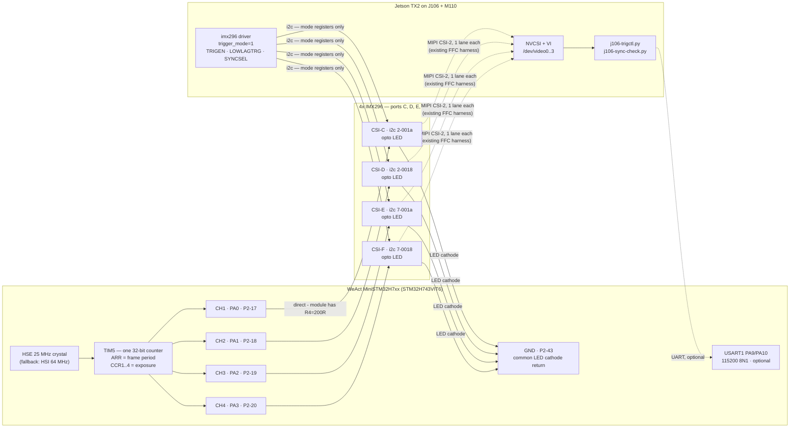

# Hardware trigger — wiring for 4× IMX296 on J106/TX2

Synchronising the four IMX296 global-shutter modules (ports C–F) by driving their `XTRIG` input
from a **WeAct MiniSTM32H7xx** hardware timer.

- **Why an external MCU and not the TX2** → [§1](#1-why-the-trigger-does-not-come-from-the-tx2)
- **The trigger input is opto-isolated** (measured) → [§3](#3-the-trigger-input-is-opto-isolated--measured). It needs **current, not voltage**, so read §3 and §4.1 before wiring.
- **A working reference exists**: the same module triggers correctly on a Raspberry Pi Zero W
  → [§9b](#9b-pi-side-reference-rig--the-same-trigger-working-2026-08-27). This disproves §9a's
  leading hypothesis — `XTR±` *does* reach `XTRIG`, so the TX2 fault is on the TX2 side.
- Design rationale and alternatives: [`openspec/changes/add-imx296-hw-trigger/design.md`](../openspec/changes/add-imx296-hw-trigger/design.md)

---

## 1. Why the trigger does not come from the TX2

The question was asked directly, so here is the evidence rather than the conclusion.

**The TX2 has no usable hardware-PWM pin on this carrier.**

| Check | Result |
|---|---|
| Pads on tegra186 that can mux to a PWM function | only `gp_pwm6_pl6`, `gp_pwm7_pl7`, `uart5_rx_px5`, a few DIS/SEN pads |
| Of those, broken out on J106/M110 | **`FAN_PWM` only** — `pwm@c340000`, already owned by `pwm-fan`, through an *inverting open-drain MOSFET* |
| `uart5_rx_px5` | already hogged to `spi3` for the on-board MPU-9250 IMU |
| Pins actually muxed to PWM on the running board | **none** (`/sys/kernel/debug/pinctrl/2430000.pinmux/pinmux-pins`) |

So a TX2-sourced trigger would be a **software-toggled GPIO**. There are free ones — e.g.
`GPIO11_AP_WAKE_BT` = gpio **389** = `GPIO_PQ5_PI5`, MUX and GPIO both unclaimed, exposed on M110
`J21` pin 8 — but in IMX296 Fast Trigger mode **the `XTRIG` low pulse width *is* the exposure time**.
Scheduler jitter therefore lands directly on image brightness: ±100 µs of jitter (typical for
userspace GPIO on this non-RT 4.9 kernel, worse under load) is ±2 % exposure error on a 5 ms
exposure, frame to frame.

The STM32H7's `TIM5` produces the same pulse in hardware with an 8.33 ns tick and no jitter at all.

> **Note:** none of this is about *inter-camera* sync — one net fanned out to four cameras is
> perfectly synchronous whatever drives it. It is about *exposure stability*, which the pulse-width
> encoding makes a timing problem.

---

## 2. Signal chain



**The optocouplers keep the two domains genuinely separate:**

| | carries | over |
|---|---|---|
| **Trigger** | when to expose, and for how long | 8 conductors as 4 twisted pairs (§5), MCU → cameras, **galvanically isolated** |
| **Control** | which mode the sensor is in, gain, readout | existing CSI/I²C harness, TX2 → cameras |

The TX2 never touches the trigger wiring. The MCU never touches I²C, and never shares a ground with
the cameras. Nothing about the existing camera harness, device tree or DTB changes.


**Two domains, deliberately kept apart:**

| | carries | over |
|---|---|---|
| **Trigger** | when to expose, and for how long | 2 new wires (`XTRIG`, `GND`), MCU → cameras |
| **Control** | which mode the sensor is in, gain, readout | existing CSI/I²C harness, TX2 → cameras |

The TX2 never touches the trigger wire. The MCU never touches I²C. Nothing about the existing
camera harness, device tree or DTB changes.

### Waveform

```
        <-------------------- frame period (1/fps) -------------------->
        ______                                                    ______
XTRIG         |__________________________________________________|
              <----------- exposure - 14.26 us ------------------>
              |
              +-- exposure starts here (Fast Trigger: immediate on assertion)
```

- `t_exposure = t_pulse + 14.26 µs` ← the sensor adds a fixed offset, and the optocoupler adds its
  own on/off asymmetry; the firmware **subtracts both** from what you ask for (`skew`, §6).
- The diagram shows the signal *at the sensor*. What this board drives is the **LED**, and whether
  LED-on means asserted is a module fact behind the isolation barrier — hence the firmware's `pol`
  command. Default idle is **LED off**, so an idle or unpowered board cannot hold a sensor inside an
  exposure.

### Datasheet limits (all-pixel 1456×1088 readout)

| Quantity | Value | Where from |
|---|---|---|
| 1 H | `HMAX`/74.25 MHz = 1100/74.25 MHz = **14.8148 µs** | `HMAX` is in units of an internal 74.25 MHz reference, **independent of INCK** |
| `tTGPD` — next-trigger prohibited | 1126 H = **16.6815 ms** → **max 59.95 fps** | Fast Trigger parameter list |
| `tTGSE` — min pulse | 0.05 µs → min exposure ≈ **14.31 µs** | Fast Trigger parameter list |
| `tOFFSET` | **14.26 µs** | Exposure formula |
| `XTRIG` input | OVDD = **1.8 V**; VIH **1.44 V**; VIL **0.36 V**; **abs max 3.3 V** | DC characteristics |

Source: [`IMX296LQR-C_Fulldatasheet_Awin.pdf`](../IMX296LQR-C_Fulldatasheet_Awin.pdf) (repo root).

---

## 3. The trigger input is opto-isolated — MEASURED

The module's `XTR+`/`XTR−` pads are **an optocoupler LED**, galvanically isolated from the module's
own ground. Measured on the hardware, not inferred:

| Measurement | Result | Meaning |
|---|---|---|
| `XTR+` ↔ `XTR−`, diode mode | **1.2 V** one way, **OL** reversed | An LED junction. Too high for silicon (~0.7 V) or Schottky (~0.3 V); right for a GaAs emitter. |
| `3V3` pad ↔ module GND, powered | **3.3 V** | The ground reference is real — this is what makes the two rows below trustworthy. |
| `3V3` pad ↔ module GND, unpowered | **1.9 kΩ** | Probe contact is good, so an OL elsewhere means open, not a bad probe. |
| `XTR−` ↔ GND, powered | **OL** | Floating. |
| `XTR+` ↔ GND, powered | **OL** | Floating. |

**The vendor manual confirms it and names the part.** The Inno-Maker IMX296 module manual
(`manuals.plus/inno/imx296-sensor-module-manual`) documents the trigger input as optocoupled through
a **TLP281**, calls the pads `XTR（Trig+）, GND(Trig-)`, and says "multiple cameras can be connected
to the same pulse".

**Critically, it also states the module carries its own series resistor: `R4 = 200 Ω`.**

That single fact resolves both of the confusing bench readings *and* removes the need for any
external component:

- A 200 Ω resistor in series with the LED is why **resistance mode reads OL / tens of MΩ** — the
  Ω-range test voltage cannot turn on a 1.25 V LED through 200 Ω. Diode mode reads the LED drop plus
  the small drop across R4 at the meter's test current, i.e. **~1.2–1.45 V**. The two readings never
  conflicted.
- The manual's sizing formula is `R_total = (Vcc − Vf) / If` with `Vf = 1.25 V` and `If = 20 mA`
  recommended. R4 already supplies 200 Ω of that total.

### What this changes — mostly for the better

- **The 1.8 V level problem is gone.** `XTRIG` itself is a 1.8 V input with a 3.3 V absolute
  maximum, but we never touch it: the opto's own output drives it, inside the module. **No level
  translation, no divider, and no way to over-volt the sensor from out here.**
- **No ground connection to the cameras.** The LED's cathode returns to *this board's* ground, not
  the module's. No star grounding, no ground loops, no shared return.
- **But it needs current, not voltage** — which is what forces the topology in §4.

### Consequences to hold on to

1. **One GPIO cannot drive four.** Each input draws ~10 mA at 3.3 V (see §4.1); four in parallel is
   41 mA from one pin, over the STM32's 25 mA absolute per-pin limit. Series is worse — 4 × 1.25 V
   of LED drop, more than a 3.3 V pin can push. Hence **one channel per camera** (§4.1). They still
   share one timer counter, so the frame start is identical by construction.
2. **The pulse *sense* is unknown.** Whether driving the LED asserts `XTRIG` or releases it depends
   on the module's internal wiring, which is behind the isolation barrier and cannot be probed from
   outside. The firmware has a runtime `pol` command for this; the default is idle-LED-off, the safe
   state.
3. **The TLP281 is slow, and pulse width is exposure.** It is a phototransistor opto: response
   times are single-digit µs typical, spec'd to ~18 µs, and **strongly dependent on forward
   current**. Turn-on and turn-off differ, so the sensor integrates slightly longer or shorter than
   commanded. This is **identical on all four cameras**, so *synchronisation is unaffected* — only
   absolute exposure. Measure once, set it with the firmware's `skew` command. It also puts a floor
   on the shortest usable exposure: expect **~100 µs** rather than the sensor's own 14 µs.
   Driving at 5 V (17.8 mA) switches noticeably faster than at 3.3 V (10.3 mA) — see §4.1b.
4. **LED polarity.** With the meter's red (positive) lead on `XTR−` it conducted, so `XTR−` is the
   **anode** and `XTR+` the cathode — the opposite of what the labels suggest, so confirm before
   soldering. Getting it backwards is **harmless**: 3.3 V reverse is inside a typical 5 V LED
   reverse rating, so you get no frames and you swap the two wires.

> **If the opto's part number is legible** on the module (a small 4-pin package near the pads),
> record it — it fixes the expected forward current and switching times, which is what sets the
> minimum usable exposure. An `817`-class part is slow (tens of µs); a `6N137`/`TLP2361`-class logic
> opto is fast (~50 ns).

## 4. Wiring tables

### 4.1 Trigger — MCU → 4 cameras (required)

**No external components at all** — the module's own `R4 = 200 Ω` sets the LED current, so the
STM32 pins connect straight to the trigger pads. **8 conductors**: four signals and four returns,
run as four twisted pairs. (It is five *nets*, but the ground node still has to reach four separate
boards — see §5.) One TIM5 channel per camera, all four on the
same counter — so the frame start is identical across cameras by construction, while each channel
can carry its own exposure. No connection to camera ground anywhere.

```
  PA0  (P2-17) -----------------> Trig+   CSI-C      If = (3.3 - 1.25) / 200
  PA1  (P2-18) -----------------> Trig+   CSI-D         = 10.3 mA per camera
  PA2  (P2-19) -----------------> Trig+   CSI-E      (200R is ON THE MODULE)
  PA3  (P2-20) -----------------> Trig+   CSI-F
                                    |
  GND  (P2-15) ---------------------+      common Trig- return
```

| From (WeAct board) | Silkscreen | Header pin | → | To |
|---|---|---|---|---|
| `TIM5_CH1` | **`A0`** | P2‑17 | → | CSI‑**C** `Trig+` |
| `TIM5_CH2` | **`A1`** | P2‑18 | → | CSI‑**D** `Trig+` |
| `TIM5_CH3` | **`A2`** | P2‑19 | → | CSI‑**E** `Trig+` |
| `TIM5_CH4` | **`A3`** | P2‑20 | → | CSI‑**F** `Trig+` |
| Ground | **`GND`** | P2‑15 | → | `Trig−` × 4 — one return per channel, two wires on the GND pin (§5) |

> ### ⚠ These pins changed — `PE9/PE11/PE13/PE14` are now the display
> Earlier revisions of this document put the trigger on `TIM1` at `E9`/`E11`/`E13`/`E14`
> (P2‑32/34/36/37), chosen when the on-board TFT-LCD header was assumed unpopulated. On a board with
> the display fitted those pins **are** the panel — `E11` = CS, `E13` = WR_RS, `E14` = MOSI. Wiring
> the optocouplers there now drives four trigger signals into the LCD.
>
> The trigger moved to `TIM5` on `A0`–`A3`, which this board leaves free. A side benefit: `TIM5` is
> a 32-bit counter, so the auto-prescaler stays at 1 and pulse resolution is one timer tick —
> **8.33 ns**, against ~517 ns on 16-bit `TIM1`.

4 × 10.3 mA = 41 mA total, spread across four pins — each well inside the STM32's 25 mA per-pin
limit.

⚠ **The four channels zig-zag between the header's two columns.** `A0` and `A2` are odd-numbered
(left column); `A1` and `A3` are even (right column). They occupy two adjacent rows, with a `GND` pin
one row above `A0` — convenient, but easy to mis-count. See the pin map in §5 before soldering.

> ### ⚠ Do NOT add a series resistor at 3.3 V
> The module already has `R4 = 200 Ω`. At 3.3 V that is *more* resistance than 20 mA would need
> (`(3.3 − 1.25)/0.02 = 102 Ω`), so the input **cannot be overdriven from a 3.3 V rail** — and any
> resistor you add only starves it. An extra 220 Ω would drop the current to 4.9 mA, roughly halving
> it and making an already-slow optocoupler slower. External resistance is only needed at higher
> supply voltages: the manual's own example is 12 V → 537.5 Ω total → 337.5 Ω external.

**Polarity.** The manual says `XTR (Trig+)` is the anode. A bench diode test on this rig suggested
the opposite (`XTR−` conducting with the meter's red lead on it), and this module is not identical
to the manual's board — it has `MAS`/`XVS`/`XHS` pads that one lacks. **Confirm per module** in
diode mode: the anode is the pad that conducts with the red lead on it. Backwards is harmless — no
frames, swap the two wires — never damaging.

**Checking the current once wired:** you cannot measure across R4 (it is on the module), so measure
the pin voltage instead. With a channel asserted, `PA0`→`GND` should sit near 3.3 V minus very
little; the current is then `(3.3 − 1.25 − V_pin_drop)/200`. Simpler: confirm the module responds,
and calibrate timing with `skew`.

### 4.1a Where the M110's power rails are

Relevant if you drive the LEDs from the carrier instead of from the MCU pins.

| Connector | Pin | Rail | Notes |
|---|---|---|---|
| `J23` power out | 1 | **3.3 V SATA** | on-board **3.3 V / 3 A** converter — the best 3.3 V tap |
| `J23` | 2 | 3.3 V | shared carrier rail passed through from the J106 |
| `J23` | 3 | 1.8 V | max 50 mA; too low for the LEDs (`(1.8−1.25)/200` = 2.75 mA) |
| `J23` | 4 | GND | |
| `J22` UART2 | 1 | **5 V** | "same as USB 2.0 (J17)" — the tidiest 5 V tap, and the same connector carries the optional serial link |
| `J29` buttons, SPI/GPIO hdr | 1 | 5 V | "no current limiter, 1 A max" |

**There is no 5 V on `J23`.** Four LEDs draw 41 mA total, which none of these rails notice.

Paralleling all four anodes onto one rail is safe **because each module has its own `R4`** — LEDs
sharing a single resistor would current-hog, but these do not share one.

Note that at 3.3 V an external rail gains nothing over driving the STM32 pins directly: the current
is `(3.3 − 1.25)/200` = 10.3 mA either way, R4 sets it, and a rail needs a switching element added
back (a rail wired straight to `Trig+` holds every trigger permanently asserted). It only pays at
5 V — see below.

### 4.1b Optional — 5 V drive for a faster optocoupler

The TLP281's switching speed improves substantially with forward current. If `skew` calibration
shows the lag is hurting short exposures, drive the LEDs from 5 V instead:

```
    +5V (WeAct P2-42, or M110 J22 pin 1 - NOT J23, which has no 5V)
     |
     +----+----+----+----+          If = (5 - 1.25 - 0.2) / 200
     |    |    |    |                  = 17.8 mA   (near the manual's
   Trig+ x4 (C, D, E, F)                            recommended 20 mA)
     |    |    |    |
   Trig- x4 -------+
                   |
               Collector
             2N2222 (verify pinout in diode mode - TO-92 varies)
  PA0 --[1k]-- Base
               Emitter
                   |
                  GND   (same ground as that +5V)
```

Still **no LED series resistors** — R4 does that job at 5 V too. Trade-offs versus §4.1: one
transistor switches all four LEDs together, so **all four cameras share one exposure**, and you lose
the per-channel `exp <ch>` capability. Add a 10 kΩ base→emitter resistor to hold the transistor off
while the GPIO floats during reset.

Four transistors (one per channel) would give both faster switching *and* per-camera exposure. A
single **ULN2003** does the same in one package — seven channels, inputs that take 3.3 V logic
directly, no base resistors — at `(5 − 1.25 − 1.0)/200` = 13.8 mA after its Darlington drop.

**Grounds:** with the rail coming from the carrier, the MCU's ground must tie to the carrier ground
for the base/input current to return. Already true if the WeAct is powered from `J22` 5 V or a TX2
USB port. This gives up isolation only on the *drive* side; the barrier protecting the sensor is
inside the optocoupler and is untouched.

### 4.2 Serial control link — MCU ↔ TX2 (optional, 3 nets)

Only needed to change fps/exposure at runtime. **The rig triggers without it** — the firmware boots
with defaults and starts on its own.

| From (WeAct) | Silkscreen | Header pin | → | To (M110 `J22`, UART2, 3.3 V TTL) | Pin |
|---|---|---|---|---|---|
| `USART1_TX` (`PA9`) | **`A9`** | P1‑27 | → | `UART2_RXD` | 3 |
| `USART1_RX` (`PA10`) | **`A10`** | P1‑26 | ← | `UART2_TXD` | 2 |
| `GND` | **`GND`** | P2‑43 | — | `GND` | 6 |

**Which `/dev/ttyTHS*` is `J22`?** → **`/dev/ttyTHS1`**, identified on the bench 2026‑08‑26 with the
MCU attached and running: writing `status` to it at 115200 returned camtrig's report, and a limit
refusal came back byte-identical to the same command over USB CDC. `ttyTHS2` and `ttyTHS3` are
silent. Wiring as tabled above (`A9`→pin 3, `A10`→pin 2, `GND`→pin 6) is correct as printed — no
crossing surprise.

The loopback procedure below is kept for a board where the mapping differs or the MCU is not yet
attached. It is not derivable from the running tree: no UART pin is claimed in `pinmux-pins`.

```bash
# On the TX2, with J22 pins 2 and 3 shorted together (loopback), no MCU attached:
for t in /dev/ttyTHS1 /dev/ttyTHS2 /dev/ttyTHS3; do
  stty -F $t 115200 raw -echo 2>/dev/null || continue
  timeout 2 cat $t > /tmp/rx.$$ & sleep 0.3; printf 'PING\n' > $t; wait
  echo "$t -> $(cat /tmp/rx.$$)"; rm -f /tmp/rx.$$
done   # the one echoing PING is J22
```

**Zero-ambiguity fallback:** any USB-TTL dongle in a TX2 USB port → `/dev/ttyUSB0`, wired to
`A9`/`A10`/`GND`. `j106-trigctl.py --port` takes either.

### 4.3 Power for the WeAct board

Pick **exactly one**. Never both — back-feeding VBUS through the board's 5 V rail is a good way to
lose the board.

| Option | Wiring | Notes |
|---|---|---|
| **From M110 `J22`** | `J22` pin 1 (5 V) → WeAct `5V` (P2‑42); `J22` pin 6 → `GND` | One connector powers **and** talks. Recommended when using §4.2. |
| **USB-C** | plug into a TX2 USB host port | Also the flashing path (§6). Recommended when *not* using §4.2. |

M110 `J23` also offers 3.3 V (pin 2) and **1.8 V (pin 3, ≤50 mA)** — the 1.8 V rail is there if you
ever want a proper level translator's B-side supply instead of the §3.4 divider.

> **Verify against your board.** The Auvidea M90/M100/M110 manual's M110 chapter is literally
> "1. to be added" — the `J21`/`J22`/`J23` pinouts above are from the M100 sections of that shared
> document. Confirm the connector exists and count pins before soldering.

### 4.4 Optional — trigger echo back to the TX2 (future)

Not part of this change. If you later want kernel-timestamped trigger edges, `GPIO11_AP_WAKE_BT`
(gpio **389**, M110 `J21` pin 8) is free and unclaimed — but it is a **1.8 V unbuffered** input, so
it needs the same treatment as §3.4 in reverse. `GNSS_PPS` (`J21` pin 7) is the semantically nicer
pin if it maps to a Tegra GPIO on TX2.

---

## 5. Cable practice and harness topology

The isolation removes most of what usually makes this fiddly — there is no shared ground with the
cameras, so no ground loops and no star-point discipline.

### Header layout — mind the column

```
        WeAct P2 header  (odd | even)      silkscreen
   row  7    13 GND  | 14 V+              GND  V+     <- Trig- return
   row  8    15 PA0  | 16 PA1             A0   A1     <- CH1 | CH2
   row  9    17 PA2  | 18 PA3             A2   A3     <- CH3 | CH4
   row 10    19 PA4  | 20 PA5             A4   A5
   ...
   row 16    31 PE8  | 32 PE9             E8   E9     <- (old CH1 - now free)
   row 17    33 PE10 | 34 PE11            E10  E11    <- LCD backlight | LCD CS
   row 18    35 PE12 | 36 PE13            E12  E13    <- LCD SCK       | LCD WR_RS
   row 19    37 PE14 | 38 PE15            E14  E15    <- LCD MOSI
```

All four channels sit in **two adjacent rows**, with a `GND` pin in the row immediately above `A0`.
They **zig-zag between the columns**: `A0`/`A2` are odd (left), `A1`/`A3` are even (right). Read the
silkscreen label next to each hole rather than counting rows — the labels are printed per pin and
are the authoritative reference.

⚠ **`PE10`–`PE14` are the on-board TFT-LCD connector and are now driven as the display.** Do not wire
the trigger there. Earlier revisions of this document did; see the box in §4.1.

### Harness topology — count conductors, not nets

The trigger is **5 nets** (four signals plus one ground node), and it is tempting to call that
5 wires. It is not. The ground node has to physically reach four `Trig−` pads on four separate
boards, so in a star from the MCU:

| Topology | Nets | **Conductors leaving the MCU** |
|---|---|---|
| Common return, star | 5 | 4 signal + 4 return = **8** |
| Four twisted pairs | 8 | 4 signal + 4 return = **8** |

**The same.** So twisting costs nothing and is strictly better — each LED loop is closed with
minimal enclosed area instead of four loops sharing an ill-defined return path.

```
  PA0  p17 ===+=====================> Trig+   CSI-C
  GND  p43 ===+   twisted pair         Trig-

  PA1  p18 ===+=====================> Trig+   CSI-D
  GND  p43 ===+                        Trig-

  PA2  p19 ===+=====================> Trig+   CSI-E
  GND  p44 ===+                        Trig-

  PA3  p20 ===+=====================> Trig+   CSI-F
  GND  p44 ===+                        Trig-

  the four returns share p43 / p44 at the connector - two wires per GND pin
```

**Daisy-chaining the return** is the only way to reduce the conductor count at the connector — one
wire to the first camera, then jumpers between cameras: 5 from the MCU, but still 8 segments
overall. Not recommended:

- On a BEV rig the four cameras point in four directions and are far apart, so a return threaded
  between them encloses a large loop.
- One broken jumper silently kills every camera downstream of it, and the symptom (some cameras
  stop triggering) does not obviously point at a wire.

### What actually matters, either way

- **Short runs** — under ~30 cm.
- **Do not run alongside the CSI FFCs.** Cross them at right angles if you must; they are the
  noisiest thing on the carrier.
- **Keep the return adjacent to the signals** in the bundle, not routed off on its own — that is
  what sets loop area in Option B.
- **No series resistors** — the module's own `R4 = 200 Ω` sets the current (§4.1). Only a supply
  above ~3.3 V needs external resistance.

## 6. Firmware — build and flash

See [`firmware/README.md`](firmware/README.md). In short:

```bash
cd hw-trigger/firmware && make          # arm-none-eabi-gcc -> build/camtrig.bin
# hold BOOT0, tap NRST, release BOOT0  -> ROM DFU bootloader
dfu-util -a 0 -s 0x08000000:leave -D build/camtrig.bin
```

No debugger needed — the STM32 ROM bootloader provides USB DFU, and `dfu-util` is already on the
build host.

Two commands exist specifically for the optocoupler, both settable at runtime over the serial link:

| Command | For |
|---|---|
| `pol <0\|1>` | Which way round the pulse drives the LED. `1` (default) = the pulse turns the LED **on**, so idle is LED-off. Use `0` if the module asserts `XTRIG` when the LED is *off*. |
| `skew <ns>` | The opto's turn-on/turn-off delay asymmetry, subtracted from the pulse alongside the sensor's own 14.26 µs. Measure once per module type. |

---

## 7. Bring-up order

Each step is reversible and fails loudly rather than silently.

1. **Confirm LED polarity** on each module (diode mode; anode is the pad that conducts with the red
   lead on it) and record it in §9.
2. **Flash** the firmware (§6 — `make flash`, no BOOT0 press needed). With nothing connected, the
   `PE3` LED blinks a steady **1 Hz** (0.5 s on, 0.5 s off): it toggles every 15 emitted pulses, so
   the rate is derived from the real timer clock and a wrong clock tree is visible by eye. A *fast*
   flash in repeating groups is a fault code, not the heartbeat — see `firmware/README.md`.
   The **on-board TFT** shows rate, exposure and a live pulse count. `status` over USB
   (`/dev/ttyACM*`) or `USART1` confirms clock source, period and per-channel pulse widths.
3. **Check a channel before it meets a camera.** A DMM on DC across `PA0`→`GND` reads the average:
   at 30 fps / 5 ms with the default active-high polarity that is `3.3 × 0.15 ≈ 0.5 V`. Reading
   ~2.8 V instead means the polarity is inverted — fix with `pol` before wiring.
4. **Wire one camera first** (§4.1) — two wires, no components — cameras still free-running
   (`trigger_mode=0`).
5. **Enable trigger mode** and confirm that one camera still delivers frames:
   `echo 1 | sudo tee /sys/module/imx296/parameters/trigger_mode`, then restart capture. `dmesg`
   must show `EXTERNAL TRIGGER`.
   - **No frames?** Try `./j106-trigctl.py raw 'pol 0'` — the module may assert on LED *off*. If it
     still fails, swap that camera's two wires (the LED may be reversed).
6. **Calibrate the opto delay.** With a known commanded exposure, compare image brightness against
   the same exposure free-running, or scope the module's `XVS` pad. Set the difference with
   `./j106-trigctl.py raw 'skew <ns>'`.
7. **Wire the remaining three**, then re-run `j106-sync-check.py`.
8. **Count**: `./j106-trigctl.py burst 300` and confirm each camera delivered 300 frames.

**Rollback at any point:** `echo 0 > /sys/module/imx296/parameters/trigger_mode` and restart
capture. No reboot, no reflash, no DTB change.

## 8. What this does *not* do

- **Exposure accuracy depends on the optocoupler.** Its turn-on and turn-off delays differ, so the
  sensor integrates for slightly more or less than commanded until `skew` is calibrated. This is
  identical on all four cameras, so it does not affect synchronisation. It also puts a floor of
  roughly 100 µs on the shortest usable exposure, well above the sensor's own 14 µs.
- **Argus/ISP exposure control stops working** in trigger mode — Argus cannot drive a wire it does
  not know about. Triggered operation targets raw V4L2 capture.
- **No absolute time reference.** The trigger is a free-running crystal (±20 ppm). Frames are
  synchronous with *each other*, not with GNSS or PTP.
- **Max 59.95 fps** in all-pixel mode — the sensor's `tTGPD` (§2), not a firmware limit.

---

## 9. Measured results

| Step | Result | Date |
|---|---|---|
| `XTR+` ↔ `XTR−`, diode mode | **1.2 V forward, OL reversed** → optocoupler LED | 2026‑08‑25 |
| `3V3` ↔ module GND | **3.3 V** powered / **1.9 kΩ** unpowered → ground reference verified | 2026‑08‑25 |
| `XTR−` ↔ GND, `XTR+` ↔ GND, powered | **both OL** → input is galvanically isolated | 2026‑08‑25 |
| ~~LED polarity~~ | ~~red lead on `XTR−` conducts ⇒ `XTR−` = anode~~ — **SUPERSEDED, see below** | 2026‑08‑25 |
| **LED polarity (corrected)** | red lead on **`XTR+`** conducts (1.2 V) ⇒ **`XTR+` = anode**, as the vendor manual says | 2026‑08‑27 |
| **Free-running baseline** — worst skew **2.43 ms**, drift **8.33 µs/s** over 20 s, 4× IMX296 @ 30.01 fps | **measured** | 2026‑08‑25 |
| Optocoupler part number | **TLP281**, per the vendor manual; on-module `R4 = 200 Ω` ⇒ 10.3 mA at 3.3 V, no external resistor | 2026‑08‑25 |
| Working polarity (`pol 0` or `1`) | _blocked — neither produces frames, see §9a_ | |
| `skew` calibration | _blocked_ | |
| Triggered inter-camera spread | _blocked_ | |
| Frame count vs trigger count over 300 pulses | _blocked_ | |

> ⚠ **The 2026‑08‑25 polarity result was wrong, and the reason matters.** It was taken with the
> meter's test leads in the wrong jacks — the same session read the 5 V rail as **−5 V**, which was
> not noticed at the time. Every DC and diode reading from that session has inverted sign, so the
> anode was identified backwards. The 2026‑08‑27 retest was done after validating the meter against
> a known signal (`A0` reading a clean 30 Hz and 486 mV), and agrees with the vendor manual.
>
> Lesson for anyone repeating this: **validate the meter on a signal of known value before trusting
> a polarity result.** A reversed-lead diode test looks perfectly plausible and points you the wrong
> way.

### 9a. Trigger bring-up attempt — 2026‑08‑26/27

Port C wired (`A0` → `XTR+`, `GND` → `XTR−`). **No frames in any configuration.** The drive side
and the sensor side each verify correct; the link between them does not.

**Vendor reference circuit** — InnoMaker `CAM-IMX296RAW` manual §2.5.1, kept alongside as
`hw-trigger/CAM-IMX296RAW-UserManual-V2.0.pdf`. Their trigger connector is `J3` (`TRIG+`/`TRIG−`,
spec **"3.3 V–5.0 V External Trigger Input"**):

```
  DOVDD ──── 4 ┃ PS2901-1 ┃ 1 ──── R4 200R ──── J3-1  TRIG+
                ┃   opto   ┃
  FSIN ─────── 3 ┃         ┃ 2 ──────────────── J3-2  TRIG−
    │
   R5 10k
    │
   GND
```

Two consequences, **if our module matches this circuit**:

1. The output is an **emitter follower with a pull-DOWN**, not open-collector with a pull-up.
   LED on ⇒ `FSIN` HIGH; LED off ⇒ R5 pulls it LOW. `XTRIG` being active-low, **the exposure
   happens while the LED is OFF**.
2. Therefore **`pol 0` is correct and `pol 1` is the unsafe idle** — the reverse of §4.1's reasoning.
   The vendor's own script confirms it: `gpioset 23=1` for ~2 s (idle), then `23=0` for 3.3 ms (the
   exposure). Idle HIGH, pulse LOW.

⚠ §4.1 argues `pol 1` is the safe default because "idle-LED-off cannot hold a sensor inside an
exposure". **For this circuit that is backwards** — idle-LED-off *is* the exposing state. Flagged
rather than rewritten, because it is unconfirmed that our module has this circuit: ours carries
`MAS`/`XVS`/`XHS` pads this board lacks entirely, and its `XVS` reads dead while streaming.

`pol 0` was tested at 5 ms/30 fps, 20 ms/5 fps and 100 ms/2 fps regardless — no frames. So this does
not resolve the failure; it does confirm our method matches the vendor's documented one, including
the 3.3 V drive level.

**Isolation re-verified 2026‑08‑27** — with the trigger wires *disconnected* and everything powered
off, probing from each pad to carrier ground (which reaches the module through the CSI ribbon):

| Pad → carrier GND | Reading | Meaning |
|---|---|---|
| `XTR−` | **OL** | isolated |
| `XTR+` | **OL** | isolated |
| `3V3` | 64 Ω | unpowered rail: decoupling + IC leakage, not a short |
| `XHS` / `XVS` | 112 kΩ | a real path to something — *not* an unconnected pad |

**This confirms §3's optocoupler finding.** Only the *polarity* from the 2026‑08‑25 session was
wrong; the isolation was right. Two consequences worth stating plainly:

- **The 3.3 V drive is safe.** `XTRIG` is 1.8 V logic with an absolute maximum of `OVDD + 0.3 V` =
  2.1 V, but the optocoupler means the sensor never sees it — the 3.3 V only ever drives an LED.
  The §3.4 divider is *not* needed. All four cameras capture normally, confirming no damage.
- **The fault is downstream of the optocoupler**, on its output side, where we cannot probe.

⚠ The 112 kΩ on `XVS` is hard to reconcile with it reading only mains hum while the sensor was
streaming at a measured 59.34 fps with `SYNCSEL = 0xC0` (drive, not Hi-Z). A pad connected to a
driven output should have shown ~60 Hz. Left as an open contradiction rather than explained away.

**Drive side — measured**

| Measurement | Value | How |
|---|---|---|
| `A0` → `GND`, DC | **486 mV** | DMM average |
| `A0` → `GND`, frequency | **30 Hz** | DMM Hz |
| Current, `A0` in series to `XTR+` | **1.5 mA** | DMM mA, average |

Derived at the 14.957 % duty (`CCR`/(`ARR`+1) = 598288/3999999):

| Quantity | Value |
|---|---|
| Pin voltage during pulse | 3.25 V |
| LED current during pulse | **10.0 mA** |
| Drop across on-module `R4` (200 Ω) | 2.01 V |
| Implied LED forward voltage | **1.24 V** |

The derived 1.24 V and the static diode-test 1.2 V are independent routes to the same number,
agreeing within 40 mV. **The LED really is conducting ~10 mA at 15 % duty.**

**Sensor side — I²C readback while streaming in trigger mode**

| Register | Value | |
|---|---|---|
| `0x300B` TRIGEN | `0x01` | ✓ trigger enabled |
| `0x30AE` LOWLAGTRG | `0x01` | ✓ fast trigger |
| `0x3036` SYNCSEL | `0xF0` | ✓ Hi-Z (`0xC0` when free-running) |
| `0x3000` STANDBY | `0x00` | ✓ streaming |
| `0x3002` XMSTA | `0x00` | ✓ master operation released |

`dmesg` confirms `imx296 2-001a: streaming: EXTERNAL TRIGGER (XTRIG, fast trigger)`.

**Configurations tried, all producing no frames**

`pol 1` and `pol 0`, each at 5 ms/30 fps, 20 ms/5 fps and 100 ms/2 fps — six combinations. Then,
written live over I²C mid-stream: `SYNCSEL = 0xC0` (normal instead of Hi-Z), and `LOWLAGTRG = 0`
(sequential instead of fast trigger). Neither changed anything.

**The finding that reframes the problem — `XVS` is dead**

| Condition | `XVS` pad reads |
|---|---|
| Camera streaming at **59.34 fps** (measured over 900 frames), `SYNCSEL = 0xC0` (drive, not Hi-Z) | **49.97 Hz** — mains hum |

Every precondition for `XVS` to be live was satisfied, and the measurement chain was validated on
`A0` minutes earlier. **That breakout pad is not connected to the sensor's `XVS` output.**

This matters more than the trigger failure itself. The module's interface was identified entirely by
multimeter, never from a datasheet, and one of those identifications is now disproven. The assumption
that `XTR±` reaches `XTRIG` rests on exactly the same kind of inference — and it would explain the
whole picture: a correctly driven optocoupler, a correctly configured sensor, and no connection
between them.

**What is needed to proceed:** the module's schematic or pinout — specifically which sensor pin the
`XTR±` optocoupler output drives, what `MAS` selects, and whether the breakout pads require 0 Ω links
to be fitted. Further bench permutations are guesses against an undocumented interface.

Reference data for that enquiry: pads are `3V3 · MAS · XVS · XHS · XTR+ · XTR−`; the sensor
free-runs at 60 fps as master; `XTR±` measures as an isolated LED (1.2 V forward, OL reversed, both
legs open to module ground).

### 9b. Pi-side reference rig — the same trigger, WORKING (2026‑08‑27)

A single IMX296 on a **Raspberry Pi Zero W**, triggered from the Pi's own hardware PWM. Built
specifically to answer the question §9a ends on: is the module's `XTR±` → `XTRIG` path real, or is
it another `XVS`-style inference about an undocumented breakout pad?

**Result: the trigger works.** Frame rate follows the pulse frequency exactly, and exposure follows
the pulse width. **§9a's leading hypothesis is disproven — the module is fine.**

**Rig**

| | |
|---|---|
| Module | Waveshare-style IMX296‑130, back-side pads `3V3 · MAS · XVS · XHS · XTR+ · XTR−`, 4-pin SOP optocoupler adjacent to `XTR+/XTR−`. **Same pad set as the J106 modules.** |
| Host | Pi Zero W Rev 1.1, Raspberry Pi OS Trixie **armhf** (ARMv6 — arm64 will not boot), kernel `6.18.34+rpt-rpi-v6`, **stock** `imx296` driver, unpatched |
| Sensor reported | `imx296 10-001a: found IMX296LQ` (colour), `1456x1088 10-bit RGGB @ 60.38 fps` |
| Trigger source | the Pi's own **BCM2835 hardware PWM** (PWM0) — no MCU, no Pico |

**Wiring**

| From | To |
|---|---|
| Pi `GPIO18` (40-pin header **pin 12**) | `XTR+` |
| Pi `GND` (header **pin 14**) | `XTR−` |

**No external resistor** — the module's own `R4 ≈ 200 Ω` sets `If = (3.3 − 1.25)/200 ≈ 10.3 mA`,
matching the 10.0 mA measured on the TX2 side in §9a. Note the pads are `XTR+`/`XTR−`, a *floating
pair*, not `XTR`/`GND`; they label `3V3` separately, so `XTR−` is deliberately not ground.

⚠ **Do not apply the Raspberry Pi documentation's 1.5 kΩ/1.8 kΩ divider here.** That is for the
*official* RPi Global Shutter Camera, whose `XTR` is a direct 1.8 V logic pin. On an opto input the
divider halves the LED current and it will not switch. The two designs are not interchangeable, and
the failure modes are asymmetric: the divider on an opto merely fails to work, but direct 3.3 V on a
real 1.8 V `XTRIG` pad sits at its absolute maximum. **When unsure, fit the divider first.**

**Polarity is as silkscreened on this module** — `GPIO → XTR+`, `GND → XTR−`, PWM idling HIGH with a
LOW pulse for the exposure. This agrees with §9a's *corrected* reading (`pol 0`: idle HIGH, exposure
while the LED is OFF) and with the vendor's own script. It contradicts §3's note that `XTR−`
measured as the anode. Proven by the exposure sweep below rather than by merely getting frames: an
inverted opto would still give the correct frame *rate*, but brightness would *fall* as commanded
exposure rose.

**Configuration** — `/boot/firmware/config.txt`, needs a reboot:

```
dtparam=audio=off            # the onboard audio owns BOTH PWM channels
dtoverlay=imx296,always-on   # MANDATORY - see below
dtoverlay=pwm,pin=18,func=2  # PWM0 -> GPIO18
```

⚠ **`always-on` is mandatory, and is the single most transferable finding here.** The overlay's own
help text: *"Leave the regulator powered up, **to stop the camera clamping I/Os such as XTRIG to
0V**."* An unpowered module pulls `XTRIG` down and no external pulse can lift it. Note the vendor
reference circuit in §9a shows the optocoupler's phototransistor collector tied to **`DOVDD`** — so
the opto output cannot drive `FSIN`/`XTRIG` high unless the module's own digital rail is up. Any
platform must guarantee the module stays powered across the whole trigger window, not just while a
stream is nominally active.

**Trigger source and maths.** Neither vendor manual's method is good: the InnoMaker manual's
`gpioset` + `sleep` shell loop yields 0.5 fps with shell-scheduling jitter, and the Raspberry Pi
documentation uses a separate Pico. The Pi can do it itself in hardware. Helper:
`imx296-trigger.sh {on <fps> <exposure_us>|off|status}`, which computes

```
period     = 1e9 / fps                      # ns
t_low      = exposure_us * 1000 - 14260     # t_exp = t_low + 14.26 us
duty_cycle = period - t_low                 # normal polarity: duty is the HIGH time
```

then `echo 1 > /sys/module/imx296/parameters/trigger_mode`. **Start the PWM before the camera** —
armed with no pulses arriving, the sensor emits no frames at all and looks hung. Always pass a fixed
`--shutter` to `rpicam-*` so AGC does not fight the trigger.

**Measured** (`rpicam-vid --save-pts`; note the `v2` timecode file is in **milliseconds**):

| Condition | PWM | Measured fps | Interval | sd |
|---|---|---|---|---|
| `trigger_mode=1` | 30 Hz | **30.000** | 33.33 ms | 0.01 ms |
| `trigger_mode=1` | 10 Hz | **10.000** | 100.00 ms | 0.00 ms |
| `trigger_mode=0` *(control)* | 10 Hz, still running | **30.013** | 33.32 ms | 0.01 ms |

The third row is what makes the first two mean anything: free-running, the sensor ignores the pulses
entirely and reverts to its own rate. Without that control, "30 fps at 30 Hz" is a coincidence.

Exposure tracks pulse width at fixed gain (10 fps, `--gain 1.0`):

| LOW pulse | max pixel | ratio vs 1 ms | expected |
|---|---|---|---|
| 1 ms | 8 | 1.0× | 1× |
| 4 ms | 35 | **4.4×** | 4× |
| 10 ms | 73 | **9.1×** | 10× |

Practical minimum exposure is **~100 µs** (the opto is the limit, not the sensor's 14 µs); ceiling
is 59.95 fps.

#### What this changes for the TX2 investigation

§9a concluded: *"The assumption that `XTR±` reaches `XTRIG` rests on exactly the same kind of
inference [as the disproven `XVS` pad] — and it would explain the whole picture."* It then asked for
the module schematic before proceeding.

**That is no longer the leading hypothesis.** The same module type, wired the same way, at the same
~10 mA, triggers correctly on a different host with a different, unmodified driver. `XTR±` does
reach `XTRIG`. The `XVS` pad being dead remains true and unexplained, but it does not generalise to
`XTR±`.

So the fault is on the **TX2 side**. On 2026‑08‑27 both leading code hypotheses were then tested
**on the Pi** — using the working rig to falsify theories cheaply, instead of rebuilding the TX2
kernel — and **both were disproven**:

| Hypothesis | Test | Result |
|---|---|---|
| `SYNCSEL = 0xF0` (Hi‑Z) breaks the trigger. Patch `0003` writes it; the RPi driver **never** does — both `rpi-6.6.y` and `rpi-6.12.y` define `IMX296_SYNCSEL_NORMAL`/`_HIZ` and never write them, so the commit message's claim that these values "follow the Raspberry Pi driver" is wrong. | The stock Pi driver never touches `0x3036`, so writing `0xF0` while stopped **persists into the stream**, exactly reproducing the TX2 state. Verified `0xF0` before *and* after the capture. | **FALSIFIED.** 30.000 fps, 33.33 ms, sd 0.01 ms — identical to `0xC0`. SYNCSEL is innocent. |
| VMAX pinned to `fmt_height + MIN_VBLANK` = **1118** breaks it (vs the Pi's runtime **2249**). Patch `0003` pins VMAX *only* in trigger mode. | Wrote VMAX = `0x00045E` mid-stream on the Pi during a working triggered capture, and compared the rate before/after. | **FALSIFIED as the cause of total failure** — frames continued at 29.869 fps. **But jitter rose from sd 0.02 ms to sd 2.20 ms, a 100× degradation.** A real defect, just not this one. |

**TX2 sensor state verified over I²C during a failing triggered stream** (port D, `2-0018`, while the
STM32 pulsed at 30 Hz with `pol 0`):

| Register | TX2 (fails) | Pi (works) | |
|---|---|---|---|
| `0x3000` STANDBY | `0x00` | `0x00` | ✓ streaming |
| `0x300a` XMSTA | `0x00` | `0x00` | ✓ master released |
| `0x300b` TRIGEN | `0x01` | `0x01` | ✓ |
| `0x30ae` LOWLAGTRG | `0x01` | `0x01` | ✓ |
| `0x3036` SYNCSEL | `0xf0` | `0xc0` | proven irrelevant above |
| `0x3014` HMAX | `0x044c` | `0x044c` | identical |
| `0x3010` VMAX | `0x00045e` (1118) | `0x0008c9` (2249) | jitter only, not fatal |

`dmesg` shows `imx296 2-0018: streaming: EXTERNAL TRIGGER (XTRIG, fast trigger)`, then repeating
`tegra-vi4: PXL_SOF syncpt timeout! err = -11` and `CILA_ERR_INTR_STATUS 0x0000000f` (vs `0x9` when
free-running). Free-running on the same port immediately before captured 60/60 frames, so the port,
sensor, CSI lanes and VI path are all healthy.

**Conclusion: the sensor is armed correctly and identically to the working Pi, and receives nothing.
The remaining explanation is that the trigger pulse is not reaching port D's `XTRIG`.** The software
side of the TX2 is no longer a credible suspect — every functional register matches a rig that
works. §9a wired **port C**, and port C's module has since been moved to the Pi; unless the STM32
channel was physically re-landed on port D's `XTR+`/`XTR−`, port D's sensor has never had a trigger
wire on it.

**Next step is a wiring check, not a code change:** confirm which module the STM32 `TIM5_CH1`/`PA0`
lead is actually attached to, and land it on the port D module's `XTR+`/`XTR−`. Only if a verified
wire still yields no frames does the TX2 driver come back into question.

**Cross-check: the STM32 is exonerated (2026‑08‑27).** The port‑C module — now on the Pi and proven
good — was re-landed on the STM32's `A0`/`GND`, with the STM32 powered and driven from the Pi. The
Pi's own PWM was disabled so the STM32 was the only trigger source:

| STM32 setting | Pi camera measured |
|---|---|
| `pol 1` @ 30 Hz | **30.000 fps**, sd 0.01 ms |
| `pol 1` @ 10 Hz | **10.000 fps**, sd 0.00 ms |
| `pol 0` @ 10 Hz | **10.000 fps**, sd 0.00 ms |

**The STM32's trigger output is fine.** It drives a known-good IMX296 to exact rate lock. Nothing
about the MCU, its timer, its drive level or its wiring harness is implicated.

**Polarity is settled by exposure, not by rate.** Both polarities rate-lock, because the sensor sees
edges at the same frequency either way — which is why §9a's "tried `pol 0` and `pol 1`, no frames"
could never have discriminated them. Brightness does: at the same commanded 5 ms and fixed gain,
`pol 0` → max pixel **117**, `pol 1` → max pixel **11**. **`pol 0` (idle LED ON, exposure while the
LED is OFF) is correct**, confirming §9a's corrected reading and matching the Pi's own PWM
convention (idle HIGH, pulse LOW).

⚠ **This invalidates the port‑D test above.** §9a wired `A0` to **port C**, and port C's module was
later moved to the Pi *with the trigger lead still on it*. So when port D was tested on the TX2, the
STM32 was pulsing into the module that had been relocated to the Pi — **port D never had a trigger
wire attached**. The `PXL_SOF syncpt timeout` there is fully explained by an absent signal, and is
not evidence against the TX2 driver.

**What remains genuinely unexplained is only §9a's original port‑C failure**, where the wire *was*
attached. That same module now triggers correctly on the Pi. Remaining differences, in order:

1. **`always-on` has no TX2 equivalent.** The Pi needs `dtoverlay=imx296,always-on` precisely
   because otherwise the camera *"clamps I/Os such as XTRIG to 0V"*. The vendor circuit ties the
   optocoupler's phototransistor collector to **`DOVDD`**, so the opto cannot drive `FSIN`/`XTRIG`
   unless the module's digital rail is up. Whether the J106 rail is continuously powered, or gated
   around streaming, has never been checked. **This is now the leading hypothesis.**
2. Polarity: §9a's six combinations included `pol 0`, so this is unlikely — but note the STM32
   resets to `pol 1` on every power cycle, so a `pol 0` setting does not survive re-powering.

**Port D driven from the Pi's PWM — still no frames (2026‑08‑27).** With the topology swapped
(Pi camera ← STM32 `A0`; TX2 port D ← Pi `GPIO18`/`GND`), port D still produced zero frames and
`PXL_SOF syncpt timeout`. The Pi's `GPIO18` was verified genuinely driving: `pinctrl` reports
`alt5` claimed by `2020c000.pwm`, and 24 level samples gave **hi=20 / lo=4 = 83 %** against the
commanded 85 % duty.

**Full sensor register diff, both in trigger mode, read live over I²C** (Pi bus 10 @0x1a working;
TX2 bus 2 @0x18 failing):

| Reg | Pi (works) | TX2 (fails) | |
|---|---|---|---|
| `300b` TRIGEN | `0x01` | `0x01` | same |
| `30ae` LOWLAGTRG | `0x01` | `0x01` | same |
| `3000`/`300a` STANDBY/XMSTA | `0x00`/`0x00` | `0x00`/`0x00` | same |
| `3014` HMAX | `0x044c` | `0x044c` | same |
| `3089`–`308c` INCKSEL0‑3 | `b0 0f b0 0c` | `b0 0f b0 0c` | same — **both correctly on 54 MHz INCK** |
| `4114`/`418c`/`4182` magic | `0xc5`/`0xa8`/`0x0440` | `0xc5`/`0xa8`/`0x0440` | same |
| `3022`/`309c`/`3254` | `0x01`/`0x04`/`0x3c` | `0x01`/`0x04`/`0x3c` | same |
| `3036` SYNCSEL | `0xc0` | `0xf0` | differs |
| `3010` VMAX | 2249 | 1118 | differs |
| `308d` SHS1 | 1913 | 14 | differs |
| `3212` GAINDLY | `0x09` | `0x08` | differs (gain delay; cannot stop frames) |

**Every difference was then individually falsified on the working Pi rig:**

| Difference | How tested | Result |
|---|---|---|
| `SYNCSEL = 0xF0` | written while stopped so it persists into the stream (**a true at‑start test** — the stock driver never writes `0x3036`) | 30.000 fps, sd 0.01 ms — **innocent** |
| `VMAX = 1118` | mid-stream **and** at stream start (`--framerate 60` yields VMAX 1124) | 30.000 fps at start; mid-stream 29.869 fps but **jitter sd 0.02 → 2.20 ms** — innocent for frame production, **real defect for timing** |
| `SHS1 = 14` | written mid-stream during a working triggered capture | 30.000 fps before and after — **innocent** |

Note `SHS1` is nonetheless a genuine deviation: the RPi driver writes `SHS1` **unconditionally**
(`trigger_mode` appears only in `imx296_stream_on()`), whereas `0003`'s `set_exposure()` returns
early without writing it when triggered. It does not stop frames, but it is not what the reference
does.

**Where this leaves the diagnosis.** The trigger source is proven (drives a known-good camera, pin
verified toggling). The polarity is proven. The TX2's sensor register state is functionally
equivalent to a rig that works — every difference tested and cleared. Yet the TX2 produces nothing,
on **two different modules** (port C in §9a, port D now), while one of those very modules triggers
correctly on the Pi.

§9a additionally *measured* 10 mA flowing through port C's opto LED on the TX2, so the LED was
genuinely driven there. LED driven + sensor armed + no frames = the fault is on the optocoupler's
**output** side, inside the module, where it cannot be probed — yet that same module's opto output
demonstrably reaches `XTRIG` when the module sits on the Pi.

### ROOT CAUSE FOUND — `0x30af` must be `0x0b`, not `0x09` (2026‑08‑27)

**A one-byte error in patch `0002`\'s `imx296_mode_common[]` table silently disables external
trigger.** Everything else — sensor, modules, trigger source, polarity, wiring, CSI, VI — was
correct all along.

Found by mechanically diffing the two drivers\' init tables (the thing that should have been done
first). Both have **41 entries**; they differ in **exactly one**:

```
RPi imx296_init_table:   { 0x30af, 0x0b }
TX2 imx296_mode_common:  { 0x30af, 0x09 }     <-- the bug
```

`0x30af` sits **immediately adjacent to `0x30ae` = LOWLAGTRG**, the fast-trigger enable. Live
readback confirmed the divergence on the hardware: Pi `0x30af = 0x0b`, TX2 `0x30af = 0x09`, with
`LOWLAGTRG = 0x01` on both.

**Proof.** With the sensor streaming free-running and capturing normally, `0x30af`, `TRIGEN` and
`LOWLAGTRG` were written over I²C mid-stream, every write verified by readback:

```
BEFORE: 30af=0x09  300b=0x00  30ae=0x00     296 frames in 5 s = 59 fps (free-running)
AFTER : 30af=0x0b  300b=0x01  30ae=0x01
frames 385 -> 686 over 10 s  ==>  30 fps    syncpt timeouts: 1 (the transition only)
```

The sensor dropped from its free-run 59 fps to **exactly the 30 Hz trigger rate**. The identical
sequence with `0x30af = 0x09` stops frames dead (295 -> 298 -> 298, then only `PXL_SOF` timeouts) —
that is the entire failure this investigation chased.

⚠ **Always read back i2c writes in this test.** One run appeared to disprove the fix; it had a write
that silently did not land. With readback it reproduces every time.

**Fixed** in `patches/0002-imx296-tegracam-j106.patch`; the two init tables are now byte-identical.
Requires a kernel rebuild + deploy (the driver is built into `Image`, not a module).

**VERIFIED WORKING RANGE — 5 Hz to 59 Hz (2026‑08‑27).** With the fixed kernel (`#8`, `LABEL
j106fix`) and trigger mode selected the normal way (`trigger_mode=1`, no I²C pokes):

| STM32 | Measured | syncpt timeouts |
|---|---|---|
| 59 Hz | **59.08–59.40 fps** | 0 |
| 30 Hz | **30.00 fps** | 0 |
| 20 Hz | **20.00 fps** | 0 |
| 10 Hz | **10.01 fps** | 0 |
| 5 Hz | **5.00 fps** | 1 (marginal — see below) |

⚠ **An earlier claim in this section that "low trigger rates fail" was WRONG and has been removed.**
It came from testing 10 Hz via mid-stream I²C pokes on the *unfixed* kernel, which leaves the sensor
in an indeterminate state. On the fixed kernel 10 Hz locks exactly with zero timeouts. **There is no
VMAX problem and no frame-rate-derived timeout** — that guess was wrong too. The VI timeout is a flat
hardcoded constant:

```
vi4_fops.c:1089:   chan->timeout = msecs_to_jiffies(200);
```

**200 ms, fixed.** That sets the practical floor: at 5 Hz the 200 ms trigger period equals the
timeout exactly, so it works but logs the occasional recovery. Below ~5 Hz it will fail. The ceiling
is the sensor's own 59.95 fps (`tTGPD` 1126 H).

**Why this took so long — worth internalising.** The failure was invisible to every method used:
the register *state* looked right (`TRIGEN=1`, `LOWLAGTRG=1`), the driver flow was identical to
free-running, the modules and trigger sources all proved good in isolation, and no error message
ever named the real cause. Only a **mechanical diff of the complete init tables** found it. Hand-
picking 26 "relevant" registers to compare was the mistake — `0x30af` was never on that list.

**`discontinuous_clk` — a REAL defect, found and fixed (2026‑08‑27).** The IMX296 nodes declared
`discontinuous_clk = "no"` (clock continuous). In trigger mode the sensor's MIPI output is
intermittent, so that declaration was wrong. Changing **only** the four IMX296 nodes to `"yes"`
(the ten IMX219 nodes untouched — they are a separate macro) **eliminated every D-PHY/CIL error**:

| Error type | `"no"` | `"yes"` |
|---|---|---|
| `CILA_ERR_INTR_STATUS 0x0f` | present, interleaved | **zero** |
| `CILA_INTR_STATUS` | present | **zero** |
| `PXL_SOF syncpt timeout` | present | still present |

Free-running is unaffected (60/60 frames, 0 timeouts). Deployed as `/boot/j106imx296-disco.dtb`
under `LABEL j106disco`, with `LABEL j106trig` intact as fallback. **Keep this fix** — it is correct
independently of the trigger fault.

**Complete error signatures** (whole `dmesg`, normalised and counted — not a truncated `head`):

```
trigger_mode=0 -> frames=60
    1  streaming: free-running            <- the ENTIRE log. zero errors.

trigger_mode=1 -> frames=0
   94  PXL_SOF syncpt timeout! err = -N
   94  tegra_channel_error_recovery
    1  streaming: EXTERNAL TRIGGER
```

**THE DECISIVE TEST — arming TRIGEN mid-stream.** With the sensor streaming free-running and
capturing normally, `TRIGEN` and `LOWLAGTRG` were written over I²C *while frames were flowing*,
with the STM32 pulsing at 30 Hz:

| | frames |
|---|---|
| before arming | 295 |
| after arming | 298 (+3) |
| 5 s later | 298 (no change) |

Readback confirmed `TRIGEN=0x01`. **Frames stopped dead.** The receiver was demonstrably healthy one
second earlier, so this is not a VI/NVCSI problem. The sensor entered trigger mode and halted
waiting for an edge that never came.

**Conclusion: the sensor never receives an XTRIG edge while the module is on the TX2.** The absence
of *any* D-PHY, CIL or CHANSEL error corroborates it — the sensor is not transmitting malformed or
mistimed data, it is transmitting nothing at all. Every software hypothesis is now exhausted and
individually falsified; what remains is physical, on the optocoupler's output side, and it must be
measured rather than inferred.

⚠ **Process note.** The CIL errors disappearing was visible in the very output that reported the
test, and was missed because the run was judged on "frames: still zero" alone. Compare **complete,
counted error signatures between configurations**, not the head of a log — the `sigcap.sh` approach
above is the one to use.

**MODULE SWAP DONE — both modules are good (2026‑08‑27).** Port D's module was moved to the Pi and
tested with the Pi's own PWM:

| Condition | PWM | Measured |
|---|---|---|
| Triggered | 30 Hz | **30.025 fps**, sd 0.01 ms |
| Triggered | 10 Hz | **10.000 fps**, sd 0.00 ms |
| Trigger OFF *(control)* | 10 Hz still running | **30.014 fps** — ignores the pulses |

**Both modules — the one that failed on port C (§9a) and the one that failed on port D — trigger
correctly on the Pi.** No module-level explanation survives. Combined with the register diff above
(every difference individually falsified) and the identical driver flow between working and failing
modes, nothing on the sensor or in the TX2 driver accounts for the failure.

⚠ **But there is a physical puzzle that must be resolved before blaming "the TX2 platform".** The
`XTR±` pads are **on the module**, and the trigger lead lands on them directly — the J106 carrier,
its CSI connector and the TX2 itself are **not in the trigger signal path at all**. So a genuine
platform fault could only act through (a) the sensor's register configuration, which has been
verified identical to a working rig, or (b) module power state. That leaves **the physical
connection at the TX2 end** as the most probable remaining variable, despite §9a having measured
10 mA through port C's LED at the time. These are small SMD pads; a pressure or clip contact that
measures fine statically can still fail, and the lead has been moved repeatedly.

**Next test, once the TX2's i2c is recovered:** with a module fitted and probing on the TX2, land
the *same physical lead* that has just been proven to work on the Pi, without re-terminating it, and
retest. If that still yields nothing, the contradiction is real and worth escalating; if it works,
the whole affair was contact integrity.

**TX2 i2c state after the swap.** The newly fitted port C module does not respond at all:
`imx296 2-001a: i2c write failed, 0x3000 = 0` ×5 → `failed to leave standby (-121)` → `board setup
failed`. Bus 2 scans **completely empty** and only `/dev/video0`/`/dev/video1` (both bus 7) exist.
This is the documented address-shifter mis-latch: **only removing power clears it — `reboot` does
not.** Note the Pi is powered from the TX2, so cutting TX2 power cold-cycles both.

**The decisive experiment is now a module swap, not more software:** fit the module that is proven
to trigger (currently on the Pi) onto the TX2's port D connector, and land the same Pi `GPIO18`/`GND`
lead on *its* `XTR+`/`XTR−`. That reduces everything to one variable:
- **Still no frames** → the fault is the TX2 platform (something outside the sensor registers), and
  every module-level explanation is eliminated.
- **Frames** → port D's module has a dead `XTR` path, exactly like the dead `XVS` pad §9a found —
  i.e. these breakout pads are unreliable per-module and must be verified individually.

**Next test:** land `A0`/`GND` on the **port D** module's `XTR+`/`XTR−`, set `pol 0`, and repeat.
That is now a one-variable experiment: every other element in the chain has been independently
proven on the Pi.

Two fixes worth making to `0003` regardless, neither of them the root cause:
1. **Drop the `SYNCSEL` write** — it is not in the reference driver and is unjustified.
2. **Stop pinning VMAX to the bare minimum** — 1118 costs 100× frame-timing jitter on a rig whose
   entire purpose is timing. Track the trigger period the way the RPi driver does (its VMAX equals
   the frame period exactly: 2249 × 14.8148 µs = 33.32 ms at 30 fps).

Also noted while cross-reading: §9a's I²C readback table lists **`0x3002` XMSTA**, but `XMSTA` is
`CTRL0A` at **`0x300a`**. If that is only a typo in the table, ignore it; if `0x3002` is what was
actually read, then master-operation release was never confirmed and that reading should be redone.

### Free-running baseline, in full

`tools/j106-sync-check.py -n 600`, ports C–F, before any trigger wiring:

```
per camera
  node        frames  dropped   mean interval   jitter (sd)
  video0         600        0      33318.6 us        1.6 us   (30.01 fps)
  video1         600        0      33318.4 us        1.5 us   (30.01 fps)
  video2         600        0      33318.4 us        1.5 us   (30.01 fps)
  video3         600        0      33318.3 us        1.5 us   (30.01 fps)

skew relative to video0 (nearest-frame match)
  node             median    max |skew|         drift
  video1       -1125.0 us     1165.0 us      -3.98 us/s
  video2       -2396.0 us     2430.0 us      -3.37 us/s
  video3       -1299.0 us     1382.0 us      -8.33 us/s

verdict: NOT synchronised — free-running.
```

Three things to note, because they are the case for doing this work at all:

1. The cameras sit up to **2.4 ms apart** — about 1/14th of a frame at 30 fps.
2. That offset is **re-randomised on every stream start** (an earlier 200-frame run gave
   `+2767 / +601 / +3058 µs` instead of `−1125 / −2396 / −1299`), so it cannot be calibrated out
   once and reused.
3. It then **drifts** at 3–8 µs/s. The crystals are only 3–8 ppm apart, which is why drift alone is
   a weak test over a short run — and why the check also tests the offset.
