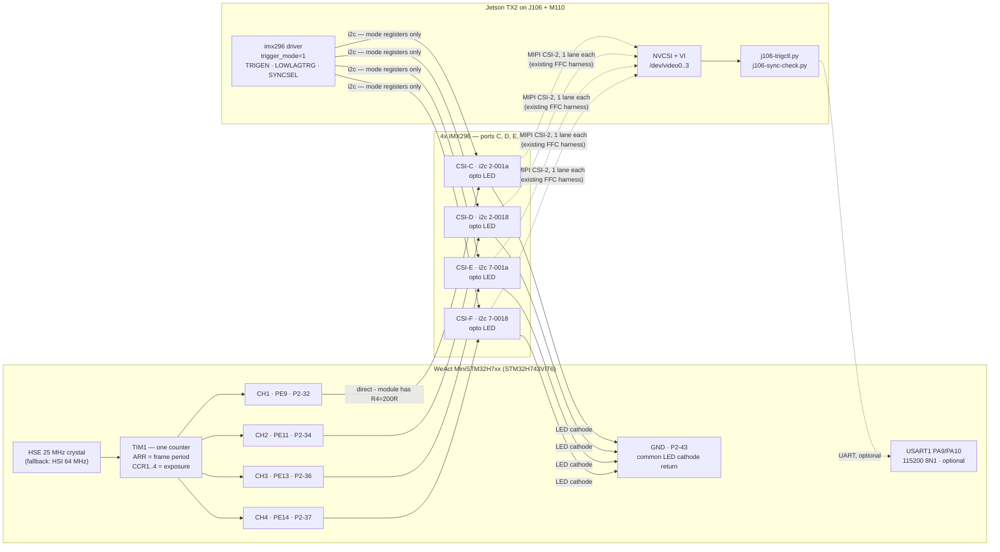

# Hardware trigger — wiring for 4× IMX296 on J106/TX2

Synchronising the four IMX296 global-shutter modules (ports C–F) by driving their `XTRIG` input
from a **WeAct MiniSTM32H7xx** hardware timer.

- **Why an external MCU and not the TX2** → [§1](#1-why-the-trigger-does-not-come-from-the-tx2)
- **The trigger input is opto-isolated** (measured) → [§3](#3-the-trigger-input-is-opto-isolated--measured). It needs **current, not voltage**, so read §3 and §4.1 before wiring.
- Design rationale and alternatives: [`openspec/changes/add-imx296-hw-trigger/design.md`](../openspec/changes/add-imx296-hw-trigger/design.md)

---

## 1. Why the trigger does not come from the TX2

The question was asked directly, so here is the evidence rather than the conclusion.

**The TX2 has no usable hardware-PWM pin on this carrier.**

| Check | Result |
|---|---|
| Pads on tegra186 that can mux to a PWM function | only `gp_pwm6_pl6`, `gp_pwm7_pl7`, `uart5_rx_px5`, a few DIS/SEN pads |
| Of those, broken out on J106/M110 | **`FAN_PWM` only** — `pwm@c340000`, already owned by `pwm-fan`, through an *inverting open-drain MOSFET* |
| `uart5_rx_px5` | already hogged to `spi3` for the on-board MPU-9250 IMU |
| Pins actually muxed to PWM on the running board | **none** (`/sys/kernel/debug/pinctrl/2430000.pinmux/pinmux-pins`) |

So a TX2-sourced trigger would be a **software-toggled GPIO**. There are free ones — e.g.
`GPIO11_AP_WAKE_BT` = gpio **389** = `GPIO_PQ5_PI5`, MUX and GPIO both unclaimed, exposed on M110
`J21` pin 8 — but in IMX296 Fast Trigger mode **the `XTRIG` low pulse width *is* the exposure time**.
Scheduler jitter therefore lands directly on image brightness: ±100 µs of jitter (typical for
userspace GPIO on this non-RT 4.9 kernel, worse under load) is ±2 % exposure error on a 5 ms
exposure, frame to frame.

The STM32H7's `TIM1` produces the same pulse in hardware with a ~40 ns tick and no jitter at all.

> **Note:** none of this is about *inter-camera* sync — one net fanned out to four cameras is
> perfectly synchronous whatever drives it. It is about *exposure stability*, which the pulse-width
> encoding makes a timing problem.

---

## 2. Signal chain



**The optocouplers keep the two domains genuinely separate:**

| | carries | over |
|---|---|---|
| **Trigger** | when to expose, and for how long | 5 wires (4 anodes + 1 common cathode return), MCU → cameras, **galvanically isolated** |
| **Control** | which mode the sensor is in, gain, readout | existing CSI/I²C harness, TX2 → cameras |

The TX2 never touches the trigger wiring. The MCU never touches I²C, and never shares a ground with
the cameras. Nothing about the existing camera harness, device tree or DTB changes.


**Two domains, deliberately kept apart:**

| | carries | over |
|---|---|---|
| **Trigger** | when to expose, and for how long | 2 new wires (`XTRIG`, `GND`), MCU → cameras |
| **Control** | which mode the sensor is in, gain, readout | existing CSI/I²C harness, TX2 → cameras |

The TX2 never touches the trigger wire. The MCU never touches I²C. Nothing about the existing
camera harness, device tree or DTB changes.

### Waveform

```
        <-------------------- frame period (1/fps) -------------------->
        ______                                                    ______
XTRIG         |__________________________________________________|
              <----------- exposure - 14.26 us ------------------>
              |
              +-- exposure starts here (Fast Trigger: immediate on assertion)
```

- `t_exposure = t_pulse + 14.26 µs` ← the sensor adds a fixed offset, and the optocoupler adds its
  own on/off asymmetry; the firmware **subtracts both** from what you ask for (`skew`, §6).
- The diagram shows the signal *at the sensor*. What this board drives is the **LED**, and whether
  LED-on means asserted is a module fact behind the isolation barrier — hence the firmware's `pol`
  command. Default idle is **LED off**, so an idle or unpowered board cannot hold a sensor inside an
  exposure.

### Datasheet limits (all-pixel 1456×1088 readout)

| Quantity | Value | Where from |
|---|---|---|
| 1 H | `HMAX`/74.25 MHz = 1100/74.25 MHz = **14.8148 µs** | `HMAX` is in units of an internal 74.25 MHz reference, **independent of INCK** |
| `tTGPD` — next-trigger prohibited | 1126 H = **16.6815 ms** → **max 59.95 fps** | Fast Trigger parameter list |
| `tTGSE` — min pulse | 0.05 µs → min exposure ≈ **14.31 µs** | Fast Trigger parameter list |
| `tOFFSET` | **14.26 µs** | Exposure formula |
| `XTRIG` input | OVDD = **1.8 V**; VIH **1.44 V**; VIL **0.36 V**; **abs max 3.3 V** | DC characteristics |

Source: [`IMX296LQR-C_Fulldatasheet_Awin.pdf`](../IMX296LQR-C_Fulldatasheet_Awin.pdf) (repo root).

---

## 3. The trigger input is opto-isolated — MEASURED

The module's `XTR+`/`XTR−` pads are **an optocoupler LED**, galvanically isolated from the module's
own ground. Measured on the hardware, not inferred:

| Measurement | Result | Meaning |
|---|---|---|
| `XTR+` ↔ `XTR−`, diode mode | **1.2 V** one way, **OL** reversed | An LED junction. Too high for silicon (~0.7 V) or Schottky (~0.3 V); right for a GaAs emitter. |
| `3V3` pad ↔ module GND, powered | **3.3 V** | The ground reference is real — this is what makes the two rows below trustworthy. |
| `3V3` pad ↔ module GND, unpowered | **1.9 kΩ** | Probe contact is good, so an OL elsewhere means open, not a bad probe. |
| `XTR−` ↔ GND, powered | **OL** | Floating. |
| `XTR+` ↔ GND, powered | **OL** | Floating. |

**The vendor manual confirms it and names the part.** The Inno-Maker IMX296 module manual
(`manuals.plus/inno/imx296-sensor-module-manual`) documents the trigger input as optocoupled through
a **TLP281**, calls the pads `XTR（Trig+）, GND(Trig-)`, and says "multiple cameras can be connected
to the same pulse".

**Critically, it also states the module carries its own series resistor: `R4 = 200 Ω`.**

That single fact resolves both of the confusing bench readings *and* removes the need for any
external component:

- A 200 Ω resistor in series with the LED is why **resistance mode reads OL / tens of MΩ** — the
  Ω-range test voltage cannot turn on a 1.25 V LED through 200 Ω. Diode mode reads the LED drop plus
  the small drop across R4 at the meter's test current, i.e. **~1.2–1.45 V**. The two readings never
  conflicted.
- The manual's sizing formula is `R_total = (Vcc − Vf) / If` with `Vf = 1.25 V` and `If = 20 mA`
  recommended. R4 already supplies 200 Ω of that total.

### What this changes — mostly for the better

- **The 1.8 V level problem is gone.** `XTRIG` itself is a 1.8 V input with a 3.3 V absolute
  maximum, but we never touch it: the opto's own output drives it, inside the module. **No level
  translation, no divider, and no way to over-volt the sensor from out here.**
- **No ground connection to the cameras.** The LED's cathode returns to *this board's* ground, not
  the module's. No star grounding, no ground loops, no shared return.
- **But it needs current, not voltage** — which is what forces the topology in §4.

### Consequences to hold on to

1. **One GPIO cannot drive four.** Each input draws ~10 mA at 3.3 V (see §4.1); four in parallel is
   41 mA from one pin, over the STM32's 25 mA absolute per-pin limit. Series is worse — 4 × 1.25 V
   of LED drop, more than a 3.3 V pin can push. Hence **one channel per camera** (§4.1). They still
   share one timer counter, so the frame start is identical by construction.
2. **The pulse *sense* is unknown.** Whether driving the LED asserts `XTRIG` or releases it depends
   on the module's internal wiring, which is behind the isolation barrier and cannot be probed from
   outside. The firmware has a runtime `pol` command for this; the default is idle-LED-off, the safe
   state.
3. **The TLP281 is slow, and pulse width is exposure.** It is a phototransistor opto: response
   times are single-digit µs typical, spec'd to ~18 µs, and **strongly dependent on forward
   current**. Turn-on and turn-off differ, so the sensor integrates slightly longer or shorter than
   commanded. This is **identical on all four cameras**, so *synchronisation is unaffected* — only
   absolute exposure. Measure once, set it with the firmware's `skew` command. It also puts a floor
   on the shortest usable exposure: expect **~100 µs** rather than the sensor's own 14 µs.
   Driving at 5 V (17.8 mA) switches noticeably faster than at 3.3 V (10.3 mA) — see §4.1b.
4. **LED polarity.** With the meter's red (positive) lead on `XTR−` it conducted, so `XTR−` is the
   **anode** and `XTR+` the cathode — the opposite of what the labels suggest, so confirm before
   soldering. Getting it backwards is **harmless**: 3.3 V reverse is inside a typical 5 V LED
   reverse rating, so you get no frames and you swap the two wires.

> **If the opto's part number is legible** on the module (a small 4-pin package near the pads),
> record it — it fixes the expected forward current and switching times, which is what sets the
> minimum usable exposure. An `817`-class part is slow (tens of µs); a `6N137`/`TLP2361`-class logic
> opto is fast (~50 ns).

## 4. Wiring tables

### 4.1 Trigger — MCU → 4 cameras (required)

**5 wires. No external components at all.** The module's own `R4 = 200 Ω` sets the LED current, so
the STM32 pins connect straight to the trigger pads. One TIM1 channel per camera, all four on the
same counter — so the frame start is identical across cameras by construction, while each channel
can carry its own exposure. No connection to camera ground anywhere.

```
  PE9  (P2-32) -----------------> Trig+   CSI-C      If = (3.3 - 1.25) / 200
  PE11 (P2-34) -----------------> Trig+   CSI-D         = 10.3 mA per camera
  PE13 (P2-36) -----------------> Trig+   CSI-E      (200R is ON THE MODULE)
  PE14 (P2-37) -----------------> Trig+   CSI-F
                                    |
  GND  (P2-43) ---------------------+      common Trig- return
```

| From (WeAct board) | Silkscreen | Header pin | → | To |
|---|---|---|---|---|
| `TIM1_CH1` | **`E9`** | P2‑32 | → | CSI‑**C** `Trig+` |
| `TIM1_CH2` | **`E11`** | P2‑34 | → | CSI‑**D** `Trig+` |
| `TIM1_CH3` | **`E13`** | P2‑36 | → | CSI‑**E** `Trig+` |
| `TIM1_CH4` | **`E14`** | P2‑37 | → | CSI‑**F** `Trig+` |
| Ground | **`GND`** | P2‑43 | → | `Trig−`, all four (tie together) |

4 × 10.3 mA = 41 mA total, spread across four pins — each well inside the STM32's 25 mA per-pin
limit.

> ### ⚠ Do NOT add a series resistor at 3.3 V
> The module already has `R4 = 200 Ω`. At 3.3 V that is *more* resistance than 20 mA would need
> (`(3.3 − 1.25)/0.02 = 102 Ω`), so the input **cannot be overdriven from a 3.3 V rail** — and any
> resistor you add only starves it. An extra 220 Ω would drop the current to 4.9 mA, roughly halving
> it and making an already-slow optocoupler slower. External resistance is only needed at higher
> supply voltages: the manual's own example is 12 V → 537.5 Ω total → 337.5 Ω external.

**Polarity.** The manual says `XTR (Trig+)` is the anode. A bench diode test on this rig suggested
the opposite (`XTR−` conducting with the meter's red lead on it), and this module is not identical
to the manual's board — it has `MAS`/`XVS`/`XHS` pads that one lacks. **Confirm per module** in
diode mode: the anode is the pad that conducts with the red lead on it. Backwards is harmless — no
frames, swap the two wires — never damaging.

**Checking the current once wired:** you cannot measure across R4 (it is on the module), so measure
the pin voltage instead. With a channel asserted, `PE9`→`GND` should sit near 3.3 V minus very
little; the current is then `(3.3 − 1.25 − V_pin_drop)/200`. Simpler: confirm the module responds,
and calibrate timing with `skew`.

### 4.1b Optional — 5 V drive for a faster optocoupler

The TLP281's switching speed improves substantially with forward current. If `skew` calibration
shows the lag is hurting short exposures, drive the LEDs from 5 V instead:

```
    +5V (WeAct P2-42, or M110 J22 pin 1)
     |
     +----+----+----+----+          If = (5 - 1.25 - 0.2) / 200
     |    |    |    |                  = 17.8 mA   (near the manual's
   Trig+ x4 (C, D, E, F)                            recommended 20 mA)
     |    |    |    |
   Trig- x4 -------+
                   |
               Collector
             2N2222 (verify pinout in diode mode - TO-92 varies)
  PE9 --[1k]-- Base
               Emitter
                   |
                  GND   (same ground as that +5V)
```

Still **no LED series resistors** — R4 does that job at 5 V too. Trade-offs versus §4.1: one
transistor switches all four LEDs together, so **all four cameras share one exposure**, and you lose
the per-channel `exp <ch>` capability. Add a 10 kΩ base→emitter resistor to hold the transistor off
while the GPIO floats during reset.

Four transistors (one per channel) would give both faster switching *and* per-camera exposure, at
the cost of four more parts.

### 4.2 Serial control link — MCU ↔ TX2 (optional, 3 nets)

Only needed to change fps/exposure at runtime. **The rig triggers without it** — the firmware boots
with defaults and starts on its own.

| From (WeAct) | Silkscreen | Header pin | → | To (M110 `J22`, UART2, 3.3 V TTL) | Pin |
|---|---|---|---|---|---|
| `USART1_TX` (`PA9`) | **`A9`** | P1‑27 | → | `UART2_RXD` | 3 |
| `USART1_RX` (`PA10`) | **`A10`** | P1‑26 | ← | `UART2_TXD` | 2 |
| `GND` | **`GND`** | P2‑43 | — | `GND` | 6 |

**Which `/dev/ttyTHS*` is `J22`?** Not derivable from the running tree — no UART pin is claimed in
`pinmux-pins`, so identify it on the bench:

```bash
# On the TX2, with J22 pins 2 and 3 shorted together (loopback), no MCU attached:
for t in /dev/ttyTHS1 /dev/ttyTHS2 /dev/ttyTHS3; do
  stty -F $t 115200 raw -echo 2>/dev/null || continue
  timeout 2 cat $t > /tmp/rx.$$ & sleep 0.3; printf 'PING\n' > $t; wait
  echo "$t -> $(cat /tmp/rx.$$)"; rm -f /tmp/rx.$$
done   # the one echoing PING is J22
```

**Zero-ambiguity fallback:** any USB-TTL dongle in a TX2 USB port → `/dev/ttyUSB0`, wired to
`A9`/`A10`/`GND`. `j106-trigctl.py --port` takes either.

### 4.3 Power for the WeAct board

Pick **exactly one**. Never both — back-feeding VBUS through the board's 5 V rail is a good way to
lose the board.

| Option | Wiring | Notes |
|---|---|---|
| **From M110 `J22`** | `J22` pin 1 (5 V) → WeAct `5V` (P2‑42); `J22` pin 6 → `GND` | One connector powers **and** talks. Recommended when using §4.2. |
| **USB-C** | plug into a TX2 USB host port | Also the flashing path (§6). Recommended when *not* using §4.2. |

M110 `J23` also offers 3.3 V (pin 2) and **1.8 V (pin 3, ≤50 mA)** — the 1.8 V rail is there if you
ever want a proper level translator's B-side supply instead of the §3.4 divider.

> **Verify against your board.** The Auvidea M90/M100/M110 manual's M110 chapter is literally
> "1. to be added" — the `J21`/`J22`/`J23` pinouts above are from the M100 sections of that shared
> document. Confirm the connector exists and count pins before soldering.

### 4.4 Optional — trigger echo back to the TX2 (future)

Not part of this change. If you later want kernel-timestamped trigger edges, `GPIO11_AP_WAKE_BT`
(gpio **389**, M110 `J21` pin 8) is free and unclaimed — but it is a **1.8 V unbuffered** input, so
it needs the same treatment as §3.4 in reverse. `GNSS_PPS` (`J21` pin 7) is the semantically nicer
pin if it maps to a Tegra GPIO on TX2.

---

## 5. Cable practice

The isolation removes most of what usually makes this fiddly — there is no shared ground with the
cameras, so no ground loops and no star-point discipline to get right.

- **Twist each pair.** Each channel's anode wire twisted with the common cathode return, ideally
  < 30 cm. An LED loop is low-impedance and not especially noise-sensitive, but a twisted pair also
  stops *it* radiating into the CSI harness.
- **Keep it away from the CSI FFCs**, which are the noisiest thing on the carrier.
- **No series resistors** — the module's own `R4 = 200 Ω` sets the current (§4.1). Only a supply
  above ~3.3 V needs external resistance.
- **`PE11`/`PE13`/`PE14` are shared with the on-board TFT-LCD header.** Fine here — the LCD is not
  fitted — but do not populate both.

## 6. Firmware — build and flash

See [`firmware/README.md`](firmware/README.md). In short:

```bash
cd hw-trigger/firmware && make          # arm-none-eabi-gcc -> build/camtrig.bin
# hold BOOT0, tap NRST, release BOOT0  -> ROM DFU bootloader
dfu-util -a 0 -s 0x08000000:leave -D build/camtrig.bin
```

No debugger needed — the STM32 ROM bootloader provides USB DFU, and `dfu-util` is already on the
build host.

Two commands exist specifically for the optocoupler, both settable at runtime over the serial link:

| Command | For |
|---|---|
| `pol <0\|1>` | Which way round the pulse drives the LED. `1` (default) = the pulse turns the LED **on**, so idle is LED-off. Use `0` if the module asserts `XTRIG` when the LED is *off*. |
| `skew <ns>` | The opto's turn-on/turn-off delay asymmetry, subtracted from the pulse alongside the sensor's own 14.26 µs. Measure once per module type. |

---

## 7. Bring-up order

Each step is reversible and fails loudly rather than silently.

1. **Confirm LED polarity** on each module (diode mode; anode is the pad that conducts with the red
   lead on it) and record it in §9.
2. **Flash** the firmware (§6). With nothing connected, the `PE3` LED blinking ~2 Hz means the timer
   is running. `status` over serial confirms clock source, period and per-channel pulse widths.
3. **Check a channel before it meets a camera.** A DMM on DC across `PE9`→`GND` reads the average:
   at 30 fps / 5 ms with the default active-high polarity that is `3.3 × 0.15 ≈ 0.5 V`. Reading
   ~2.8 V instead means the polarity is inverted — fix with `pol` before wiring.
4. **Wire one camera first** (§4.1) — two wires, no components — cameras still free-running
   (`trigger_mode=0`).
5. **Enable trigger mode** and confirm that one camera still delivers frames:
   `echo 1 | sudo tee /sys/module/imx296/parameters/trigger_mode`, then restart capture. `dmesg`
   must show `EXTERNAL TRIGGER`.
   - **No frames?** Try `./j106-trigctl.py raw 'pol 0'` — the module may assert on LED *off*. If it
     still fails, swap that camera's two wires (the LED may be reversed).
6. **Calibrate the opto delay.** With a known commanded exposure, compare image brightness against
   the same exposure free-running, or scope the module's `XVS` pad. Set the difference with
   `./j106-trigctl.py raw 'skew <ns>'`.
7. **Wire the remaining three**, then re-run `j106-sync-check.py`.
8. **Count**: `./j106-trigctl.py burst 300` and confirm each camera delivered 300 frames.

**Rollback at any point:** `echo 0 > /sys/module/imx296/parameters/trigger_mode` and restart
capture. No reboot, no reflash, no DTB change.

## 8. What this does *not* do

- **Exposure accuracy depends on the optocoupler.** Its turn-on and turn-off delays differ, so the
  sensor integrates for slightly more or less than commanded until `skew` is calibrated. This is
  identical on all four cameras, so it does not affect synchronisation. It also puts a floor of
  roughly 100 µs on the shortest usable exposure, well above the sensor's own 14 µs.
- **Argus/ISP exposure control stops working** in trigger mode — Argus cannot drive a wire it does
  not know about. Triggered operation targets raw V4L2 capture.
- **No absolute time reference.** The trigger is a free-running crystal (±20 ppm). Frames are
  synchronous with *each other*, not with GNSS or PTP.
- **Max 59.95 fps** in all-pixel mode — the sensor's `tTGPD` (§2), not a firmware limit.

---

## 9. Measured results

| Step | Result | Date |
|---|---|---|
| `XTR+` ↔ `XTR−`, diode mode | **1.2 V forward, OL reversed** → optocoupler LED | 2026‑08‑25 |
| `3V3` ↔ module GND | **3.3 V** powered / **1.9 kΩ** unpowered → ground reference verified | 2026‑08‑25 |
| `XTR−` ↔ GND, `XTR+` ↔ GND, powered | **both OL** → input is galvanically isolated | 2026‑08‑25 |
| LED polarity | red lead on `XTR−` conducts ⇒ **`XTR−` = anode** (confirm per module) | 2026‑08‑25 |
| **Free-running baseline** — worst skew **2.43 ms**, drift **8.33 µs/s** over 20 s, 4× IMX296 @ 30.01 fps | **measured** | 2026‑08‑25 |
| Optocoupler part number | **TLP281**, per the vendor manual; on-module `R4 = 200 Ω` ⇒ 10.3 mA at 3.3 V, no external resistor | 2026‑08‑25 |
| Working polarity (`pol 0` or `1`) | _pending_ | |
| `skew` calibration | _pending_ | |
| Triggered inter-camera spread | _pending_ | |
| Frame count vs trigger count over 300 pulses | _pending_ | |

### Free-running baseline, in full

`tools/j106-sync-check.py -n 600`, ports C–F, before any trigger wiring:

```
per camera
  node        frames  dropped   mean interval   jitter (sd)
  video0         600        0      33318.6 us        1.6 us   (30.01 fps)
  video1         600        0      33318.4 us        1.5 us   (30.01 fps)
  video2         600        0      33318.4 us        1.5 us   (30.01 fps)
  video3         600        0      33318.3 us        1.5 us   (30.01 fps)

skew relative to video0 (nearest-frame match)
  node             median    max |skew|         drift
  video1       -1125.0 us     1165.0 us      -3.98 us/s
  video2       -2396.0 us     2430.0 us      -3.37 us/s
  video3       -1299.0 us     1382.0 us      -8.33 us/s

verdict: NOT synchronised — free-running.
```

Three things to note, because they are the case for doing this work at all:

1. The cameras sit up to **2.4 ms apart** — about 1/14th of a frame at 30 fps.
2. That offset is **re-randomised on every stream start** (an earlier 200-frame run gave
   `+2767 / +601 / +3058 µs` instead of `−1125 / −2396 / −1299`), so it cannot be calibrated out
   once and reused.
3. It then **drifts** at 3–8 µs/s. The crystals are only 3–8 ppm apart, which is why drift alone is
   a weak test over a short run — and why the check also tests the offset.
