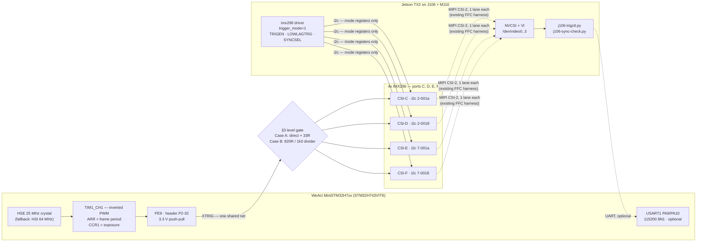

# Hardware trigger — wiring for 4× IMX296 on J106/TX2

Synchronising the four IMX296 global-shutter modules (ports C–F) by driving their `XTRIG` input
from a **WeAct MiniSTM32H7xx** hardware timer.

- **Why an external MCU and not the TX2** → [§1](#1-why-the-trigger-does-not-come-from-the-tx2)
- **⚠ Read [§3](#3-safety-gate--measure-before-you-connect-anything) before connecting anything.**
- Design rationale and alternatives: [`openspec/changes/add-imx296-hw-trigger/design.md`](../openspec/changes/add-imx296-hw-trigger/design.md)

---

## 1. Why the trigger does not come from the TX2

The question was asked directly, so here is the evidence rather than the conclusion.

**The TX2 has no usable hardware-PWM pin on this carrier.**

| Check | Result |
|---|---|
| Pads on tegra186 that can mux to a PWM function | only `gp_pwm6_pl6`, `gp_pwm7_pl7`, `uart5_rx_px5`, a few DIS/SEN pads |
| Of those, broken out on J106/M110 | **`FAN_PWM` only** — `pwm@c340000`, already owned by `pwm-fan`, through an *inverting open-drain MOSFET* |
| `uart5_rx_px5` | already hogged to `spi3` for the on-board MPU-9250 IMU |
| Pins actually muxed to PWM on the running board | **none** (`/sys/kernel/debug/pinctrl/2430000.pinmux/pinmux-pins`) |

So a TX2-sourced trigger would be a **software-toggled GPIO**. There are free ones — e.g.
`GPIO11_AP_WAKE_BT` = gpio **389** = `GPIO_PQ5_PI5`, MUX and GPIO both unclaimed, exposed on M110
`J21` pin 8 — but in IMX296 Fast Trigger mode **the `XTRIG` low pulse width *is* the exposure time**.
Scheduler jitter therefore lands directly on image brightness: ±100 µs of jitter (typical for
userspace GPIO on this non-RT 4.9 kernel, worse under load) is ±2 % exposure error on a 5 ms
exposure, frame to frame.

The STM32H7's `TIM1` produces the same pulse in hardware with a ~40 ns tick and no jitter at all.

> **Note:** none of this is about *inter-camera* sync — one net fanned out to four cameras is
> perfectly synchronous whatever drives it. It is about *exposure stability*, which the pulse-width
> encoding makes a timing problem.

---

## 2. Signal chain



**Two domains, deliberately kept apart:**

| | carries | over |
|---|---|---|
| **Trigger** | when to expose, and for how long | 2 new wires (`XTRIG`, `GND`), MCU → cameras |
| **Control** | which mode the sensor is in, gain, readout | existing CSI/I²C harness, TX2 → cameras |

The TX2 never touches the trigger wire. The MCU never touches I²C. Nothing about the existing
camera harness, device tree or DTB changes.

### Waveform

```
        <-------------------- frame period (1/fps) -------------------->
        ______                                                    ______
XTRIG         |__________________________________________________|
   idle HIGH  <----------- exposure - 14.26 us ------------------>
              |
              +-- exposure starts here (Fast Trigger: immediate on the falling edge)
```

- `t_exposure = t_XTRIG_low + 14.26 µs`  ← the sensor adds a fixed offset, so the firmware
  **subtracts** it from what you ask for.
- Idle state is **HIGH**. A low `XTRIG` means "exposing".

### Datasheet limits (all-pixel 1456×1088 readout)

| Quantity | Value | Where from |
|---|---|---|
| 1 H | `HMAX`/74.25 MHz = 1100/74.25 MHz = **14.8148 µs** | `HMAX` is in units of an internal 74.25 MHz reference, **independent of INCK** |
| `tTGPD` — next-trigger prohibited | 1126 H = **16.6815 ms** → **max 59.95 fps** | Fast Trigger parameter list |
| `tTGSE` — min pulse | 0.05 µs → min exposure ≈ **14.31 µs** | Fast Trigger parameter list |
| `tOFFSET` | **14.26 µs** | Exposure formula |
| `XTRIG` input | OVDD = **1.8 V**; VIH **1.44 V**; VIL **0.36 V**; **abs max 3.3 V** | DC characteristics |

Source: [`IMX296LQR-C_Fulldatasheet_Awin.pdf`](../IMX296LQR-C_Fulldatasheet_Awin.pdf) (repo root).

---

## 3. Safety gate — measure before you connect anything

> ### ⚠ `XTRIG` is a **1.8 V** input whose **absolute maximum is 3.3 V**.
> Driving a raw `XTRIG` pin from a 3.3 V push-pull output puts it *at* its absolute maximum rating.
> Establish which domain the pads present **before** the first wire goes on.

### 3.1 What the pads are

The module exposes six pads: `3V3`, `MAS`, `XVS`, `XHS`, `XTR+`, `XTR−` ([photo](images/)).

| Pad | Sensor pin | What it is | Do we connect it? |
|---|---|---|---|
| `3V3` | — | board 3.3 V rail | **No** — reference/measurement only |
| `MAS` | `XMASTER` | master(L)/slave(H) select | **No** — must stay **low**; already is (see 3.2) |
| `XVS` | `XVS` | vertical sync — an **output** in master mode | **No** — driver sets it Hi-Z |
| `XHS` | `XHS` | horizontal sync — an **output** in master mode | **No** — driver sets it Hi-Z |
| `XTR+` | `XTRIG` | trigger input | **Yes** — the one signal |
| `XTR−` | `VSS` | trigger ground return | **Yes** |

Vendor documentation for this pad family (Inno-Maker `CAM-IMX296RAW` manual §4) confirms
`XTR（Trig+）, GND(Trig-)` — **single-ended, `XTR−` is ground**, not a differential pair — and that
"multiple cameras can be connected to the same pulse".

### 3.2 Measurements (multimeter, no scope needed)

Do these on **one** module first. **The cameras do not need to be streaming** — `XTRIG` is an
*input*, so its idle level is set by whatever pulls it on the module, which depends only on the
rails being up, not on whether the sensor is producing frames. Powered and idle is enough.

#### Part 1 — board UNPOWERED

Resistance and continuity inject a test current, so they are only meaningful with the rails down.
Shut the board down cleanly (`sudo poweroff`), don't just pull the plug.

| # | Measure | Expected | Meaning |
|---|---|---|---|
| 1 | `XTR−` ↔ board GND, continuity | ~0 Ω | `XTR−` is the ground return, as the vendor doc says. **If it is not ~0 Ω, stop** — the pads may be an isolated or differential input, which this guide does not cover. |
| 2 | `XTR+` ↔ `3V3` pad, resistance | see below | Is there a pull-up, and to which rail? |
| 3 | `XTR+` ↔ GND, resistance | see below | |

#### Part 2 — board POWERED, cameras idle (no streaming)

| # | Measure | Expected | Meaning |
|---|---|---|---|
| 4 | `MAS` ↔ GND, DC volts | ~0 V | `XMASTER` low = **master mode**, which Fast Trigger requires. It must already be low — the cameras free-run *at all* today, which is only possible in master mode. **If it reads high, stop**: the whole approach assumes master mode. |
| 5 | `XTR+` ↔ GND, DC volts, idle | see below | **This is the gate.** |

#### Reading the result

Take measurement 5 first; measurements 2–3 disambiguate it when it is unclear.

| Measurement 5 | Also | Domain | Action |
|---|---|---|---|
| **~3.3 V** | typ. 10 k to `3V3` | pad is pulled to the board's 3.3 V rail → there is a buffer/shifter behind it | **Case A** |
| **~1.8 V** | no path to `3V3` | pad is the raw sensor `XTRIG`, idling high on OVDD | **Case B** |
| **~0 V** | finite R to GND only | pad is the raw `XTRIG` with a pull-down | **Case B** |
| **drifts / won't settle** | no finite R either way | an auto-direction translator (TXB-type) with its input floating — these have weak keepers and no defined idle | **Case A**, but confirm by measuring again with `XTR+` briefly tied to `3V3` through 10 k: if it follows to 3.3 V, the pad is 3.3 V logic |
| anything else | — | unclear | Assume **Case B** — it is the safe assumption, and it costs two resistors |

### 3.3 Case A — `XTR+` tolerates 3.3 V (expected)

Direct wire. One series resistor at the **MCU end** damps reflections on the fan-out stubs:

```
PE9 (P2-32) ----[ 33R ]----+----> XTR+  (CSI-C)
                           +----> XTR+  (CSI-D)
                           +----> XTR+  (CSI-E)
                           +----> XTR+  (CSI-F)

GND (P2-43) ---------------+----> XTR-  x4  (star from the MCU, see §5)
```

### 3.4 Case B — `XTR+` is a raw 1.8 V input

One divider, shared by all four inputs (they are high-impedance CMOS loads):

```
                     820R              +----> XTR+ (CSI-C)
PE9 (P2-32) ---+----/\/\/\----+--------+----> XTR+ (CSI-D)
               |              |        +----> XTR+ (CSI-E)
             [10k]          [1k0]      +----> XTR+ (CSI-F)
               |              |
              3V3            GND
           (optional,      (P2-43)
            see below)
```

- **3.3 V × 1000/(820+1000) = 1.813 V** — above VIH (1.44 V), below the 1.9 V OVDD max. Low level
  is 0 V, below VIL (0.36 V).
- Source impedance 820 ∥ 1000 = **451 Ω**. Against ~150 pF of stubs and wiring that is a ~150 ns
  edge — symmetric on both edges, so it **cancels out of the pulse width** to first order and is
  irrelevant next to a ≥50 µs exposure.
- The optional **10 kΩ to 3V3 (P2-41)** holds `XTRIG` high while the MCU is in reset or
  unplugged, so the sensors are never parked inside an exposure. Not strictly needed — the sensors
  ignore `XTRIG` until the driver sets `trigger_mode=1` — but it is two pence of insurance.
- Use **1 %** resistors. E24 alternatives: 1k0/1k2 → 1.80 V, or 470R/560R → 1.80 V (lower impedance,
  faster edges, 3.2 mA draw).

---

## 4. Wiring tables

### 4.1 Trigger — MCU → 4 cameras (required, 2 nets)

| From (WeAct board) | Silkscreen | Header pin | → | To | Note |
|---|---|---|---|---|---|
| `TIM1_CH1` | **`E9`** | P2‑32 | → | `XTR+` on **all four** modules | via §3.3 or §3.4 |
| Ground | **`GND`** | P2‑43 | → | `XTR−` on **all four** modules | star, see §5 |

**Finding `E9` on the board:** right-hand header, the row labelled `E8 E9` — `E9` is the outer pin
of that pair. It is **6 rows above** the `3V3 5V` row, which is second from the bottom. The
`GND GND` row is the bottom row.

`PE9` is free on this board: `PE10`–`PE14` are the on-board TFT-LCD, `PE0/1/4/5/6` are the DCMI
camera connector, `PE3` is the blue LED, `PA11/PA12` are USB. (WeAct schematic
`STM32H7xx SchDoc V12.pdf`.)

### 4.2 Serial control link — MCU ↔ TX2 (optional, 3 nets)

Only needed to change fps/exposure at runtime. **The rig triggers without it** — the firmware boots
with defaults and starts on its own.

| From (WeAct) | Silkscreen | Header pin | → | To (M110 `J22`, UART2, 3.3 V TTL) | Pin |
|---|---|---|---|---|---|
| `USART1_TX` (`PA9`) | **`A9`** | P1‑27 | → | `UART2_RXD` | 3 |
| `USART1_RX` (`PA10`) | **`A10`** | P1‑26 | ← | `UART2_TXD` | 2 |
| `GND` | **`GND`** | P2‑43 | — | `GND` | 6 |

**Which `/dev/ttyTHS*` is `J22`?** Not derivable from the running tree — no UART pin is claimed in
`pinmux-pins`, so identify it on the bench:

```bash
# On the TX2, with J22 pins 2 and 3 shorted together (loopback), no MCU attached:
for t in /dev/ttyTHS1 /dev/ttyTHS2 /dev/ttyTHS3; do
  stty -F $t 115200 raw -echo 2>/dev/null || continue
  timeout 2 cat $t > /tmp/rx.$$ & sleep 0.3; printf 'PING\n' > $t; wait
  echo "$t -> $(cat /tmp/rx.$$)"; rm -f /tmp/rx.$$
done   # the one echoing PING is J22
```

**Zero-ambiguity fallback:** any USB-TTL dongle in a TX2 USB port → `/dev/ttyUSB0`, wired to
`A9`/`A10`/`GND`. `j106-trigctl.py --port` takes either.

### 4.3 Power for the WeAct board

Pick **exactly one**. Never both — back-feeding VBUS through the board's 5 V rail is a good way to
lose the board.

| Option | Wiring | Notes |
|---|---|---|
| **From M110 `J22`** | `J22` pin 1 (5 V) → WeAct `5V` (P2‑42); `J22` pin 6 → `GND` | One connector powers **and** talks. Recommended when using §4.2. |
| **USB-C** | plug into a TX2 USB host port | Also the flashing path (§6). Recommended when *not* using §4.2. |

M110 `J23` also offers 3.3 V (pin 2) and **1.8 V (pin 3, ≤50 mA)** — the 1.8 V rail is there if you
ever want a proper level translator's B-side supply instead of the §3.4 divider.

> **Verify against your board.** The Auvidea M90/M100/M110 manual's M110 chapter is literally
> "1. to be added" — the `J21`/`J22`/`J23` pinouts above are from the M100 sections of that shared
> document. Confirm the connector exists and count pins before soldering.

### 4.4 Optional — trigger echo back to the TX2 (future)

Not part of this change. If you later want kernel-timestamped trigger edges, `GPIO11_AP_WAKE_BT`
(gpio **389**, M110 `J21` pin 8) is free and unclaimed — but it is a **1.8 V unbuffered** input, so
it needs the same treatment as §3.4 in reverse. `GNSS_PPS` (`J21` pin 7) is the semantically nicer
pin if it maps to a Tegra GPIO on TX2.

---

## 5. Grounding and cable practice

- **One star point.** All four `XTR−` returns go back to the *same* WeAct `GND` pin. Do not daisy-
  chain camera-to-camera; a shared return that passes through another module turns its ground
  bounce into your trigger's noise margin.
- **Twist each run.** Each `XTRIG`/`GND` pair twisted together, ideally < 30 cm.
- **Keep it away from the CSI FFCs.** The MIPI harness is the noisiest thing on the carrier.
- The 33 Ω (Case A) or the divider (Case B) belongs at the **MCU end**, so the fan-out stubs are
  driven from one damped source.

---

## 6. Firmware — build and flash

See [`firmware/README.md`](firmware/README.md). In short:

```bash
cd hw-trigger/firmware && make          # arm-none-eabi-gcc -> build/camtrig.bin
# hold BOOT0, tap NRST, release BOOT0  -> ROM DFU bootloader
dfu-util -a 0 -s 0x08000000:leave -D build/camtrig.bin
```

No debugger needed — the STM32 ROM bootloader provides USB DFU, and `dfu-util` is already on the
build host.

---

## 7. Bring-up order

Do it in this order. Each step is reversible and each one fails loudly rather than silently.

1. **Measure** the pads (§3.2) on one module. Record the result at the bottom of this file.
2. **Flash** the firmware (§6). With nothing else connected, `status` over serial (or the `PE3` LED
   blinking at the frame rate) confirms the timer is running.
3. **Scope or DMM `PE9`** before it goes anywhere near a camera. A DMM on DC will read the average:
   at 30 fps with 5 ms exposure that is 3.3 × (1 − 0.15) ≈ 2.8 V. Wrong polarity (idle low) reads
   ~0.5 V and means the PWM polarity is inverted — fix that before connecting.
4. **Wire** `XTRIG` + `GND` per §3.3/§3.4, cameras still free-running (`trigger_mode=0`). Confirm
   no regression — all four cameras must still capture exactly as before.
5. **Baseline**: `tools/j106-sync-check.py` free-running. Expect the inter-camera spread to walk.
6. **Enable**: `echo 1 | sudo tee /sys/module/imx296/parameters/trigger_mode`, restart capture.
   `dmesg` must show trigger mode active on all four sensors.
7. **Verify**: re-run `j106-sync-check.py`. Expect a small, bounded spread.
8. **Count**: `j106-trigctl.py burst 300` and confirm each camera delivered 300 frames.

**Rollback at any point:** `echo 0 > /sys/module/imx296/parameters/trigger_mode` and restart
capture. No reboot, no reflash, no DTB change.

---

## 8. What this does *not* do

- **All four cameras share one exposure.** One net ⇒ one pulse width ⇒ one exposure. Per-camera
  exposure needs four nets (`TIM1_CH1..CH4`, still one counter so still perfectly phase-locked);
  the firmware's parameter model leaves room for it.
- **Argus/ISP exposure control stops working** in trigger mode — Argus cannot drive a wire it does
  not know about. Triggered operation targets raw V4L2 capture.
- **No absolute time reference.** The trigger is a free-running crystal (±20 ppm). Frames are
  synchronous with *each other*, not with GNSS or PTP.
- **Max 59.95 fps** in all-pixel mode — the sensor's `tTGPD` (§2), not a firmware limit.

---

## 9. Measured results

Fill in during bring-up (§7).

| Step | Result | Date |
|---|---|---|
| §3.2 measurement 1 — `XTR−` continuity to GND | _pending_ | |
| §3.2 measurement 2 — `MAS` level | _pending_ | |
| §3.2 measurement 3 — `XTR+` idle voltage → Case A / B | _pending_ | |
| **Free-running baseline** — worst skew **2.43 ms**, drift **8.33 µs/s** over 20 s, 4× IMX296 @ 30.01 fps | **measured** | 2026‑08‑25 |
| Triggered inter-camera spread | _pending_ | |
| Frame count vs trigger count over 300 pulses | _pending_ | |

### Free-running baseline, in full

`tools/j106-sync-check.py -n 600`, ports C–F, before any trigger wiring:

```
per camera
  node        frames  dropped   mean interval   jitter (sd)
  video0         600        0      33318.6 us        1.6 us   (30.01 fps)
  video1         600        0      33318.4 us        1.5 us   (30.01 fps)
  video2         600        0      33318.4 us        1.5 us   (30.01 fps)
  video3         600        0      33318.3 us        1.5 us   (30.01 fps)

skew relative to video0 (nearest-frame match)
  node             median    max |skew|         drift
  video1       -1125.0 us     1165.0 us      -3.98 us/s
  video2       -2396.0 us     2430.0 us      -3.37 us/s
  video3       -1299.0 us     1382.0 us      -8.33 us/s

verdict: NOT synchronised — free-running.
```

Three things to note, because they are the case for doing this work at all:

1. The cameras sit up to **2.4 ms apart** — about 1/14th of a frame at 30 fps.
2. That offset is **re-randomised on every stream start** (an earlier 200-frame run gave
   `+2767 / +601 / +3058 µs` instead of `−1125 / −2396 / −1299`), so it cannot be calibrated
   out once and reused.
3. It then **drifts** at 3–8 µs/s. The crystals are only 3–8 ppm apart, which is why the
   drift alone is a weak test over a short run — and why the check also tests the offset.
